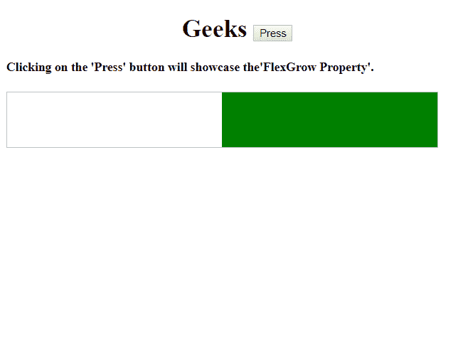
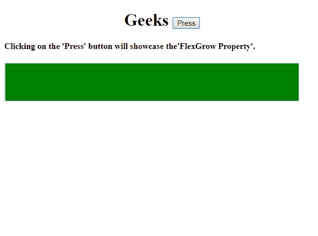
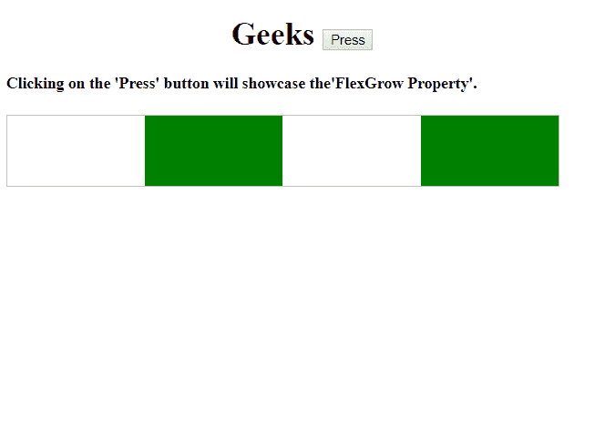
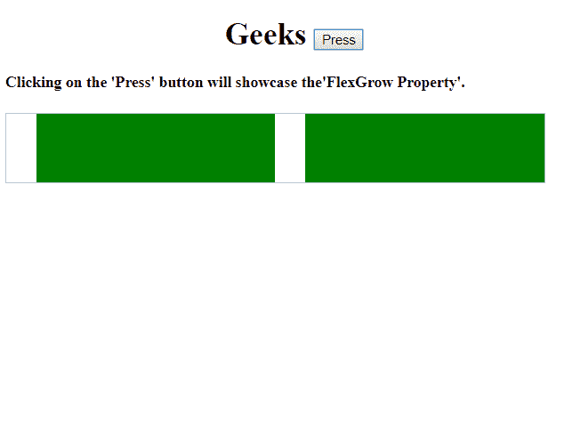

# HTML | DOM 样式 flexGrow 属性

> 原文:[https://www . geesforgeks . org/html-DOM-style-flex grow-property/](https://www.geeksforgeeks.org/html-dom-style-flexgrow-property/)

HTML DOM **样式的 flexGrow 属性**被用作一种度量，以确定一个项目相对于同一个容器内的其他灵活项目**将增长多少。**

**语法:**

*   返回 flexGrow 属性:

    ```html
    object.style.flexGrow
    ```

*   设置 flexGrow 属性:

    ```html
    object.style.flexGrow = "number|initial|inherit"
    ```

**属性:**

*   **号:**指定**号**中的数量，该数量决定了该物品相对于其他柔性物品的增长量。
*   **初始值:**它将 flexGrow 属性设置为默认值。
*   **inherit:** 它从其父元素继承属性值。

**返回值:**
它返回一个字符串，代表元素的 flex-grow 属性。

**示例-1:** 项目相对于同一容器内的其余柔性项目而言有所增长。

```html
<!DOCTYPE html>
<html>
<head>
    <title>
       HTML | DOM Style flexGrow Property
    </title>
    <style>
        #main {
            width: 550px;
            height: 70px;
            border: 1px solid #c3c3c3;
            display: -webkit-flex;
            display: flex;
        }

        #main div:nth-of-type(1) {
            -webkit-flex-grow: 1;
        }

        #main div:nth-of-type(2) {
            -webkit-flex-grow: 1;
        }

        #main div:nth-of-type(1) {
            flex-grow: 1;
        }

        #main div:nth-of-type(2) {
            flex-grow: 1;
        }
    </style>
</head>
<body>
    <h1>
      <center>
        Geeks <button onclick="flex()">Press
        </button>
      </center> 
    </h1>

    <h4>
      Clicking on the 'Press' button 
      will showcase the'FlexGrow Property'.
    </h4>
    <div id="main">
        <div style="background-color:white;">
      </div>
        <div style="background-color:green;"
             id="gfg">
      </div>
    </div>

    <script>
        function flex() {

            // Access element and grow the item
            document.getElementById(
              "gfg").style.flexGrow = 
              "1000";
        }
    </script>

</body>

</html>
```

**输出:**

**点击按钮前:**


**点击按钮后:**


**例 2:** 当“第 n 个类型”为 4 时，项目增长。

```html
<!DOCTYPE html>
<html>
<head>
    <title>
       HTML | DOM Style flexGrow Property
    </title>
    <style>
        #main {
            width: 550px;
            height: 70px;
            border: 1px solid #c3c3c3;
            display: -webkit-flex;
            display: flex;
        }

        <!-- SAFARI -->
        #main div:nth-of-type(1) {
            -webkit-flex-grow: 1;
        }

        #main div:nth-of-type(2) {
            -webkit-flex-grow: 1;
        }

        #main div:nth-of-type(3) {
            -webkit-flex-grow: 1;
        }

        #main div:nth-of-type(4) {
            -webkit-flex-grow: 1;
        }

        <!-- Chrome, Firefox, Opera, Edge -->  
        #main div:nth-of-type(1) {
            flex-grow: 1;
        }

        #main div:nth-of-type(2) {
            flex-grow: 1;
        }

        #main div:nth-of-type(3) {
            flex-grow: 1;
        }

        #main div:nth-of-type(4) {
            flex-grow: 1;
        }
    </style>
</head>
<body>
    <h1>
      <center>
        Geeks <button onclick="flex()">Press
        </button>
      </center> 
    </h1>

    <h4>
     Clicking on the 'Press' button
     will showcase the'FlexGrow Property'.
    </h4>
    <div id="main">
        <div style="background-color:white;"></div>
        <div style="background-color:green;" id="gfg"></div>
        <div style="background-color:white;"></div>
        <div style="background-color:green;" id="gfgg"></div>
    </div>

    <script>
        function flex() {

            // SAFARI.
            document.getElementById(
              "gfg").style.WebkitFlexGrow = "8";
            document.getElementById(
              "gfg").style.flexGrow = "8";

            //  OTHERS.
            document.getElementById(
              "gfgg").style.WebkitFlexGrow = "8";
            document.getElementById(
              "gfgg").style.flexGrow = "8";
        }
    </script>

</body>

</html>
```

**输出:**

**点击按钮前:**


**点击按钮后:**


**浏览器支持:***DOM flexGrow 属性*支持的浏览器如下:

*   谷歌 Chrome
*   微软公司出品的 web 浏览器
*   火狐浏览器
*   歌剧
*   旅行队