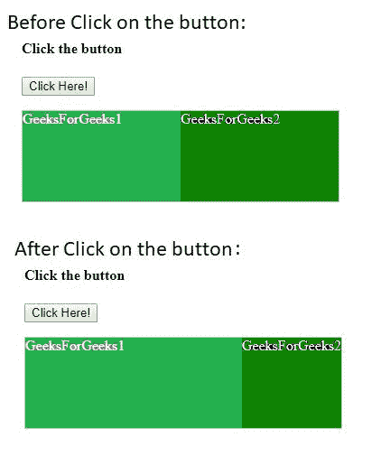
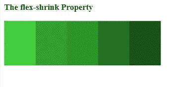

# HTML | DOM 样式 flexShrink 属性

> 原文:[https://www . geesforgeks . org/html-DOM-style-flex shrink-property/](https://www.geeksforgeeks.org/html-dom-style-flexshrink-property/)

HTML DOM 中的 **Style flexShrink** 属性用于设置特定项目相对于容器中剩余的灵活项目可以如何收缩。
**语法:**

*   它用于返回 flexShrink 属性。

    ```html
    object.style.flexShrink
    ```

*   用于设置 flexShrink 属性。

    ```html
    object.style.flexShrink = "number|initial|inherit"
    ```

**属性值:**

*   **数字:**用于设置一个数字，该数字指定相对于剩余的柔性物品，物品可收缩的程度。其默认值为 0。
*   **初始值:**将 flexShrink 属性设置为默认值。
*   **inherit:** 该属性值从其父元素继承而来。

**示例-1:**

```html
<!DOCTYPE html>
<html>

<head>
    <title>
        HTML DOM Style flexShrink Property
    </title>
    <style>
        #Geeks {
            width: 350px;
            height: 100px;
            border: 1px solid #c3c3c3;
            display: flex;
        }

        #Geeks div {
            flex-grow: 1;
            flex-shrink: 1;
            flex-basis: 300px;
        }
    </style>
</head>

<body>
    <h4>Click the button</h4>
    <button onclick="GFG()">Click Here!
        <br>
    </button>
    <p></p>
    <div id="Geeks">
        <div style="background-color:#64c962;
                    color:white;">
          GeeksForGeeks1
      </div>
        <div style="background-color:#2c932a;
                    color:white;" 
             id="Geeks2">
          GeeksForGeeks2
      </div>
    </div>

    <script>
        function GFG() {

            // Safari 6.1+
            document.getElementById(
              "Geeks2").style.WebkitFlexShrink = "5"; 

            document.getElementById(
              "Geeks2").style.flexShrink = "5";
        }
    </script>
</body>

</html>
```

**输出:**


**示例-2:**

```html
<!DOCTYPE html>
<html>

<head>
    <title>
        HTML DOM Style flexShrink Property
    </title>
    <style>
        #Geeks {
            width: 350px;
            height: 100px;
            border: 1px solid #c3c3c3;
            display: flex;
        }

        #Geeks div {
            flex-grow: 1;
            flex-shrink: 1;
            flex-basis: 300px;
        }
    </style>
</head>

<body>
    <h3>The flex-shrink Property</h3>

    <div id="Geeks">
        <div style="background-color:#44cc3f;">
      </div>
        <div style="background-color:#34a030;">
      </div>
        <div style="background-color:#2c932a;">
      </div>
        <div style="background-color:#267023;">
      </div>
        <div style="background-color:#175415;">
      </div>
    </div>

</body>

</html>
```

**输出:**


**支持的浏览器:**T2 DOM hashchangevent 属性支持的浏览器如下:

*   谷歌 Chrome 5.0
*   Internet Explorer 8.0
*   Firefox 3.6
*   歌剧 10.6
*   Safari 5.0