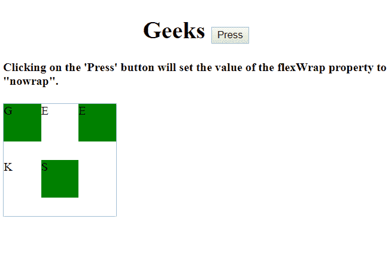
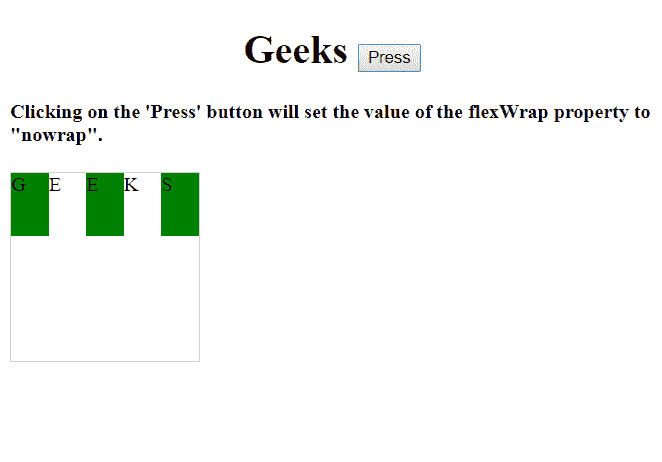
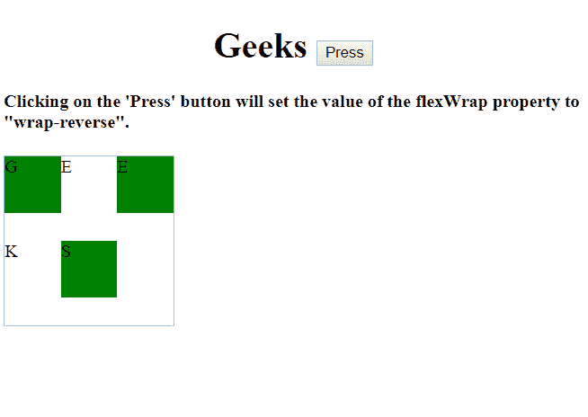
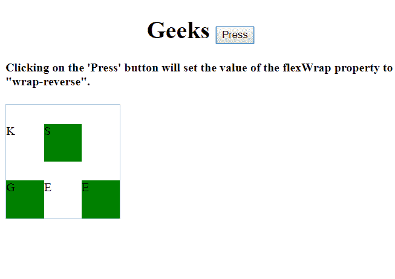
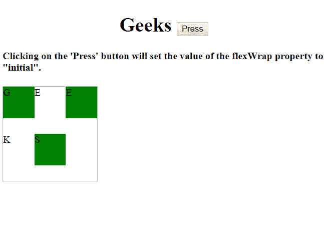
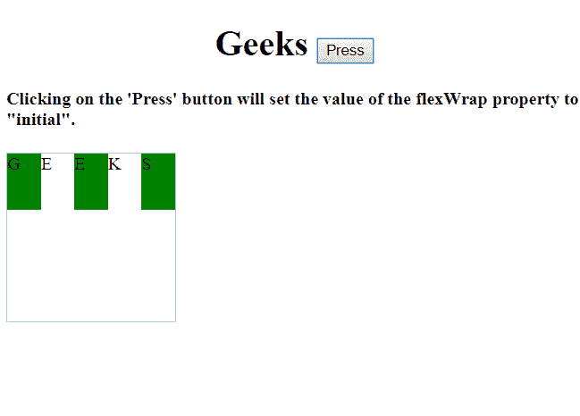
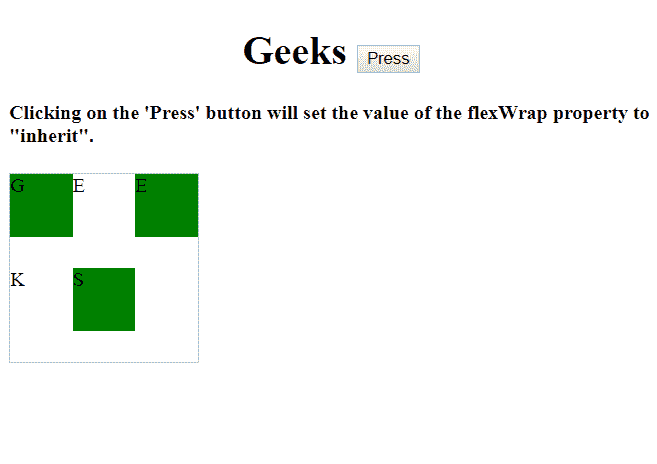
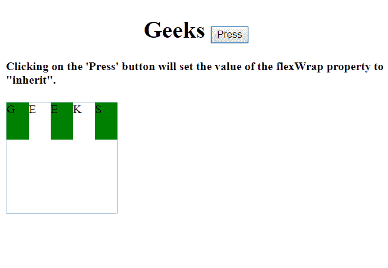

# HTML | DOM 样式 flexWrap 属性

> 原文:[https://www . geesforgeks . org/html-DOM-style-flex wrap-property/](https://www.geeksforgeeks.org/html-dom-style-flexwrap-property/)

DOM **flexGrow 属性**用于确定柔性项是否应该换行。

**语法:**

*   **返回 flexWrap 属性:**

    ```html
    object.style.flexWrap
    ```

*   **设置 flexWrap 属性:**

    ```html
    object.style.flexWrap = "nowrap|wrap|wrap-reverse|
    initial|inherit"
    ```

**属性:**

*   **nowrap:** 指定柔性物品不缠绕。
*   **包裹:**指定需要时柔性物品会包裹。
*   **缠绕-反转:**指定如果需要，柔性物品将以相反的顺序缠绕。
*   **初始值:**用于将属性设置为默认值。
*   **继承:**用于继承父元素的属性值。

**返回值:**它返回一个字符串，表示元素的 flex-wrap 属性。

**示例-1:显示 nowrap 属性**

```html
<!DOCTYPE html>
<html>

<head>
    <title>
       HTML | DOM Style flexWrap Property
    </title>
</head>
    <body>

        <center>
            <h1>Geeks 
              <button onclick="wrap()">
                Press
              </button>
            </h1>
        </center>

        <h4>
          Clicking on the 'Press' button will set the 
          value of the flexWrap property to "nowrap".
        </h4>

        <style>
            #main {
                width: 150px;
                height: 150px;
                border: 1px solid #c3c3c3;
                display: -webkit-flex;
                -webkit-flex-wrap: wrap;
                display: flex;
                flex-wrap: wrap;
            }

            #main div {
                width: 50px;
                height: 50px;
            }
        </style>

        <div id="main">
            <div style="background-color:green;">G</div>
            <div style="background-color:white;">E</div>
            <div style="background-color:green;">E</div>
            <div style="background-color:white;">K</div>
            <div style="background-color:green;">S</div>

        </div>

        <script>
            function wrap() {

                // SAFARI
                document.getElementById(
                        "main").style.WebkitFlexWrap =
                    "nowrap";

                // Other Standard Browsers
                document.getElementById(
                        "main").style.flexWrap =
                    "nowrap";
            }
        </script>

    </body>

</html>
```

**输出:**

**点击按钮前:**


**点击按钮后:**


**示例-2:显示反转属性**

```html
<!DOCTYPE html>
<html>

<body>
    <h1>
      <center>
        Geeks <button onclick="wrap()">Press
        </button>
      </center>
  </h1>

   <h4>Clicking on the 'Press' button will set the 
   value of the flexWrap property to "wrap-reverse".</h4>

    <style>
        #main {
            width: 150px;
            height: 150px;
            border: 1px solid #c3c3c3;
            display: -webkit-flex;
            -webkit-flex-wrap: wrap;
            display: flex;
            flex-wrap: wrap;
        }

        #main div {
            width: 50px;
            height: 50px;
        }
    </style>

    <div id="main">
        <div style="background-color:green;">G</div>
        <div style="background-color:white;">E</div>
        <div style="background-color:green;">E</div>
        <div style="background-color:white;">K</div>
        <div style="background-color:green;">S</div>

    </div>

    <script>
        function wrap() {

            // SAFARI
            document.getElementById(
              "main").style.WebkitFlexWrap =
              "nowrap";

            // Other Standard Browsers
            document.getElementById(
              "main").style.flexWrap = 
              "wrap-reverse";
        }
    </script>

</body>

</html>
```

**输出:**

**点击按钮前:**


**点击按钮后:**


**示例-3:显示初始属性**

```html
<!DOCTYPE html>
<html>

<head>
    <title>
        HTML | DOM Style flexWrap Property
    </title>
</head>

<body>

    <center>
        <h1>Geeks <button onclick="wrap()">Press
        </button></h1>
    </center>

    <h4>Clicking on the 'Press' button will set the 
    value of the flexWrap property to "initial".</h4>

    <style>
        #main {
            width: 150px;
            height: 150px;
            border: 1px solid #c3c3c3;
            display: -webkit-flex;
            -webkit-flex-wrap: wrap;
            display: flex;
            flex-wrap: wrap;
        }

        #main div {
            width: 50px;
            height: 50px;
        }
    </style>

    <div id="main">
        <div style="background-color:green;">G</div>
        <div style="background-color:white;">E</div>
        <div style="background-color:green;">E</div>
        <div style="background-color:white;">K</div>
        <div style="background-color:green;">S</div>

    </div>

    <script>
        function wrap() {

            // SAFARI
            document.getElementById(
                    "main").style.WebkitFlexWrap =
                "nowrap";

            // Other Standard Browsers
            document.getElementById(
                    "main").style.flexWrap =
                "initial";
        }
    </script>

</body>

</html>
```

**输出:**

**点击按钮前:**


**点击按钮后:**


**示例-4:显示继承属性**

```html
<!DOCTYPE html>
<html>

<body>
    <h1>
      <center>
        Geeks <button onclick="wrap()">Press
        </button>
      </center> 
  </h1>

   <h4>Clicking on the 'Press' button will set
     the value of the flexWrap property to "inherit".</h4>

    <style>
        #main {
            width: 150px;
            height: 150px;
            border: 1px solid #c3c3c3;
            display: -webkit-flex;
            -webkit-flex-wrap: wrap;
            display: flex;
            flex-wrap: wrap;
        }

        #main div {
            width: 50px;
            height: 50px;
        }
    </style>

    <div id="main">
        <div style="background-color:green;">G</div>
        <div style="background-color:white;">E</div>
        <div style="background-color:green;">E</div>
        <div style="background-color:white;">K</div>
        <div style="background-color:green;">S</div>

    </div>

    <script>
        function wrap() {

            // SAFARI
            document.getElementById(
              "main").style.WebkitFlexWrap = 
              "nowrap";

            // Other Standard Browsers
            document.getElementById(
              "main").style.flexWrap =
              "inherit";
        }
    </script>

</body>

</html>
```

**输出:**

**点击按钮前:**


**点击按钮后:**


**浏览器支持:**列出的浏览器支持 **DOM flexWrap** 属性:

*   谷歌 Chrome
*   火狐浏览器
*   Internet Explorer 11.0
*   歌剧
*   Safari 6.1