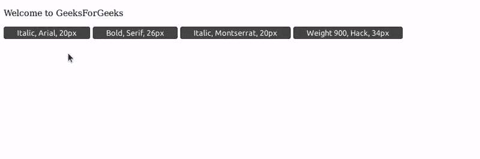

# HTML | DOM 样式字体属性

> 原文:[https://www.geeksforgeeks.org/html-dom-style-font-property/](https://www.geeksforgeeks.org/html-dom-style-font-property/)

HTML strong DOM Style 的字体属性用于更改元素的字体属性。它可用于更改字体样式、粗细、大小和字体系列。

**语法:**

*   设置字体样式:

    ```html
    node.style.font = "font-properties font-size font-family;"
    ```

*   获取当前字体样式:

    ```html
    node.style.font;
    ```

**返回值:**返回一个字符串值，代表元素的不同字体属性

**属性值:**它是一个字符串，具有字体属性、字体大小和字体系列等值。
要求属性的顺序如下:

*   字体样式
*   字体变体
*   字体粗细
*   字体大小
*   字体高度
*   字体系列

**方法:**我们有一个段落元素，其 ID 为**文本**。我们在 JavaScript 中创建了一个函数，该函数将变量 **gfg** 中的字符串值作为参数，并将“**`text`**”ID 元素的 *style.font* 属性设置为“ **`gfg`** ”。我们从按钮调用这个函数，并适当地提供属性值。

**示例:**

```html
<!DOCTYPE html>
<html lang="en">

<head>
    <meta charset="UTF-8">
    <title>HTML DOM | Style font property</title>
</head>

<body>
    <p id='text'>Welcome to GeeksForGeeks</p>

    <button onclick=
            "changeFont('italic 20px arial')">
      Italic, Arial, 20px
  </button>

    <button onclick=
            "changeFont('bold 26px serif')">
      Bold, Serif, 26px
  </button>

    <button onclick=
            "changeFont('italic bold 30px Montserrat')">
      Italic, Montserrat, 20px
  </button>

    <button onclick="changeFont('900 34px hack')">
      Weight 900, Hack, 34px
  </button>

    <script type="text/javascript">
        function changeFont(gfg) {

            //  Get font style.
            document.getElementById(
              'text').style.font = gfg;
        }
    </script>

</body>

</html>
```

**输出:**


**支持的浏览器:**DOM**style . font**属性支持的浏览器如下:

*   谷歌 Chrome
*   互联网浏览器/边缘
*   火狐浏览器
*   歌剧
*   旅行队