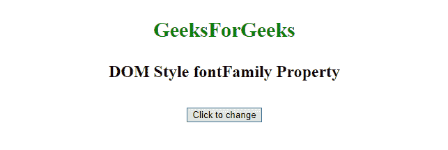
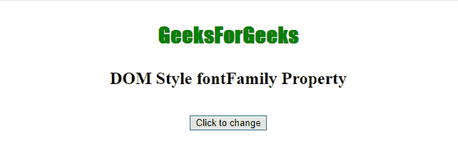
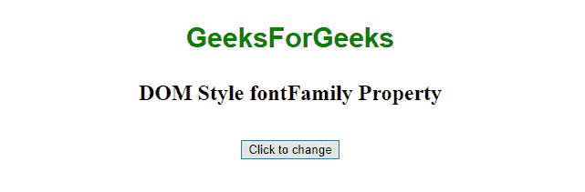
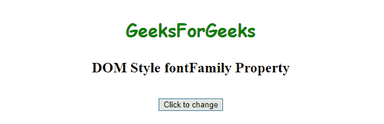

# HTML | DOM 样式 fontFamily 属性

> 原文:[https://www . geesforgeks . org/html-DOM-style-font family-property/](https://www.geeksforgeeks.org/html-dom-style-fontfamily-property/)

**字体系列属性**为元素中的文本设置/返回*字体系列名称*和*通用系列名称*的列表。网络浏览器将实现它识别的第一个值。

**语法:**

*   它返回 fontFamily 属性。

    ```html
    object.style.fontFamily

    ```

*   它设置了字体系列属性。

```html
object.style.fontFamily = "font1, font2, etc.|initial|inherit"

```

**属性值:**

| 价值 | 描述 |
| 字体 1、字体 2 等。 | 字体系列名称和通用系列名称的列表，用逗号分隔。 |
| 最初的 | 在默认值中设置属性。 |
| 继承 | 从父元素继承。 |

**返回值:**返回字体系列名称和/或通用系列名称的数量。

**示例-1:** 字体-姓氏**“冲击”**。

```html
<!DOCTYPE html>
<html>

<head>
    <title>DOM Style fontFamily Property </title>
</head>

<body>
    <center>
        <p style="color: green;
                  width: 100%; 
                  font-size: 30px; 
                  font-weight: bold;"
           id="Geek1">
            GeeksForGeeks
        </p>

        <h2>DOM Style fontFamily Property </h2>
        <br>

        <button type="button" onclick="myGeeks()">
            Click to change
        </button>

        <script>
            function myGeeks() {

                //  Set font-family 'impact'.
                document.getElementById(
                  "Geek1").style.fontFamily = "Impact";
            }
        </script>
    </center>
</body>

</html>
```

**输出:**

*   **之前点击按钮:**
    
*   **点击按钮后:**
    

**示例-2:** 字体-家族名称**“无衬线”**。

```html
<!DOCTYPE html>
<html>

<head>
    <title>DOM Style fontFamily Property </title>
</head>

<body>
    <center>
        <p style="color: green;
                  width: 100%;
                  font-size: 30px;
                  font-weight: bold;" id="Geek1">
            GeeksForGeeks
        </p>

        <h2>DOM Style fontFamily Property </h2>
        <br>

        <button type="button" onclick="myGeeks()">
            Click to change
        </button>

        <script>
            function myGeeks() {

                //  Set font-family 'sans-serif'.
                document.getElementById(
                  "Geek1").style.fontFamily = "sans-serif";
            }
        </script>
    </center>
</body>

</html>
```

**输出:**

*   **之前点击按钮:**
    
*   **点击按钮后:**
    

**示例-3:** 字体-家族名称**“漫画无 MS，草书，无衬线”**。

```html
<!DOCTYPE html>
<html>

<head>
    <title>DOM Style fontFamily Property </title>
</head>

<body>
    <center>
        <p style="color: green; 
                  width: 100%;
                  font-size: 30px;
                  font-weight: bold;" id="Geek1">
            GeeksForGeeks
        </p>

        <h2>DOM Style fontFamily Property </h2>
        <br>

        <button type="button" onclick="myGeeks()">
            Click to change
        </button>

        <script>
            function myGeeks() {

                //   Set font-family 'Comic Sans MS, cursive
                //  and sans-serif'
                document.getElementById(
                        "Geek1").style.fontFamily =
                    'Comic Sans MS, cursive, sans-serif';
            }
        </script>
    </center>
</body>

</html>
```

**输出:**

*   **之前点击按钮:**
    
*   **点击按钮后:**
    

**支持的浏览器:**以下列出了*HTML | DOM Style font family Property*支持的浏览器:

*   谷歌 Chrome
*   微软公司出品的 web 浏览器
*   Mozilla firefox
*   歌剧
*   旅行队