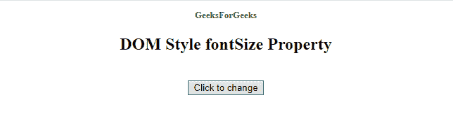

# HTML | DOM 样式字体大小属性

> 原文:[https://www . geesforgeks . org/html-DOM-style-font size-property/](https://www.geeksforgeeks.org/html-dom-style-fontsize-property/)

**fontSize 属性**用于设置或获取一个单词中字符应该出现的字体大小。

**语法:**

*   它返回 fontSize 属性。

    ```html
    object.style.fontSize

    ```

*   它设置字体大小属性。

```html
object.style.fontSize = "value|initial|inherit"

```

**属性值:**

| 价值 | 描述 |
| xx-小号
x 小号
小号
中号
大号
x 大号
xx-大号 | 预定义的字体大小 |
| 较小的 | 减小字体大小的一个相对单位 |
| 更大的 | 增加字体大小的一个相对单位 |
| 长度 | 以长度单位表示的字体大小 |
| % | 父元素字体大小的% |
| 最初的 | 设置默认值 |
| 继承 | 从其父值继承属性 |

**返回值:**返回元素文本的字体大小。

**示例-1:** 将字体大小改为小。

```html
<!DOCTYPE html>
<html>

<head>
    <title>DOM Style fontSize Property </title>
</head>

<body>
    <center>
        <p style="color: green;
                  width: 100%;
                  font-size: 30px; 
                  font-weight: bold;" 
           id="Geek1">
            GeeksForGeeks
        </p>

        <h2>DOM Style fontSize Property </h2>
        <br>
        <button type="button" onclick="myGeeks()">
            Click to change
        </button>

        <script>
            function myGeeks() {

                //  Change font size in to small.
                document.getElementById(
               "Geek1").style.fontSize = "small";
            }
        </script>
    </center>
</body>

</html>
```

**输出:**

*   点击按钮前:
    
*   点击按钮后:
    

**例-2:** 将字号改为 xx-大号。

```html
<!DOCTYPE html>
<html>

<head>
    <title>DOM Style fontSize Property </title>
</head>

<body>
    <center>
        <p style="color: green; 
                  width: 100%; 
                  font-size: 10px; 
                  font-weight: bold;" 
           id="Geek1">
            GeeksForGeeks
        </p>

        <h2>DOM Style fontSize Property </h2>
        <br>
        <button type="button" onclick="myGeeks()">
            Click to change
        </button>

        <script>
            function myGeeks() {

                //  change into xx-large.
                document.getElementById(
                  "Geek1").style.fontSize = "xx-large";
            }
        </script>
    </center>
</body>

</html>
```

**输出:**

*   点击按钮前:
    
*   点击按钮后:
    

**示例-3:** 使用长度单位更改字体大小。

```html
<!DOCTYPE html>
<html>

<head>
    <title>DOM Style fontSize Property </title>
</head>

<body>
    <center>
        <p style="color: green;
                  width: 100%;
                  font-size: 10px; 
                  font-weight: bold;"
           id="Geek1">
            GeeksForGeeks
        </p>

        <h2>DOM Style fontSize Property </h2>
        <br>
        <button type="button" onclick="myGeeks()">
            Click to change
        </button>

        <script>
            function myGeeks() {

                //  Change font size from 
                //  from 10px to 30px
                document.getElementById(
                  "Geek1").style.fontSize = "30px";
            }
        </script>
    </center>
</body>

</html>
```

**输出:**

*   点击按钮前:
    
*   点击按钮后:
    

**示例-4:** 使用“%”更改字体大小

```html
<!DOCTYPE html>
<html>

<head>
    <title>DOM Style fontSize Property </title>
</head>

<body>
    <center>
        <p style="color: green;
                  width: 100%; 
                  font-size: 10px; 
                  font-weight: bold;"
           id="Geek1">
            GeeksForGeeks
        </p>

        <h2>DOM Style fontSize Property </h2>
        <br>
        <button type="button" onclick="myGeeks()">
            Click to change
        </button>

        <script>
            function myGeeks() {

                //  Change font-size from 100% to 200%
                document.getElementById(
                  "Geek1").style.fontSize = "200%";
            }
        </script>
    </center>
</body>

</html>
```

**输出:**

*   点击按钮
    前
*   点击
    按钮后

**支持的浏览器:**以下列出了 *HTML | DOM Style fontSize 属性*支持的浏览器:

*   谷歌 Chrome
*   微软公司出品的 web 浏览器
*   Mozilla firefox
*   歌剧
*   旅行队