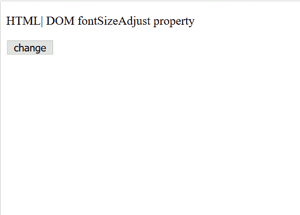
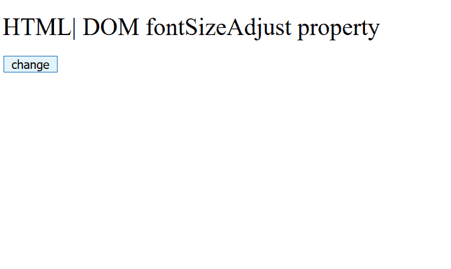

# HTML | DOM 样式字体大小调整属性

> 原文:[https://www . geesforgeks . org/html-DOM-style-font size adjust-property/](https://www.geeksforgeeks.org/html-dom-style-fontsizeadjust-property/)

如果第一个字体选项不可用，则**字体大小调整**属性可以更好地控制字体大小。它设置或返回文本的字体外观值。
纵横比是小写字母“X”和大写字母“X”之间的大小差异。

**语法:**

*   设置字体大小调整属性

    ```html
    object.style.fontSizeAdjust = "none|initial|number|inherit"
    ```

*   获取字体大小调整属性

    ```html
    object.style.fontSizeAdjust
    ```

**属性值:**

*   **无:**大小设置为默认值。没有变化。
*   **编号:**计算并保留属性字体系列值中第一个列出字体的长宽值。该值在公式 *f*(af/as)=s* 中使用，其中**“f”**是首选字体大小，**“af”**是首选字体的长宽值，**“as”**是可用字体长宽值的长宽值&“T10”【s”是使用可用字体的大小。
*   **初始:**大小设置为默认值。
*   **inherit:** Size 从其父元素继承而来。

**示例:**

```html
<!DOCTYPE html>
<html>

<head>
    <title>
        HTML | DOM Style fontSizeAdjust Property
    </title>
</head>

<body>

    <p id="change">
      HTML| DOM fontSizeAdjust property
    </p>

    <button type="button" onclick="myFunction()">
        change
    </button>

    <script>
        function myFunction() {

            //  Adjust font size.
            document.getElementById(
                    "change").style.fontSizeAdjust =
                                                "0.76";
        }
    </script>

</body>

</html>
```

**输出:**
**之前点击按钮:**


**点击按钮后:**


**支持的浏览器:**以下是*HTML | DOM Style font size 调整属性*支持的浏览器:

*   Mozilla Firefox