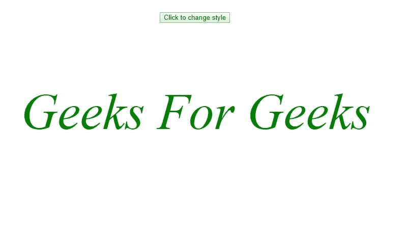

# HTML | DOM Style fontStyle 属性

> 原文:[https://www . geesforgeks . org/html-DOM-style-font style-property/](https://www.geeksforgeeks.org/html-dom-style-fontstyle-property/)

**HTML DOM Style fontStyle 属性**用于动态设置或获取元素的字体样式。

**语法:**

*   要设置字体样式属性:

```html
object.style.fontStyle = normal|italic|oblique|initial|inherit;
```

*   要获取字体样式属性值:

```html
object.style.height
```

**属性值:**

<figure class="table">

| value |
| --- |
| normal |
| italic type |
| tilt |
| initial |
| inherit |

</figure>

**返回值:**给出元素 fontStyle 的字符串。

**示例:**

## 超文本标记语言

```html
<!DOCTYPE html>
<html>

<head>
    <title>
        HTML | DOM Style fontStyle Property
    </title>
    <style>
        #gfg {
            color: green;
            font-size: 100px;
            font-style: normal;
        }
    </style>
</head>

<body>
    <center>

        <button onclick="changeStyle()">
          Click to change style
        </button>
        <!-- Script to change the fontStyle -->
        <script>
            function changeStyle() {
                document.getElementById("gfg").style.fontStyle
                                    = "italic";
            }
        </script>

        <p id="gfg">
            Geeks For Geeks
        </p>

    </center>
</body>

</html>
```

**输出**
**之前点击按钮:**


**点击按钮后:**



**示例:**

## 超文本标记语言

```html
<!DOCTYPE html>
<html>

<head>
    <title>
        HTML | DOM Style fontStyle Property
    </title>
    <style>
        #gfg {
            color: green;
            font-size: 50px;
            font-style: normal;
        }
    </style>
</head>

<body>
    <center>
        <br>
        <button onclick="changeStyle()">
          Click to change style
        </button>
        <br />
        <br />
        <!-- Script to change the fontStyle -->
        <script>
            function changeStyle() {
                document.getElementById("gfg").style.fontStyle
                                    = "oblique";
            }
        </script>

        <div id="gfg">
            HTML DOM fontStyle Property
        </div>
    </center>
</body>

</html>
```

**输出:**
**点击按钮前:**


**点击按钮后:**


**支持的浏览器:**以下列出了*HTML | DOM Style font Style Property*支持的浏览器:

*   谷歌 Chrome 1.0
*   互联网浏览器/边缘 4.0
*   Firefox 1.0
*   Opera 7.0
*   Safari 1.0