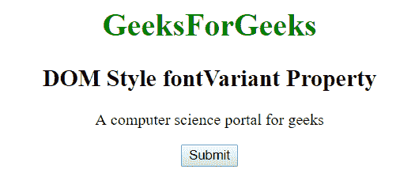
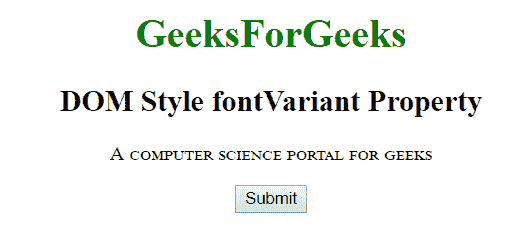
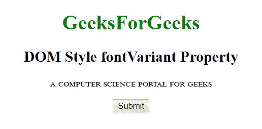

# HTML | DOM 样式 fontVariant 属性

> 原文:[https://www . geesforgeks . org/html-DOM-style-font variant-property/](https://www.geeksforgeeks.org/html-dom-style-fontvariant-property/)

DOM HTML 中的**样式 fontVariant** 属性用于设置大写字母的字体。该属性主要将小写字母转换为大写字母，但与其余文本相比，这些字母的字体较小。

**语法:**

*   它返回 fontVariant 属性。

    ```html
    object.style.fontVariant
    ```

*   它用于设置 fontVariant 属性。

    ```html
    object.style.fontVariant = "normal|small-caps|initial|inherit"
    ```

**值:**

| 价值 | 描述 |
| 常态 | 带有普通文本的默认值。 |
| 小盘股 | 小写字母字体 |
| 最初的 | 设置为默认值 |
| 继承 | 从父元素继承属性 |

**返回值:**

*   它返回一个用小写字母表示字体的字符串。

**示例-1:**

```html
<!DOCTYPE html>
<html>

<head>
    <title>DOM Style fontVariant Property </title>
</head>

<body>
    <center>
        <h1 style="color:green;width:40%;"> 
                GeeksForGeeks 
       </h1>
        <h2>DOM Style fontVariant Property </h2>

        <p id="gfg">
            A computer science portal for geeks
        </p>

        <button type="button" onclick="geeks()">
            Submit
        </button>

        <script>
            function geeks() {

                //  Set fontVariant
                document.getElementById(
                        "gfg").style.fontVariant =
                    "small-caps";
            }
        </script>
    </center>
</body>

</html>
```

**输出:**

之前点击按钮:


点击按钮后:


**示例-2:**

```html
<!DOCTYPE html>
<html>

<head>
    <title>DOM Style fontVariant Property </title>
</head>

<body>
    <center>
        <h1 style="color:green;width:40%;"> 
                GeeksForGeeks 
            </h1>
        <h2>DOM Style fontVariant Property </h2>

        <p id="gfg">
          A computer science portal for geeks
      </p>

        <button type="button" onclick="geeks()">
            Submit
        </button>

        <script>
            function geeks() {

                // Set fontVariant
                document.getElementById(
                  "gfg").style.fontVariant = 
                  "all-small-caps";
            }
        </script>
    </center>
</body>

</html>
```

**输出:**

之前点击按钮:


点击按钮后:


**支持的浏览器:**由 *DOM Style fontVariant* 属性支持的浏览器如下:

*   谷歌 Chrome
*   微软公司出品的 web 浏览器
*   火狐浏览器
*   歌剧
*   苹果 Safari