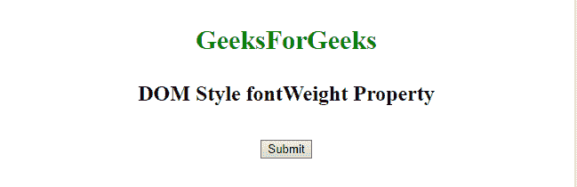
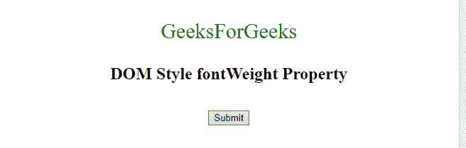
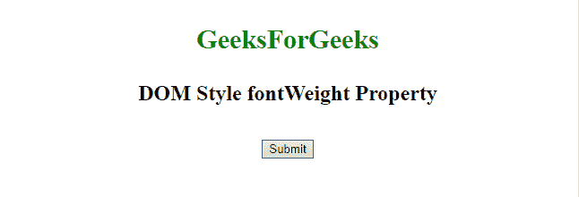
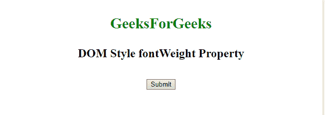
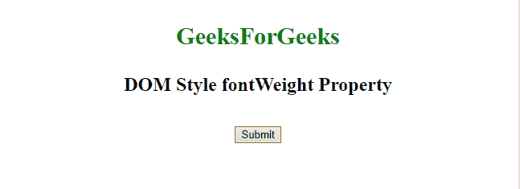

# HTML | DOM 样式字体权重属性

> 原文:[https://www . geesforgeks . org/html-DOM-style-font weight-property/](https://www.geeksforgeeks.org/html-dom-style-fontweight-property/)

**fontWeight** 属性用于*设置*或*返回*一个单词中字符的粗细。

**语法:**

*   它返回 fontWeight 属性。

    ```html
    object.style.fontWeight
    ```

*   它设置字体粗细属性。

```html
object.style.fontWeight = "normal|lighter|bold|bolder|value|
initial|inherit"
```

**属性值:**

| 价值 | 描述 |
| **正常** | 字体默认值 |
| **打火机** | 比正常情况轻 |
| **加粗** | 比平常更大胆 |
| **更大胆** | 比大胆更大胆 |
| **值** | 定义从 100 到 900，其中 400 是正常值 |
| **初始** | 设置为默认值 |
| **继承** | 从父元素继承属性 |

**返回值:**返回字符串字体的粗细。

**示例-1:**

```html
<!DOCTYPE html>
<html>

<head>
    <title>DOM Style fontWeight Property </title>
</head>

<body>
    <center>

        <!-- Property for p tag. -->
        <p style="color: green;
                  width: 100%;
                  font-size: 30px;
                  font-weight: bold;"
           id="sudo">
            GeeksForGeeks
        </p>

        <h2>DOM Style fontWeight Property </h2>
        <br>
        <button type="button" onclick="myGeeks()">
            Click to change
        </button>

        <script>
            function myGeeks() {

                //  Set property for "p" tag form
                //  'bold' to 'lighter'.
                document.getElementById(
                  "sudo").style.fontWeight = "lighter";
            }
        </script>
    </center>
</body>

</html>
```

**输出:**

*   **之前点击按钮:**
    
*   **点击按钮后:**
    

**示例-2:**

```html
<!DOCTYPE html>
<html>

<head>
    <title>DOM Style fontWeight Property </title>
</head>

<body>
    <center>
        <p style="color: green;
                  width: 100%; 
                  font-size: 30px;" 
           id="sudo">
            GeeksForGeeks
        </p>

        <h2>DOM Style fontWeight Property </h2>
        <br>
        <button type="button" onclick="myGeeks()">
            Click to change
        </button>

        <script>
            function myGeeks() {

                //  Set property from normal to bold.
                document.getElementById(
                "sudo").style.fontWeight = "bold";
            }
        </script>
    </center>
</body>

</html>
```

**输出:**

*   **之前点击按钮:**
    
*   **点击按钮后:**
    

**示例-3:**

```html
<!DOCTYPE html>
<html>

<head>
    <title>DOM Style fontWeight Property </title>
</head>

<body>
    <center>
        <p style="color: green;
                  width: 100%; 
                  font-size: 30px;"
           id="sudo">
            GeeksForGeeks
        </p>

        <h2>DOM Style fontWeight Property </h2>
        <br>
        <button type="button" onclick="myGeeks()">
            Click to change
        </button>

        <script>
            function myGeeks() {

                //  Set property bolder.
                document.getElementById(
                  "sudo").style.fontWeight = "bolder";
            }
        </script>
    </center>
</body>

</html>
```

**输出:**

*   **之前点击按钮:**
    
*   **点击按钮后:**
    

**示例-4:**

```html
<!DOCTYPE html>
<html>

<head>
    <title>DOM Style fontWeight Property </title>
</head>

<body>
    <center>
        <p style="color: green;
                  width: 100%; 
                  font-size: 30px;"
           id="sudo">
            GeeksForGeeks
        </p>

        <h2>DOM Style fontWeight Property </h2>
        <br>
        <button type="button" onclick="myGeeks()">
            Click to change
        </button>

        <script>
            function myGeeks() {

                //  Set font using values.
                document.getElementById(
                  "sudo").style.fontWeight = "1000";
            }
        </script>
    </center>
</body>

</html>                  
```

**输出:**

*   **之前点击按钮:**
    
*   **点击按钮后:**
    

**支持的浏览器:**下面列出了 *HTML | DOM Style fontWeight 属性*支持的浏览器:

*   谷歌 Chrome
*   微软公司出品的 web 浏览器
*   Mozilla Firefox
*   歌剧
*   旅行队