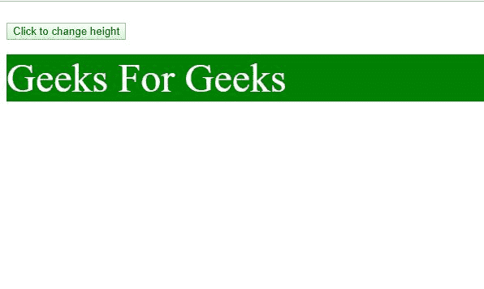

# HTML | DOM 样式高度属性

> 原文:[https://www . geesforgeks . org/html-DOM-style-height-property/](https://www.geeksforgeeks.org/html-dom-style-height-property/)

**HTML DOM Style 高度属性**与 [CSS 高度属性](https://www.geeksforgeeks.org/css-height-property/)类似，但用于动态设置或获取元素的高度。
**语法:**

*   要设置高度属性:

```html
object.style.height = auto|length|%|initial|inherit;
```

*   要获取高度属性值:

```html
object.style.height
```

**属性值:**

<figure class="table">

| value | explain |
| automatic | default |
| length | This defines the height in length units. |
| % | This defines the height as a percentage of the parent element. |
| initial | Set its default value |
| inherit | Inherit parents' property |

</figure>

**返回值:**给出元素高度的字符串。
**例-1:**

## 超文本标记语言

```html
<!DOCTYPE html>
<html>

<head>
    <title>
        HTML | DOM Style height Property
    </title>
    <style>
        p {
            height: auto;
            color: white;
            font-size: 50px;
            background-color: green;
        }
    </style>
</head>

<body>
    <br>
    <button onclick="Play()">
      Click to change height
    </button>
    <br />
    <br />

    <script>
        function Play() {
            document.getElementById(
              "block").style.height = "200px"
        }
    </script>
    <p id="block">
        Geeks For Geeks

    </p>

</body>

</html>
```

**输出**

*   **之前:**



之前的 HTML DOM 高度

*   **之后:**


后的 HTML DOM 高度

**示例-2:**

## 超文本标记语言

```html
<!DOCTYPE html>
<html>

<head>
    <title>
        HTML | DOM Style height Property
    </title>
    <style>
        div {
            height: 10px;
            background-color: green;
            width: 100px;
        }
    </style>
</head>

<body>
    <br>
    <button onclick="Play()">
      Click to increase height of object
    </button>
    <br />
    <br />

    <script>
        function Play() {
            document.getElementById("block"
               ).style.height = "100px"
        }
    </script>
    <center>
        <div id="block">

        </div>
    </center>
</body>

</html>
```

**输出:**

*   **之前:**


之前的 DOM 高度示例

*   **之后:**


之后的 DOM 高度

**支持的浏览器:***DOM Style 高度属性*支持的浏览器如下:

*   谷歌 Chrome 1.0
*   Internet Explorer 4.0
*   Firefox 1.0
*   歌剧
*   Safari 1.0