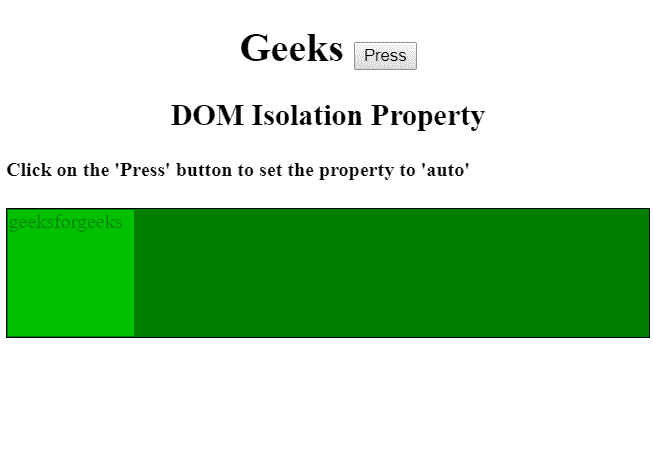
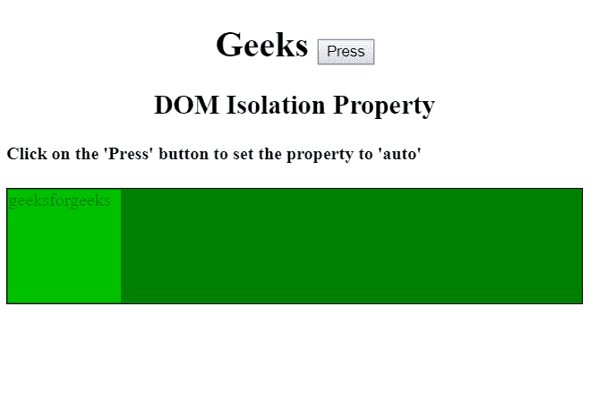
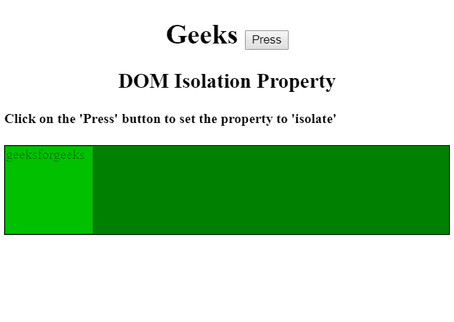
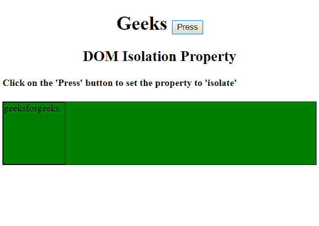
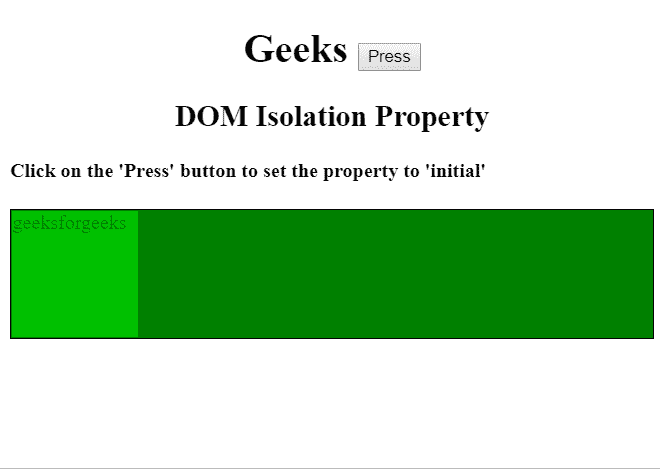
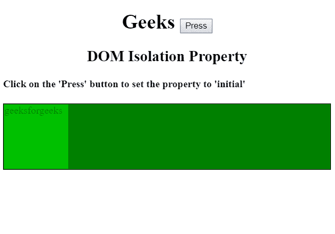
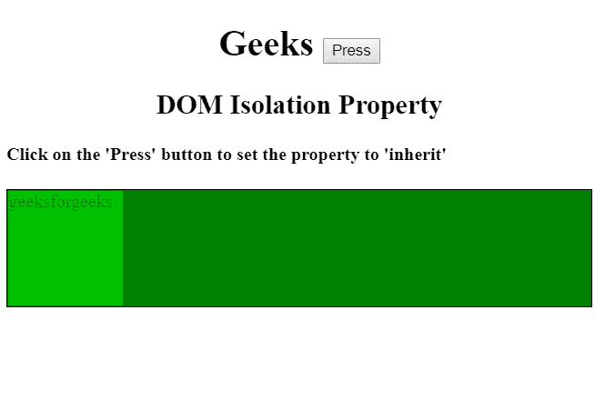
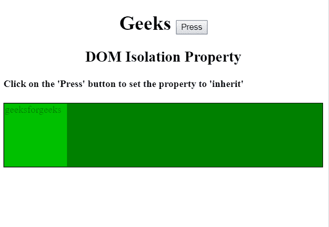

# HTML | DOM 样式隔离属性

> 原文:[https://www . geesforgeks . org/html-DOM-style-isolation-property/](https://www.geeksforgeeks.org/html-dom-style-isolation-property/)

DOM **样式隔离**属性定义元素**是否必须**创建新的堆叠上下文。

**语法:**

*   返回隔离语法:

    ```html
    object.style.isolation
    ```

*   设置隔离语法:

    ```html
    object.style.isolation = "auto|isolate|initial|inherit"
    ```

**属性:**

*   **自动:**为默认属性值。使用此属性，如果应用于元素的属性之一需要，则只创建一个新的堆叠上下文。
*   **隔离:**表示必须创建一个新的堆叠上下文，没有任何失败。
*   **初始值:**将隔离属性设置为默认值。
*   **继承:**继承父元素的隔离属性值。

**返回值:**返回元素的堆叠上下文。

**示例-1:** 显示自动属性。

```html
<!DOCTYPE html>
<html>

<head>
    <title>
       HTML | DOM Style isolation Property
    </title>
    <center>
        <h1>Geeks 
          <button onclick="isolation()">
            Press
          </button>
        </h1>

        <h2>
          DOM Isolation Property
        </h2>
    </center>
    <h4>
      Click on the 'Press' button to
      set the property to 'auto'
    </h4>

    <style>
        .p {
            background-color: green;
            border: 1px solid black;
        }

        #p1 {
            width: 300px;
            height: 100px;
        }

        .P {
            width: 100px;
            height: 100px;
            border: 1px solid black;
            mix-blend-mode: screen;
        }

        #d {
            isolation: auto;
        }
    </style>

</head>

<body>

    <div id="gfg" class="p">
        <div id="d">
            <div class="p P">
                geeksforgeeks
            </div>

        </div>
    </div>

    <script>
        function isolation() {
            document.getElementById(
                "d").style.isolation = "auto";
        }
    </script>
</body>

</html>
```

**输出:**

*   **点击按钮前:**
    
*   **点击按钮后:**
    

**实施例-2:** 显示分离特性。

```html
<!DOCTYPE html>
<html>

<head>
    <title>
        HTML | DOM Style isolation Property
    </title>
    <center>
        <h1>
          Geeks 
          <button onclick="isolation()">
            Press
          </button>
         </h1>

        <h2>DOM Isolation Property</h2>
    </center>
    <h4>
      Click on the 'Press' button to set the 
      property to 'isolate'
    </h4>

    <style>
        .p {
            background-color: green;
            border: 1px solid black;
        }

        #p1 {
            width: 300px;
            height: 100px;
        }

        .P {
            width: 100px;
            height: 100px;
            border: 1px solid black;
            mix-blend-mode: screen;
        }

        #d {
            isolation: auto;
        }
    </style>
</head>

<body>

    <div id="gfg" class="p">
        <div id="d">
            <div class="p P">
                geeksforgeeks
            </div>
        </div>
    </div>

    <script>
        function isolation() {
            document.getElementById(
                "d").style.isolation = "isolate";
        }
    </script>
</body>

</html>
```

**输出:**

*   **点击按钮前:**
    
*   **点击按钮后:**
    

**实施例-3:** 显示初始性质。

```html
<!DOCTYPE html>
<html>

<head>
    <title>
        HTML | DOM Style isolation Property
    </title>
    <center>
        <h1>
         Geeks 
          <button onclick="isolation()">
            Press
          </button>
        </h1>
        <h2>DOM Isolation Property</h2>
    </center>
    <h4>
      Click on the 'Press' button to set 
      the property to 'initial'
    </h4>

    <style>
        .p {
            background-color: green;
            border: 1px solid black;
        }

        #p1 {
            width: 300px;
            height: 100px;
        }

        .P {
            width: 100px;
            height: 100px;
            border: 1px solid black;
            mix-blend-mode: screen;
        }

        #d {
            isolation: auto;
        }
    </style>
</head>

<body>

    <div id="gfg" class="p">
        <div id="d">
            <div class="p P">
                geeksforgeeks
            </div>
        </div>
    </div>

    <script>
        function isolation() {

            document.getElementById(
                "d").style.isolation = "initial";
        }
    </script>
</body>

</html>
```

**输出:**

*   **点击按钮前:**
    
*   **点击按钮后:**
    

**示例-4:** 显示继承属性。

```html
<!DOCTYPE html>
<html>

<head>
    <title>
        HTML | DOM Style isolation Property
    </title>
    <center>
        <h1>
          Geeks 
          <button onclick="isolation()">
            Press
          </button>

        </h1>

        <h2>
          DOM Isolation Property
        </h2>
    </center>
    <h4>
      Click on the 'Press' button to 
      set the property to 'inherit'
    </h4>

    <style>
        .p {
            background-color: green;
            border: 1px solid black;
        }

        #p1 {
            width: 300px;
            height: 100px;
        }

        .P {
            width: 100px;
            height: 100px;
            border: 1px solid black;
            mix-blend-mode: screen;
        }

        #d {
            isolation: auto;
        }
    </style>
</head>

<body>

    <div id="gfg" class="p">
        <div id="d">
            <div class="p P">
                geeksforgeeks
            </div>
        </div>
    </div>

    <script>
        function isolation() {
            document.getElementById(
                "d").style.isolation = "inherit";
        }
    </script>
</body>

</html>
```

**输出:**

*   **点击按钮前:**
    
*   **点击按钮后:**
    

**注意:** Internet Explorer 不支持该属性。

**浏览器支持:**T2 DOM 隔离属性支持的浏览器如下:

*   谷歌 Chrome
*   火狐浏览器
*   歌剧
*   旅行队