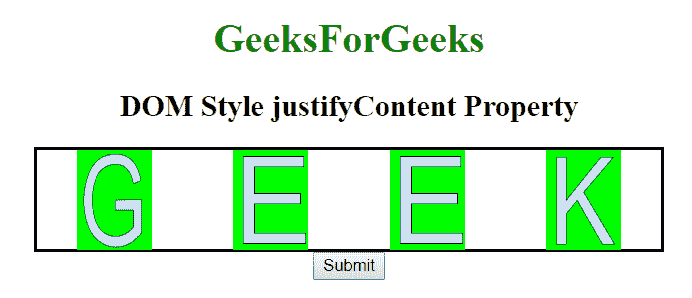
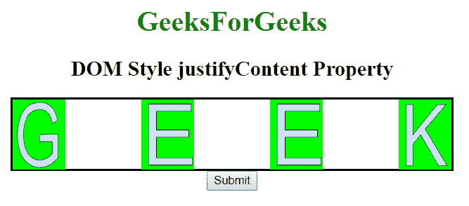
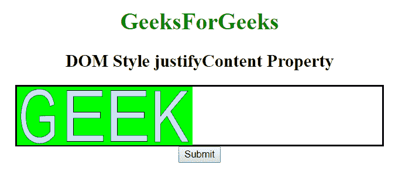

# HTML | DOM 样式调整内容属性

> 原文:[https://www . geesforgeks . org/html-DOM-style-justify content-property/](https://www.geeksforgeeks.org/html-dom-style-justifycontent-property/)

HTML DOM 中的 style **justifyContent** 属性用于在项目无法使用所有可用空间时水平对齐项目。它用于设置元素的位置。默认情况下，项目位于容器的开头。

**语法:**

*   它返回 justifyContent 属性。

    ```html
    object.style.justifyContent 
    ```

*   它用于设置 justifyContent 属性。

    ```html
    object.style.justifyContent = "flex-start|flex-end|center|
    space-between|space-around|initial|inherit"
    ```

**属性值:**

*   **flex-start:** 用于从容器开始对齐 flex 项。
*   **伸缩端:**用于对齐容器末端的伸缩项。
*   **中心:**它在容器中心对齐弯曲项目。
*   **间距:**弹性项目以均匀的间距放置，项目被推到开始，最后一个项目被推到结束。
*   **环绕空间:**弯曲的物品以相等的间距放置，即角落。
*   **间距均匀:**物品之间的间距相等，但与角的间距不同。
*   **初始:**物品按照默认值摆放。
*   **继承:**项目根据其继承的父元素值放置。

**返回值:**返回一个字符串，代表元素的 justifyContent 属性。

**示例 1:** 本示例描述属性值之间的间距。

```html
<!DOCTYPE html> 
<html> 

<head> 
    <title>
        DOM Style justifyContent Property 
    </title> 

    <style>
        #GFG { 
            width:500px;
            display:flex;
            height: 80px;
            border:2px solid black;
            background-color:white;
            justify-content: space-around; 
        }

        #GFG div {
            width: 60px;
            height: 80px;
        }
    </style>
</head> 

<body> 
    <center> 
        <h1 style = "color:green;width:40%;"> 
            GeeksForGeeks 
        </h1> 

        <h2>DOM Style justifyContent Property </h2>         

        <div id = "GFG">
            <div>
                
            </div>

            <div>
                
            </div>

            <div>
                
            </div>

            <div>
                
            </div>

        </div>

        <button type = "button" onclick = "geeks()"> 
            Submit 
        </button> 

        <!-- Style script used here -->
        <script> 
            function geeks() { 
            document.getElementById("GFG").style.justifyContent= "space-between"; 
            } 
        </script> 
    </center> 
</body> 

</html>                    
```

**输出:**
**点击按钮前:**

**点击按钮后:**


**示例 2:** 本示例描述了弹性启动属性值。

```html
<!DOCTYPE html> 
<html> 

<head> 
    <title>
        DOM Style justifyContent Property 
    </title> 

    <style>
        #GFG { 
            width:500px;
            display:flex;
            height: 80px;
            border:2px solid black;
            background-color:white;
            justify-content: space-around; 
        }

        #GFG div {
            width: 60px;
            height: 80px;
        }
    </style>
</head> 

<body> 
    <center> 
        <h1 style = "color:green;width:40%;"> 
            GeeksForGeeks 
        </h1> 

        <h2>DOM Style justifyContent Property </h2>         

        <div id = "GFG">
            <div>
                
            </div>

            <div>
                
            </div>

            <div>
                
            </div>

            <div>
                
            </div>

        </div>

        <button type = "button" onclick = "geeks()"> 
            Submit 
        </button> 

        <!-- Style script used here -->
        <script> 
        function geeks() { 
            document.getElementById("GFG").style.justifyContent= "flex-start"; 
        } 
        </script> 
    </center> 
</body> 

</html>                    
```

**输出:**
**点击按钮前:**

**点击按钮后:**


**支持的浏览器:**以下列出了 *DOM Style justifyContent 属性*支持的浏览器:

*   谷歌 Chrome
*   Internet Explorer 12.0
*   火狐浏览器
*   歌剧