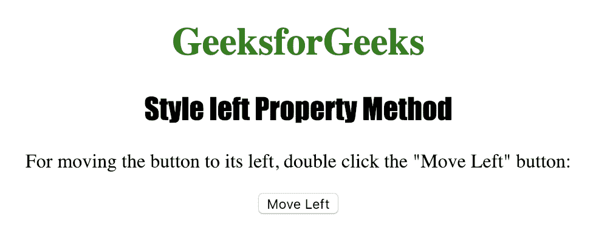
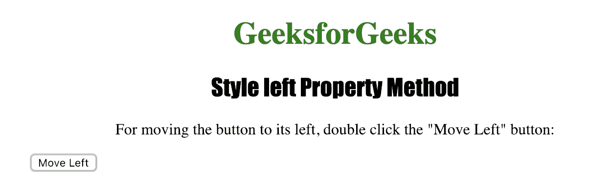

# HTML | DOM 样式左侧属性

> 原文:[https://www.geeksforgeeks.org/html-dom-style-left-property/](https://www.geeksforgeeks.org/html-dom-style-left-property/)

**样式左侧属性**用于设置或返回定位元素的左侧位置。
**样式左侧属性**用于指定元素的左侧位置，包括*填充*、*滚动条*、*边框*和*边距*。

**语法:**

*   获取属性:

    ```html
    object.style.left
    ```

    *   To set the property

    ```html
    object.style.left = "auto|length|%|initial|inherit"
    ```

    **返回值:**返回一个字符串值，代表定位元素的左边位置。

    **属性值:**

    *   **自动:**该值由浏览器自动设置默认左侧值。
    *   **长度:**该值以指定的长度单位设置左值。该指定长度可以是正的，也可以是负的。
    *   **%:** 百分比值以父元素宽度的指定百分比设置左值。
    *   **初始值:**该值将左侧属性设置为浏览器的默认值。
    *   **inherit:** 该值将左侧属性设置为其父元素的值。

    **示例:**设置<按钮>元素的左侧位置。

    ```html
    <!DOCTYPE html>
    <html>

    <head>
        <title>Style left Property Method in HTML</title>
        <style>
            #MyButton {
                position: absolute;
            }

            h1 {
                color: green;
            }

            h2 {
                font-family: Impact;
            }

            body {
                text-align: center;
            }
        </style>
    </head>

    <body onclick="MyEvent(event)">

        <h1>GeeksforGeeks</h1>
        <h2>Style left Property Method</h2>

        <p>For moving the button to its left, 
          double click the "Move Left" button: </p>

        <button type="button" id="MyButton" ondblclick="left()">
            Move Left
        </button>

        <script>
            function left() {

                /* The left property is defined with length value.
                Similarly other values also can be defined
                for this property. */

                document.getElementById("MyButton")
                    .style.left = "100px";
            }
        </script>

    </body>

    </html>
    ```

    **输出:**

    *   **点击按钮前:**
        *   **After clicking the button**
    

    **支持的浏览器:**以下是 *HTML | DOM Style 左属性*支持的浏览器:

    *   谷歌 Chrome
    *   微软公司出品的 web 浏览器
    *   火狐浏览器
    *   苹果 Safari
    *   歌剧