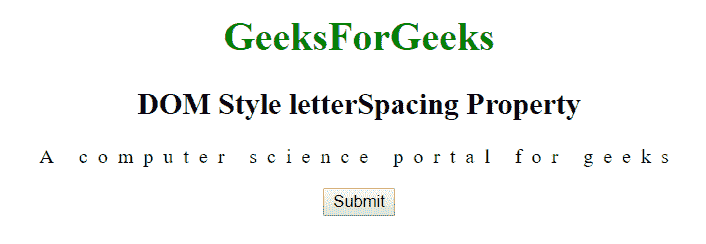
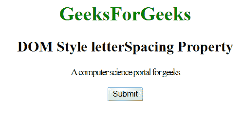

# HTML | DOM 样式字母间距属性

> 原文:[https://www . geesforgeks . org/html-DOM-style-letter spacing-property/](https://www.geeksforgeeks.org/html-dom-style-letterspacing-property/)

HTML DOM 中的 Style **字母间距**属性用于设置字符之间的间距。此属性允许设置字符之间所需的间距，也用于返回字符之间的间距。

**语法:**

*   它返回字母间距属性。

    ```html
    object.style.letterSpacing
    ```

*   它用于设置字母间距属性。

    ```html
    object.style.letterSpacing = "normal|length|initial|inherit"
    ```

**属性值:**

*   **正常:**当前字体的正常间距，即字符之间没有多余的间距。这是默认值。
*   **长度:**除了字符之间的默认间距之外，该模式还指定了额外的字符间间距。也允许负值。
*   **初始值:**将字母间距属性设置为默认值。
*   **inherit:** 该属性从其父元素继承而来。

**返回值:**返回一个字符串，代表字符之间的空格。

**例 1:**

```html
<!DOCTYPE html> 
<html> 
    <head> 
        <title>
            DOM Style letterSpacing Property 
        </title> 
    </head> 

    <body> 
        <center> 
            <h1 style = "color:green;"> 
                GeeksForGeeks 
            </h1> 

            <h2>DOM Style letterSpacing Property </h2>    

            <p id = "GFG">
                A computer science portal for geeks
            </p>

            <button type = "button" onclick = "geeks()"> 
                Submit 
            </button> 

            <script> 
                function geeks() { 
                    document.getElementById("GFG").style.letterSpacing
                            = "8px"; 
                } 
            </script> 
        </center> 
    </body> 
</html>                    
```

**输出:**

*   之前点击按钮:
    
*   点击按钮后:
    

**例 2:**

```html
<!DOCTYPE html> 
<html> 
    <head> 
        <title>
            DOM Style letterSpacing Property 
        </title> 
    </head> 

    <body> 
        <center> 
            <h1 style = "color:green;"> 
                GeeksForGeeks 
            </h1>

            <h2>
                DOM Style letterSpacing Property 
            </h2>

            <p id = "GFG">
                A computer science portal for geeks
            </p>

            <button type = "button" onclick = "geeks()"> 
                Submit 
            </button> 

            <script> 
                function geeks() { 
                    document.getElementById("GFG").style.letterSpacing
                            = "-1.5px"; 
                } 
            </script> 
        </center> 
    </body> 
</html>                    
```

**输出:**

*   之前点击按钮:
    
*   点击按钮后:
    

**支持的浏览器:**由 *DOM Style letterSpacing 属性*支持的浏览器如下:

*   谷歌 Chrome
*   微软公司出品的 web 浏览器
*   火狐浏览器
*   歌剧
*   苹果 Safari