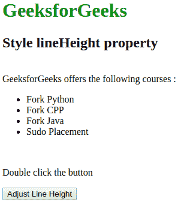
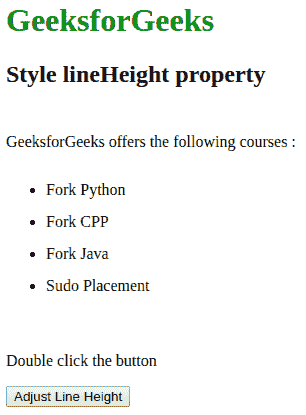

# HTML | DOM 样式行高属性

> 原文:[https://www . geesforgeks . org/html-DOM-style-line height-property/](https://www.geeksforgeeks.org/html-dom-style-lineheight-property/)

**样式行高**属性用于设置或返回文本中各行之间的距离。它是一个字符串，表示文本中各行之间的距离。

**Syntax:**

*   返回行高。

    ```html
    object.style.lineHeight
    ```

    *   To set the line-height.

    ```html
    object.style.lineHeight = "normal|number|length|%|initial|
    inherit"
    ```

    **返回值:**返回一个字符串值，代表文本中各行之间的距离

    **属性值:**

    *   **正常:**用于定义正常高度。
    *   **数字:**用于定义一个将乘以当前字体大小的数字来设置行高。
    *   **长度:**用于定义以长度单位表示的行高。
    *   **% :** 用于定义当前字体大小的行高，单位为%。
    *   **初始值:**用于将该属性设置为默认值。
    *   **inherit :** 用于从其父元素继承该属性。

    下面的程序说明了样式行高属性:
    **示例:**设置< div >元素的行高。

    ```html
    <!DOCTYPE html>
    <html>

    <head>
        <title> Style lineHeight property in HTML</title>
        <style>
            #samplediv {
                border: 1px solid green;
            }

            h1 {
                color: green;
            }

            h2 {
                font-family: Impact;
            }

        </style>
    </head>

    <body>

        <h1>GeeksforGeeks</h1>
        <h2> Style lineHeight property </h2>
        <br>

        <div id="MyDiv">
            GeeksforGeeks offers the following courses :
            <ul>
                <li> Fork Python </li>
                <li> Fork CPP </li>
                <li> Fork Java </li>
                <li> Sudo Placement </li>
            </ul>
        </div>
        <br>
        <p>Double click the button</p>
        <button type="button" ondblclick="lineheight()">
        Adjust Line Height
        </button>

        <script>
            function lineheight() {

                // Set lineHeight.
                document.getElementById(
                "MyDiv").style.lineHeight = 
                "2";
            }
        </script>

    </body>

    </html>                    
    ```

    **输出:**

    *   点击按钮前:
        
    *   点击按钮后:
        

    **支持的浏览器:**

    *   谷歌 Chrome
    *   微软公司出品的 web 浏览器
    *   火狐浏览器
    *   歌剧
    *   苹果 Safari