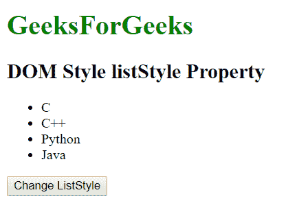

# HTML | DOM 样式列表样式属性

> 原文:[https://www . geesforgeks . org/html-DOM-style-list style-property/](https://www.geeksforgeeks.org/html-dom-style-liststyle-property/)

**Style listStyle Property**

*   列表样式类型
*   列表样式位置
*   列表样式图像

**语法:**

*   它返回列表样式属性。

    ```html
    object.style.listStyle
    ```

*   它用于设置 listStyle 属性。

    ```html
    object.style.listStyle = "type position image|initial|inherit"
    ```

**属性值:**

*   **类型:**用于标记列表项。
*   **位置:**用于定位列表项标记。
*   **图像:**用于定义列表项标记的图像。
*   **初始值:**它将列表样式属性设置为默认值。
*   **inherit:** 该属性从其父元素继承而来。

**返回值:**

*   它返回表示列表样式的字符串。

**示例-1:**

```html
<!DOCTYPE html>
<html>

<head>
    <title>DOM Style listStyle Property </title>
    <style>

    </style>

</head>

<body>

    <h1 style="color:green;width:40%;"> 
                GeeksForGeeks 
            </h1>
    <h2>DOM Style listStyle Property </h2>

    <ul id="gfg">
        <li>C</li>
        <li>C++</li>
        <li>Python</li>
        <li>Java</li>
    </ul>

    <button type="button" onclick="geeks()">
        Change ListStyle
    </button>

    <script>
        function geeks() {

            //  Set listStyle in square.
            document.getElementById(
              "gfg").style.listStyle = 
              "square inside";
        }
    </script>

</body>

</html>
```

**输出:**

*   之前点击按钮:
    
*   点击按钮后:
    

**示例-2:**

```html
<!DOCTYPE html>
<html>

<head>
    <title>DOM Style listStyle Property </title>
    <style>

    </style>

</head>

<body>

    <h1 style="color:green;width:40%;"> 
                GeeksForGeeks 
            </h1>
    <h2>DOM Style listStyle Property </h2>

    <ul id="gfg">
        <li>C</li>
        <li>C++</li>
        <li>Python</li>
        <li>Java</li>
    </ul>

    <button type="button" onclick="geeks()">
        Change ListStyle
    </button>

    <script>
        function geeks() {

            // set listStyle in decimal.
            document.getElementById(
              "gfg").style.listStyle = 
              "decimal inside";
        }
    </script>

</body>

</html>
```

**输出:**

*   之前点击按钮:
    
*   点击按钮后:
    

**支持的浏览器:***DOM Style list Style 属性*支持的浏览器如下:

*   谷歌 Chrome
*   微软公司出品的 web 浏览器
*   火狐浏览器
*   歌剧
*   苹果 Safari