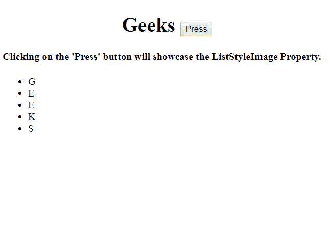
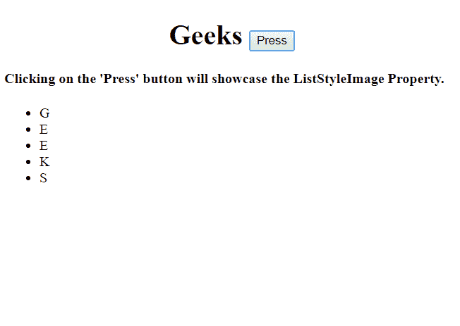
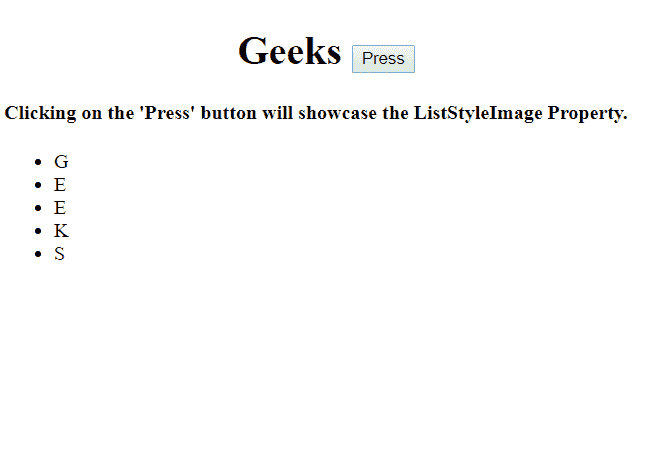
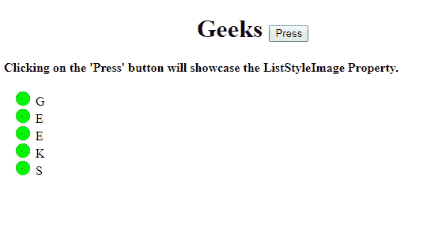
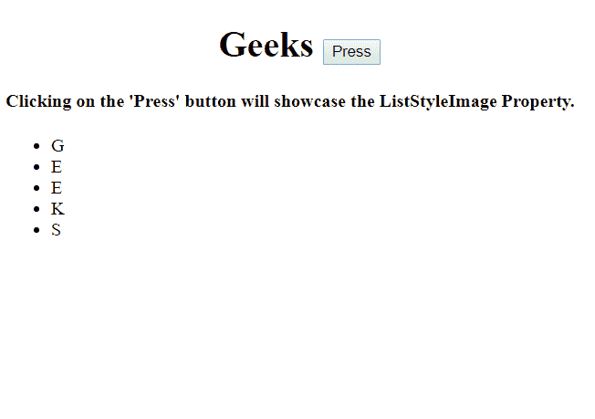
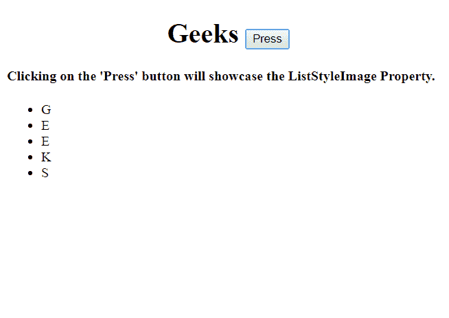

# HTML | DOM 样式列表样式图像属性

> 原文:[https://www . geesforgeks . org/html-DOM-style-list style image-property/](https://www.geeksforgeeks.org/html-dom-style-liststyleimage-property/)

**列表样式图像属性**用于*设置*或*返回*图像作为列表项图标。

**语法:**

*   返回列表样式图像属性:

    ```html
    object.style.listStyleImage
    ```

*   设置列表样式图像属性:

    ```html
    object.style.listStyleImage = "none| url| initial| inherit"
    ```

**属性:**

*   **无:**使用该属性，将不显示图像。
*   **url:** 用于指定图像的路径。
*   **初始值:**用于将属性设置为默认值。
*   **继承:**用于继承父元素的属性值。

**返回值:**返回一个字符串，代表图像的位置路径。

**示例-1:不显示属性**

```html
<!DOCTYPE html>
<html>

<head>
    <title>
        HTML | DOM Style listStyleImage Property
    </title>
</head>

<body>
    <h1>
      <center>
       Geeks <button onclick="image()">Press
      </button>
     </center>
 </h1>

    <h4>Clicking on the 'Press' button will showcase 
      the ListStyleImage Property.</h4>
    <ul id="gfg">
        <li>G</li>
        <li>E</li>
        <li>E</li>
        <li>K</li>
        <li>S</li>
    </ul>

    <script>
        function image() {

            // Set list style "none".
            document.getElementById(
                    "gfg").style.listStyleImage =
                "none";
        }
    </script>

</body>

</html>
```

**输出:**

*   点击按钮前:
    
*   点击按钮后:
    

**示例-2:显示 url 属性**

```html
<!DOCTYPE html>
<html>

<head>
    <title>
        HTML | DOM Style listStyleImage Property
    </title>
</head>

<body>
    <h1>
      <center>
        Geeks <button onclick="image()">Press
        </button>
      </center> 
  </h1>

    <h4>Clicking on the 'Press' button will
      showcase the ListStyleImage Property.</h4>
    <ul id="gfg">
        <li>G</li>
        <li>E</li>
        <li>E</li>
        <li>K</li>
        <li>S</li>
    </ul>

    <script>
        function image() {

            // Set list style image using URL.
            document.getElementById(
                    "gfg").style.listStyleImage =
                "url('https://media.geeksforgeeks.org/wp-content/uploads/rlist.png')";
        }
    </script>

</body>

</html>
```

**输出:**

*   点击按钮前:
    
*   点击按钮后:
    

**示例-3:显示初始属性**

```html
<!DOCTYPE html>
<html>

<head>
    <title>
        HTML | DOM Style listStyleImage Property
    </title>
</head>

<body>
    <h1>
      <center>
        Geeks <button onclick="image()">Press
        </button>
      </center>
  </h1>

    <h4>Clicking on the 'Press' button
     will showcase the ListStyleImage Property.</h4>
    <ul id="gfg">
        <li>G</li>
        <li>E</li>
        <li>E</li>
        <li>K</li>
        <li>S</li>
    </ul>

    <script>
        function image() {

            // Set list style initial.
            document.getElementById(
                    "gfg").style.listStyleImage =
                "initial";
        }
    </script>

</body>

</html>
```

**输出:**

*   点击按钮前:
    
*   点击按钮后:
    

**示例-4:显示继承属性**

```html
<!DOCTYPE html>
<html>

<head>
    <title>
        HTML | DOM Style listStyleImage Property
    </title>
</head>

<body>
    <h1>
      <center>
        Geeks <button onclick="image()">Press
        </button>
      </center>
  </h1>

    <h4>Clicking on the 'Press' button will
      showcase the ListStyleImage Property.</h4>
    <ul id="gfg">
        <li>G</li>
        <li>E</li>
        <li>E</li>
        <li>K</li>
        <li>S</li>
    </ul>

    <script>
        function image() {

            // Set list style inherit.
            document.getElementById(
                    "gfg").style.listStyleImage =
                "inherit";
        }
    </script>

</body>

</html>
```

**输出:**

*   点击按钮前:
    *   After clicking on the button:
    

    **浏览器支持:**浏览器支持的 *DOM 样式列表样式图像*属性如下:

    *   谷歌 Chrome
    *   微软公司出品的 web 浏览器
    *   火狐浏览器
    *   歌剧
    *   旅行队