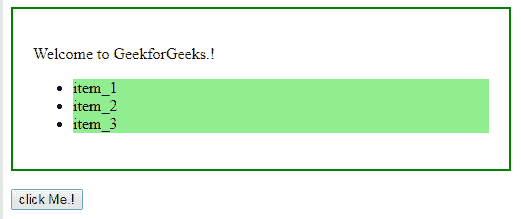
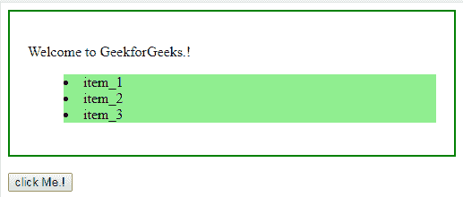
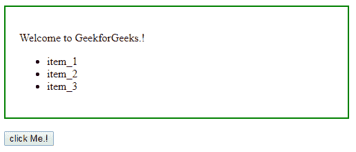
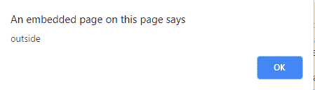

# HTML | DOM 样式列表样式位置属性

> 原文:[https://www . geesforgeks . org/html-DOM-style-list style position-property/](https://www.geeksforgeeks.org/html-dom-style-liststyleposition-property/)

**DOM Style list Style position**属性设置或返回列表项标记的位置。

**语法:**

*   用于设置列表样式位置属性:

    ```html
    object.style.listStylePosition = value

    ```

*   返回列表样式位置属性:

    ```html
    object.style.listStylePosition

    ```

**返回值:**返回代表列表项标记位置的字符串。

**值:**

| 价值 | 描述 |
| 在外面 | 这是默认设置，指定列表项标记将在任何文本内容之前呈现。 |
| 里面的 | 这会缩进列表项标记。 |
| 最初的 | 这会将此属性设置为默认值。 |
| 继承 | 这将从其父元素继承该属性。 |

**例-1:** 使用**“内”**值。

```html
<!DOCTYPE html>
<html>
<head>
    <title>
        HTML | DOM Style listStylePosition Property
    </title>
    <style>
        li {
            background-color: lightgreen;
        }

        div {
            padding: 20px;
            width: 70%;
            heinght: 40%;
            border: 2px solid green;
        }
    </style>
</head>

<body>
    <div>
        <p>Welcome to GeekforGeeks.!</p>

        <ul id="mainUL">
            <li>item_1</li>
            <li>item_2</li>
            <li>item_3</li>
        </ul>
    </div>
    <br>

    <input type="button" value="click Me.!" 
           onclick="mainFunction()" />

    <script>
        function mainFunction() {

            //  set position 'inside'
            document.getElementById(
              "mainUL").style.listStylePosition = "inside";
        }
    </script>

</body>

</html>
```

**输出:**

*   点击前:
    
*   点击后:
    

**例-2:** 使用**“外”**值。因为这是默认值，所以我们可以通过简单地返回列表样式位置属性来检查。

```html
<!DOCTYPE html>
<html>
<head>
    <title>
        HTML | DOM Style listStylePosition Property
    </title>
    <style>
        div {
            padding: 20px;
            width: 70%;
            height: 40%;
            border: 2px solid green;
        }
    </style>
</head>

<body>
    <div>
        <p>Welcome to GeekforGeeks.!</p>

        <!--  set position 'outside'  -->
        <ul id="mainList" 
            style="list-style-position:outside;">
            <li>item_1</li>
            <li>item_2</li>
            <li>item_3</li>
        </ul>

        <br>
        <input type="button" value="click Me.!" 
               onclick="mainFunction()" />
    </div>

    <script>
        function mainFunction() {

            //  Return position using alert.
            alert(document.getElementById(
              "mainList").style.listStylePosition);
        }
    </script>

</body>

</html>
```

**输出:**

*   点击前:
    *   After click:
    

    **支持的浏览器:**以下列出了*HTML | DOM Style list Style position Property*支持的浏览器:

    *   谷歌 Chrome
    *   边缘
    *   Mozilla Firefox
    *   歌剧
    *   旅行队