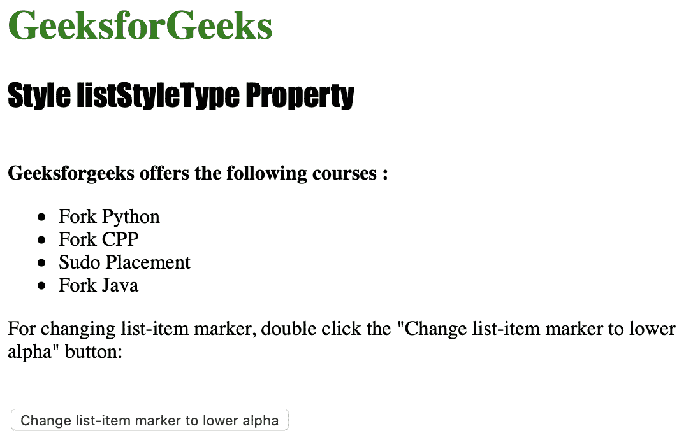
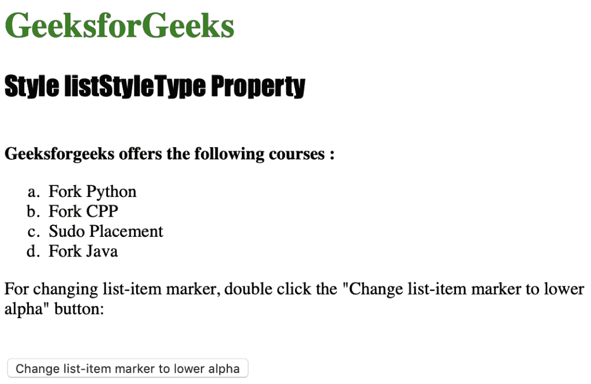

# HTML | DOM 样式列表样式属性

> 原文:[https://www . geesforgeks . org/html-DOM-style-list style-property/](https://www.geeksforgeeks.org/html-dom-style-liststyletype-property/)

样式**列表样式类型**属性用于设置或返回列表项标记类型。
默认值为< ul >的“disc”和< ol >的“decimal”，并返回一个代表列表类型的字符串。

**语法:**

*   获取属性:

    ```html
    object.style.listStyleType
    ```

*   设置属性:

    ```html
    object.style.listStyleType = value"
    ```

**返回值:**返回一个字符串值，代表列表的类型

**属性值:**

*   **亚美尼亚语:**用于表示亚美尼亚传统编号中的标记。
*   **圆圈:**用于表示圆圈中的标记。
*   **小数:**用于表示十进制格式的标记。
*   **lower-alpha:** 用于表示 lower-alpha 中的标记(a、b、c、d、e 等)。
*   **下罗马语:**用于表示下罗马语(I、ii、iii、iv、v 等)中的标记。

下面的程序说明了样式列表样式类型属性方法:

**示例:将列表项标记类型更改为“下阿尔法”。**

```html
<!DOCTYPE html>
<html>

<head>
    <title>Style listStyleType Property in HTML</title>
    <style>
        h1 {
            color: green;
        }

        h2 {
            font-family: Impact;
        }
    </style>
</head>

<body>

    <h1>GeeksforGeeks</h1>
    <h2>Style listStyleType Property</h2>
    <br>

    <b>Geeksforgeeks offers the following courses :</b>

    <ul id="courses">
        <li>Fork Python</li>
        <li>Fork CPP</li>
        <li>Sudo Placement</li>
        <li>Fork Java</li>
    </ul>

    <p>For changing list-item marker, 
      double click the 
      "Change list-item marker to lower alpha" 
      button: </p>
    <br>

    <button type="button" ondblclick="list()">
        Change list-item marker to lower alpha
    </button>

    <script>
        function list() {
            document.getElementById("courses")
                .style.listStyleType = "lower-alpha";
        }
    </script>

</body>

</html>    
```

**输出:**

*   Before Clicking the button:

    

*   点击
    按钮后

**支持的浏览器:**以下列出了*HTML | DOM Style list Style Property
T4】支持的浏览器:*

*   谷歌 Chrome
*   微软公司出品的 web 浏览器
*   火狐浏览器
*   歌剧
*   苹果 Safari