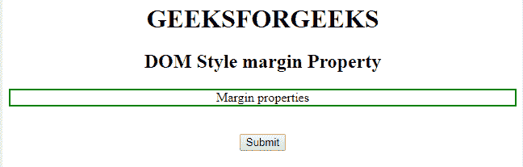
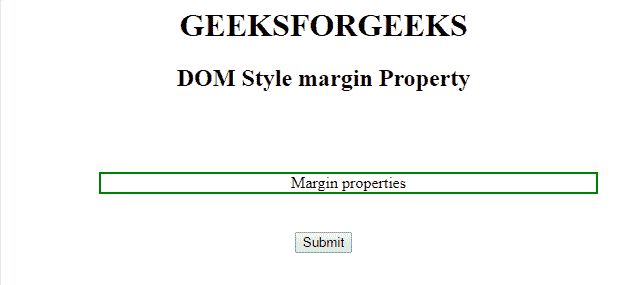
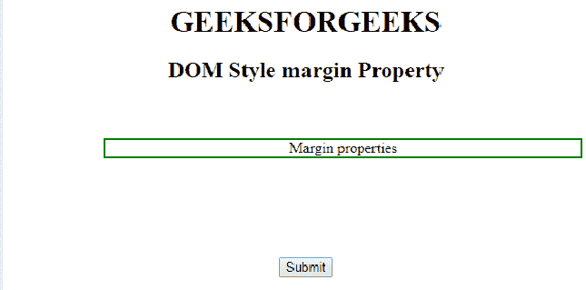
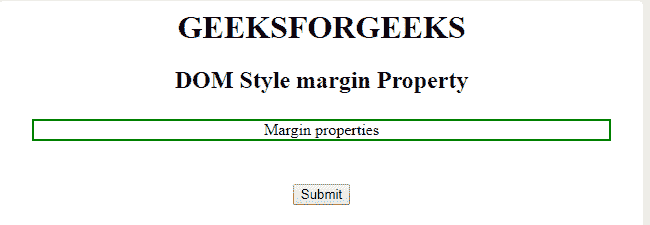

# HTML | DOM 样式边距属性

> 原文:[https://www . geesforgeks . org/html-DOM-style-margin-property/](https://www.geeksforgeeks.org/html-dom-style-margin-property/)

**DOM 样式边距属性**用于设置或返回元素的边距。我们可以为各个边(上、右、下、左)设置不同的边距大小。
边距属性可以有以下值:

1.  长度单位为厘米、像素、像素等。
2.  元素的宽度%。
3.  浏览器计算的利润:自动。

**语法:**

*   它用于设置边距属性。

```html
object.style.margin = "%|length|auto|initial|inherit" 
```

*   它用于获取边距属性。

```html
object.style.margin 
```

**属性值:**

<figure class="table">

| value | describe |
| % | Defines the length percentage relative to the parent element. |
| length | Defines the length in length units. |
| automatic | Is the default value. |
| initial | Define the initial default value. |
| inherit | Inherit from parent element. |

</figure>

**返回值:**返回一个字符串值，代表元素的上边距、右边距、下边距、左边距。
**示例-1:** Margin 属性设置为四个值 80px 40px 20px 90px，表示顶部= 80px，
右侧= 40px，底部= 20px，左侧= 90px。

## 超文本标记语言

```html
<html>

<head>
    <title>
        HTML | DOM Style margin Property
    </title>
    <style>
        h1 {
            coor: green;
        }

        #GFG {
            border: 2px solid green;
        }
    </style>
</head>

<body>
    <center>
        <h1>
        GEEKSFORGEEKS
    </h1>
        <h2>
        DOM Style margin Property
    </h2>
        <p id="GFG">
            Margin properties
        </p>

        <br>
        <BUTTON ONCLICK="Geeks()">Submit</BUTTON>
        <script>
            function Geeks() {
                document.getElementById("GFG").style.margin =
                                        "80px 40px 20px 90px";
            }
        </script>

</body>

</html>                                
```

**输出:**

*   点击按钮前:



*   点击按钮后:



**例-2:** 将四个边距全部改为单个边距*边距:25px*表示*顶部、右侧、底部和左侧= 25px*

## 超文本标记语言

```html
<html>

<head>
    <title>
        HTML | DOM Style margin Property
    </title>
    <style>
        h1 {
            coor: green;
        }

        #GFG {
            border: 2px solid green;
            margin: 60px 20px 90px 100px;
        }
    </style>
</head>

<body>
    <center>
        <h1>
        GEEKSFORGEEKS
    </h1>
        <h2>
        DOM Style margin Property
    </h2>
        <p id="GFG">
            Margin properties
        </p>

        <br>
        <BUTTON ONCLICK="Geeks()">Submit</BUTTON>
        <script>
            function Geeks() {
                document.getElementById("GFG").style.margin =
                                                      "25px";
            }
        </script>

</body>

</html>

```

**输出:**

*   在点击按钮之前:



*   点击按钮后:



**支持的浏览器:***DOM Style 边距属性*支持的浏览器如下:

*   谷歌 Chrome 1.0
*   Internet Explorer 4.0
*   Firefox 1.0
*   歌剧 3.5
*   苹果 Safari 1.0