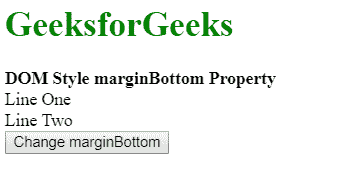
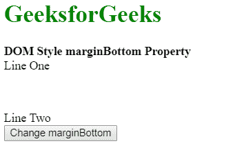

# HTML | DOM 样式边框底部属性

> 原文:[https://www . geesforgeks . org/html-DOM-style-marginbottom-property/](https://www.geeksforgeeks.org/html-dom-style-marginbottom-property/)

HTML DOM 中的**样式边距底部属性**用于设置或返回元素的底部边距。

**语法:**

*   它返回元素的下边距。

    ```html
    object.style.marginBottom
    ```

*   它用于设置元素的下边距。

    ```html
    object.style.marginBottom = "length|percentage|auto|initial|
    inherit"
    ```

**返回值:**返回一个字符串值，代表一个元素的下边距。

**属性值:**

*   **length:** It is used to set margin to fixed units. Its default value is 0.

    **示例:**

    ```html
    <!DOCTYPE html>
    <html>

    <head>
        <title>
            DOM Style marginBottom Property
        </title>
    </head>

    <body>
        <h1 style="color: green">
            GeeksforGeeks
        </h1>

        <b>DOM Style marginBottom Property</b>

        <div class="container">
            <div class="div1">Line One</div>
            <div class="div2">Line Two</div>

            <button onclick="setMargin()">
                Change marginBottom
            </button>
        </div>

        <!-- Script to set bottom margin -->
        <script>
            function setMargin() {
                elem = document.querySelector('.div1');
                elem.style.marginBottom = '50px';
            }
        </script>
    </body>

    </html>                    
    ```

    **输出:**
    **点击按钮前:**
    
    **点击按钮后:**
    

*   **percentage:** It is used to specify the amount of margin as a percentage relative to the width of the containing element.
    **Example:**

    ```html
    <!DOCTYPE html>
    <html>

    <head>
        <title>
            DOM Style marginBottom Property
        </title>
    </head>

    <body>
        <h1 style="color: green">
            GeeksforGeeks
        </h1>

        <b>DOM Style marginBottom Property</b>

        <div class="container">
            <div class="div1">Line One</div>
            <div class="div2">Line Two</div>

            <button onclick="setMargin()">
                Change marginBottom
            </button>
        </div>

        <!-- Script to set bottom margin -->
        <script>
            function setMargin() {
                elem = document.querySelector('.div1');
                elem.style.marginBottom = '10%';
            }
        </script>
    </body>

    </html>                    
    ```

    **输出:**
    **点击按钮前:**
    
    **点击按钮后:**
    

*   **auto:** If the value is set to ‘auto’, then the browser automatically calculates a suitable value for the margin size.
    **Example:**

    ```html
    <!DOCTYPE html>
    <html>

    <head>
        <title>
            DOM Style marginBottom Property
        </title>
    </head>

    <body>
        <h1 style="color: green">
            GeeksforGeeks
        </h1>

        <b>DOM Style marginBottom Property</b>

        <div class="container">

            <div class="div1" style="margin-bottom:50px;">
                Line One
            </div>

            <div class="div2">
                Line Two
            </div>

            <button onclick="setMargin()">
                Change marginBottom
            </button>
        </div>

        <!-- Script to set bottom margin -->
        <script>
            function setMargin() {
                elem = document.querySelector('.div1');
                elem.style.marginBottom = 'auto';
            }
        </script>
    </body>

    </html>                    
    ```

    **输出:**
    **点击按钮前:**
    
    **点击按钮后:**
    

*   **initial:** This is used to set the property to its default value.
    **Example:**

    ```html
    <!DOCTYPE html>
    <html>

    <head>
        <title>
            DOM Style marginBottom Property
        </title>
    </head>

    <body>
        <h1 style="color: green">
            GeeksforGeeks
        </h1>

        <b>DOM Style marginBottom Property</b>

        <div class="container">

            <div class="div1" style="margin-bottom:50px;">
                Line One
            </div>

            <div class="div2">
                Line Two
            </div>

            <button onclick="setMargin()">
                Change marginBottom
            </button>
        </div>

        <!-- Script to set bottom margin -->
        <script>
            function setMargin() {
                elem = document.querySelector('.div1');
                elem.style.marginBottom = 'initial';
            }
        </script>
    </body>

    </html>                    
    ```

    **输出:**
    **点击按钮前:**
    
    **点击按钮后:**
    

*   **inherit:** This is used to inherit the value from the element’s parent.
    **Example:**

    ```html
    <!DOCTYPE html>
    <html>

    <head>
        <title>
            DOM Style marginBottom Property
        </title>
    </head>

    <body>
        <h1 style="color: green">
            GeeksforGeeks
        </h1>

        <b>DOM Style marginBottom Property</b>

        <div class="container" style="margin-bottom:50px;">

            <div class="div1">
                Line One
            </div>

            <div class="div2">
                Line Two
            </div>

            <button onclick="setMargin()">
                Change marginBottom
            </button>
        </div>

        <!-- Script to set bottom margin -->
        <script>
            function setMargin() {
                elem = document.querySelector('.div1');
                elem.style.marginBottom = 'inherit';
            }
        </script>
    </body>

    </html>                    
    ```

    **输出:**
    **点击按钮前:**
    
    **点击按钮后:**
    

**支持的浏览器:**T2 DOM Style marginBottom 属性支持的浏览器如下:

*   谷歌 Chrome
*   微软公司出品的 web 浏览器
*   火狐浏览器
*   歌剧
*   旅行队