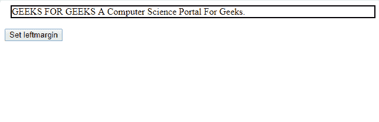

# HTML | DOM 样式边距属性

> 原文:[https://www . geesforgeks . org/html-DOM-style-margin left-property/](https://www.geeksforgeeks.org/html-dom-style-marginleft-property/)

**DOM Style marginLeft** 属性用于设置或获取元素的左边距。边距用于在边框周围插入空间，而不是用于在元素边框内插入空间的填充。

**语法:**

*   要设置余量:

    ```html
    object.style.marginLeft='%|length|auto|initial|inherit'

    ```

*   要返回余量:

    ```html
    object.style.marginLeft

    ```

**值:**

| 价值 | 描述 |
| % | 它用于定义左边距占其父级宽度的百分比 |
| 长度 | 它用于根据长度单位定义左边距 |
| 汽车 | 当希望由浏览器设置左边距时使用 |
| 最初的 | 它用于将属性值设置为默认值。 |
| 继承 | 继承该属性的值，即设置与父属性相同的值 |

**默认值:**该属性的默认值为 0。

**返回值:**代表左边距的字符串。

**例-1:** 返回左边距。

```html
<!DOCTYPE html>
<html>

<head>
    <title>     
        HTML | DOM Style marginLeft Property
    </title>
    <style>
        #d {
            border: 2px solid black;
        }
    </style>
</head>

<body>

    <div id="d" style="margin-left:3cm;">
      GEEKS FOR GEEKS  A Computer Science Portal For Geeks.
    </div>
    <br>
    <button type="button" onclick="myFunction()">
        Return left margin
    </button>

    <script>
        function myFunction() {
            // Returning left margin.
            alert(document.getElementById("d").style.marginLeft);
        }
    </script>

</body>

</html>
```

**输出:**

*   点击按钮前:
    
*   点击按钮后:
    

**示例-2:** 使用长度单位设置左边距。

```html
<!DOCTYPE html>
<html>

<head>
    <title>     
        HTML | DOM Style marginLeft Property
    </title>
    <style>
        #d {
            border: 2px solid black;
        }
    </style>
</head>

<body>

    <div id="d">
      GEEKS FOR GEEKS A Computer Science Portal For Geeks.
    </div>
    <br>

    <button type="button" onclick="myFunction()">
      Set leftmargin
    </button>

    <script>
        function myFunction() {

            //  Set left margin.
            document.getElementById("d").style.marginLeft = "10px";
        }
    </script>

</body>

</html>
```

**输出:**

*   点击按钮前:
    
*   点击按钮后:
    

**示例-3:** 使用百分比设置左边距。

```html
<!DOCTYPE html>
<html>

<head>
    <title>     
        HTML | DOM Style marginLeft Property
    </title>
    <style>
        #d {
            border: 2px solid black;
        }
    </style>
</head>

<body>

    <div id="d">
      GEEKS FOR GEEKS A Computer Science Portal For Geeks.
    </div>
    <br>

    <button type="button" onclick="myFunction()">
      Set leftmargin
    </button>

    <script>
        function myFunction() {

            //  Set left margin.
            document.getElementById("d").style.marginLeft = "10%";
        }
    </script>

</body>

</html>
```

**输出:**

*   点击按钮前:
    
*   点击按钮后:
    

**支持的浏览器:**以下列出了*HTML | DOM Style margin left Property*支持的浏览器:

*   谷歌 Chrome
*   边缘
*   Mozilla Firefox
*   歌剧
*   旅行队