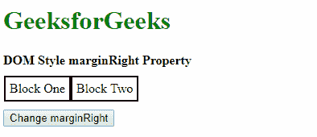
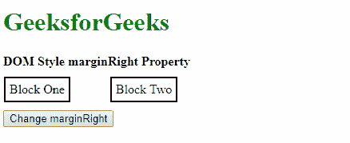
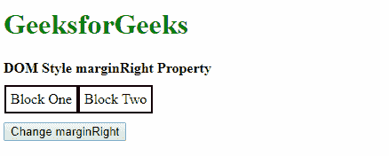
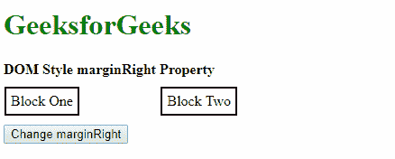
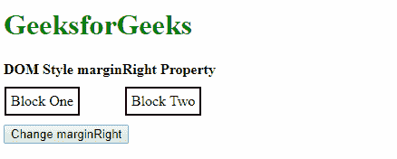
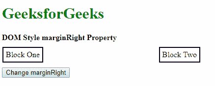
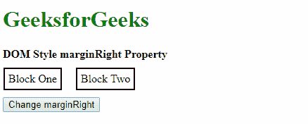
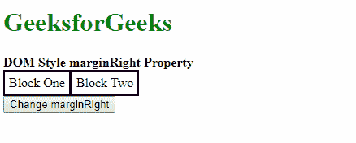
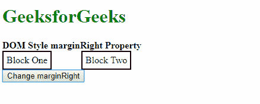

# HTML | DOM 样式边距右侧属性

> 原文:[https://www . geesforgeks . org/html-DOM-style-margin right-property/](https://www.geeksforgeeks.org/html-dom-style-marginright-property/)

HTML DOM 中的**样式边距右边属性**用于设置或返回元素的右边距。

**语法:**

*   它返回 marginRight 属性。

    ```html
    object.style.marginRight
    ```

*   它用于设置余量微调属性。

    ```html
    object.style.marginRight = "length|percentage|auto|initial|
    inherit"
    ```

**返回值:**返回一个字符串值，代表一个元素的右边距。

**属性值:**

*   **length:** It is used to specify the margin in fixed length units. The default value is 0.

    **示例:**

    ```html
    <!DOCTYPE html>
    <html>

    <head>
        <title>
            DOM Style marginRight Property
        </title>

        <style>
            .container {
                display: flex;
                flex-direction: row;
                padding: 10px 1px;
            }

            .div1, .div2 {
                padding: 5px;
                border: 2px solid;
            }
        </style>
    </head>

    <body>
        <h1 style="color: green">
            GeeksforGeeks
        </h1>

        <b>DOM Style marginRight Property</b>

        <div class="container">
            <div class="div1">Block One</div>
            <div class="div2">Block Two</div>
        </div>

        <button onclick="setMargin()">
            Change marginRight
        </button>

        <!-- Script to set marginRight to a fixed value -->
        <script>
            function setMargin() {
                elem = document.querySelector('.div1');
                elem.style.marginRight = '50px';
            }
        </script>
    </body>

    </html>                    
    ```

    **输出:**

    *   点击按钮前:
        
    *   点击按钮后:
        
*   **percentage:** It is used to specify the amount of margin as a percentage relative to the width of the containing element.
    **Example:**

    ```html
    <!DOCTYPE html>
    <html>

    <head>
        <title>
            DOM Style marginRight Property
        </title>

        <style>
            .container {
                display: flex;
                flex-direction: row;
                padding: 10px 1px;
            }

            .div1, .div2 {
                padding: 5px;
                border: 2px solid;
            }
        </style>
    </head>

    <body>
        <h1 style="color: green">
            GeeksforGeeks
        </h1>

        <b>DOM Style marginRight Property</b>

        <div class="container">
            <div class="div1">Block One</div>
            <div class="div2">Block Two</div>
        </div>

        <button onclick="setMargin()">
            Change marginRight
        </button>

        <!-- Script to set marginRight to a fixed value -->
        <script>
            function setMargin() {
                elem = document.querySelector('.div1');
                elem.style.marginRight = '20%';
            }
        </script>
    </body>

    </html>                    
    ```

    **输出:**

    *   点击按钮前:
        
    *   点击按钮后:
        
*   **auto:** If the value is set to ‘auto’, then the browser automatically calculates a suitable value for the margin size.

    **示例:**

    ```html
    <!DOCTYPE html>
    <html>

    <head>
        <title>
            DOM Style marginRight Property
        </title>

        <style>
            .container {
                display: flex;
                flex-direction: row;
                padding: 10px 1px;
            }

            .div1, .div2 {
                margin-right: 50px;
                padding: 5px;
                border: 2px solid;
            }
        </style>
    </head>

    <body>
        <h1 style="color: green">
            GeeksforGeeks
        </h1>

        <b>DOM Style marginRight Property</b>

        <div class="container">
            <div class="div1">Block One</div>
            <div class="div2">Block Two</div>
        </div>

        <button onclick="setMargin()">
            Change marginRight
        </button>

        <!-- Script to set marginRight to auto -->
        <script>
            function setMargin() {
                elem = document.querySelector('.div1');
                elem.style.marginRight = 'auto';
            }
        </script>
    </body>

    </html>                    
    ```

    **输出:**

    *   点击按钮前:
        
    *   点击按钮后:
        
*   **initial:** It is used to set the property to its default value.

    **示例:**

    ```html
    <!DOCTYPE html>
    <html>

    <head>
        <title>
            DOM Style marginRight Property
        </title>

        <style>
            .container {
                display: flex;
                flex-direction: row;
                padding: 10px 1px;
            }

            .div1, .div2 {
                margin-right: 20px;

                padding: 5px;
                border: 2px solid;
            }
        </style>
    </head>

    <body>
        <h1 style="color: green">
            GeeksforGeeks
        </h1>

        <b>DOM Style marginRight Property</b>

        <div class="container">
            <div class="div1">Block One</div>
            <div class="div2">Block Two</div>
        </div>

        <button onclick="setMargin()">
            Change marginRight
        </button>

        <!-- Script to set marginRight to initial -->
        <script>
            function setMargin() {
                elem = document.querySelector('.div1');
                elem.style.marginRight = 'initial';
            }
        </script>
    </body>

    </html>                    
    ```

    **输出:**

    *   点击按钮前:
        
    *   点击按钮后:
        
*   **inherit:** It is used to inherit the value from its parent element.

    **示例:**

    ```html
    <!DOCTYPE html>
    <html>

    <head>
        <title>
            DOM Style marginRight Property
        </title>

        <style>
            .container {
                margin-right: 50px;
                display: flex;
                flex-direction: row;
            }

            .div1, .div2 {
                padding: 5px;
                border: 2px solid;
            }
        </style>
    </head>

    <body>
        <h1 style="color: green">
            GeeksforGeeks
        </h1>

        <b>DOM Style marginRight Property</b>

        <div class="container">
            <div class="div1">Block One</div>
            <div class="div2">Block Two</div>
        </div>

        <button onclick="setMargin()">
            Change marginRight
        </button>

        <!-- Script to set marginRight to inherit -->
        <script>
            function setMargin() {
                elem = document.querySelector('.div1');
                elem.style.marginRight = 'inherit';
            }
        </script>
    </body>

    </html>                    
    ```

    **输出:**

    *   点击按钮前:
        
    *   点击按钮后:
        

    **支持的浏览器:**由 *DOM Style marginRight* 属性支持的浏览器如下:

    *   谷歌 Chrome
    *   微软公司出品的 web 浏览器
    *   火狐浏览器
    *   歌剧
    *   旅行队