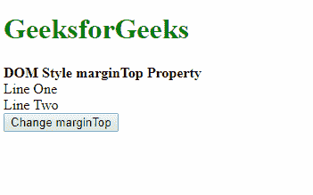
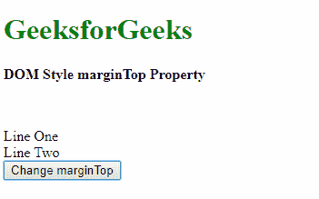
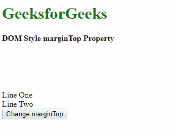
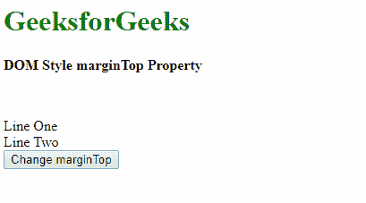
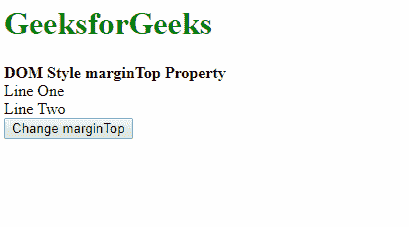

# HTML | DOM 样式边距属性

> 原文:[https://www . geesforgeks . org/html-DOM-style-margin top-property/](https://www.geeksforgeeks.org/html-dom-style-margintop-property/)

HTML DOM 中的**样式边距属性**用于设置或返回元素的上边距。

**语法:**

*   它返回 marginTop 属性。

    ```html
    object.style.marginTop
    ```

*   它用于设置 marginTop 属性。

    ```html
    object.style.marginTop = "length|percentage|auto|initial|
    inherit"
    ```

**返回值:**它返回一个代表元素上边距的字符串值

**属性值:**

*   **length:** It is used to specify the margin in fixed units. Its default value is 0.

    **示例:**

    ```html
    <!DOCTYPE html>
    <html>

    <head>
        <title>
            DOM Style marginTop Property
        </title>
    </head>

    <body>
        <h1 style="color: green">
            GeeksforGeeks
        </h1>

        <b>DOM Style marginTop Property</b>

        <div class="container">
            <div class="div1">Line One</div>
            <div class="div2">Line Two</div>

            <button onclick="setMargin()">
                Change marginTop
            </button>
        </div>

        <!-- Script to set top margin -->
        <script>
            function setMargin() {
                elem = document.querySelector('.div1');
                elem.style.marginTop = '50px';
            }
        </script>
    </body>

    </html>                    
    ```

    **输出:**

    *   Before clicking the button:
        

        点击按钮后:
        

*   **percentage:** It is used to specify the amount of margin as a percentage relative to the width of the containing element.

    **示例:**

    ```html
    <!DOCTYPE html>
    <html>

    <head>
        <title>
            DOM Style marginTop Property
        </title>
    </head>

    <body>
        <h1 style="color: green">
            GeeksforGeeks
        </h1>

        <b>DOM Style marginTop Property</b>

        <div class="container">
            <div class="div1">Line One</div>
            <div class="div2">Line Two</div>

            <button onclick="setMargin()">
                Change marginTop
            </button>
        </div>

        <!-- Script to set top margin -->
        <script>
            function setMargin() {
                elem = document.querySelector('.div1');
                elem.style.marginTop = '20%';
            }
        </script>
    </body>

    </html>                    
    ```

    **输出:**

    *   点击按钮前:
        
    *   点击按钮后:
        
*   **auto:** If the value is set to ‘auto’, then the browser automatically calculates a suitable value for the margin size.

    **示例:**

    ```html
    <!DOCTYPE html>
    <html>

    <head>
        <title>
            DOM Style marginTop Property
        </title>
    </head>

    <body>
        <h1 style="color: green">
            GeeksforGeeks
        </h1>

        <b>DOM Style marginTop Property</b>

        <div class="container">
            <div class="div1" style="margin-top: 50px;">
                Line One
            </div>

            <div class="div2">
                Line Two
            </div>

            <button onclick="setMargin()">
                Change marginTop
            </button>
        </div>

        <!-- Script to set top margin -->
        <script>
            function setMargin() {
                elem = document.querySelector('.div1');
                elem.style.marginTop = 'auto';
            }
        </script>
    </body>

    </html>                    
    ```

    **输出:**

    *   Before clicking the button:
        

        点击按钮后:
        

*   **initial:** It is used to set the property to its default value.

    **示例:**

    ```html
    <!DOCTYPE html>
    <html>

    <head>
        <title>
            DOM Style marginTop Property
        </title>
    </head>

    <body>
        <h1 style="color: green">
            GeeksforGeeks
        </h1>

        <b>DOM Style marginTop Property</b>

        <div class="container">

            <div class="div1" style="margin-top: 50px;">
                Line One
            </div>

            <div class="div2">
                Line Two
            </div>

            <button onclick="setMargin()">
                Change marginTop
            </button>
        </div>

        <!-- Script to set top margin -->
        <script>
            function setMargin() {
                elem = document.querySelector('.div1');
                elem.style.marginTop = 'initial';
            }
        </script>
    </body>

    </html>                    
    ```

    **输出:**

    *   点击按钮前:
        
    *   点击按钮后:
        
*   **inherit:** It is used to inherit the value from its parent element.

    **示例:**

    ```html
    <!DOCTYPE html>
    <html>

    <head>
        <title>
            DOM Style marginTop Property
        </title>
    </head>

    <body>
        <h1 style="color: green">
            GeeksforGeeks
        </h1>

        <b>DOM Style marginTop Property</b>

        <div class="container">
            <div class="div1" style="margin-top: 50px;">
                Line One
            </div>

            <div class="div2">
                Line Two
            </div>

            <button onclick="setMargin()">
                Change marginTop
            </button>
        </div>

        <!-- Script to set top margin -->
        <script>
            function setMargin() {
                elem = document.querySelector('.div1');
                elem.style.marginTop = 'inherit';
            }
        </script>
    </body>

    </html>                    
    ```

    **输出:**

*   点击按钮前:
    
*   点击按钮后:
    

**支持的浏览器:**由 *DOM Style marginTop 属性*支持的浏览器如下:

*   谷歌 Chrome
*   微软公司出品的 web 浏览器
*   火狐浏览器
*   歌剧
*   旅行队