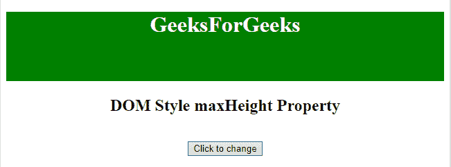
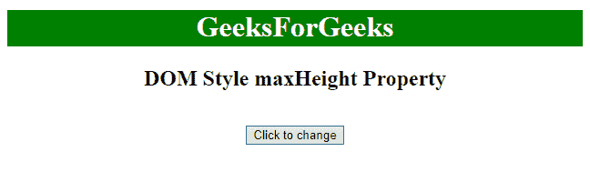
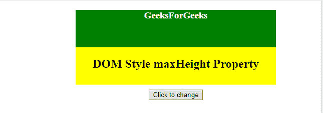
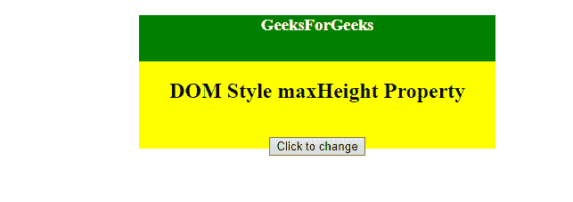

# HTML | DOM Style maxHeight 属性

> 原文:[https://www . geesforgeks . org/html-DOM-style-maxheight-property/](https://www.geeksforgeeks.org/html-dom-style-maxheight-property/)

**最大高度属性**设置/返回元素的**最大高度**。
最大高度属性仅影响*块级元素*、*绝对*或*固定位置*元素。

**语法:**

*   用于设置最大高度属性:

    ```html
    object.style.maxHeight = "none|length|%|initial|inherit"

    ```

*   它用于返回 maxHeight 属性:

```html
object.style.maxHeight

```

**返回值:**返回一个字符串，代表一个元素的最大高度

**示例-1:** 使用长度单位设置元素的最大高度。

```html
<!DOCTYPE html>
<html>

<head>
    <title>DOM Style maxHeight Property </title>
</head>
<style>
    #Geek1 {
        color: white;
        height: 100px;
        background: green;
    }
</style>

<body>
    <center>
        <h1 id="Geek1"> 
                GeeksForGeeks 
            </h1>
        <h2>DOM Style maxHeight Property </h2>
        <br>
        <button type="button" onclick="mygeeks()">
            Click to change
        </button>

        <script>
            function mygeeks() {

                // Set maximum height using 
                // Using length unit.
                document.getElementById(
                  "Geek1").style.maxHeight =
                  "40px";
            }
        </script>
    </center>
</body>

</html>
```

**输出**

*   之前点击按钮:
    
*   点击按钮后:
    

**示例-2:** 使用**「%」**设置最大高度

```html
<!DOCTYPE html>
<html>

<head>
    <title>DOM Style maxHeight Property </title>
</head>
<style>
    #Geek1 {
        color: white;
        height: 50%;
        background: green;
    }

    #Geek_Center {
        background: yellow;
        width: 400px;
        height: 150px;
        margin-left: 150px;
        text-align: center;
    }
</style>

<body>
    <div id="Geek_Center">
        <h3 id="Geek1"> 
                GeeksForGeeks 
            </h3>
        <h2>DOM Style maxHeight Property </h2>
        <br>
        <button type="button" onclick="mygeeks()">
            Click to change
        </button>
    </div>
    <script>
        function mygeeks() {

            //set maximum height.
            document.getElementById(
              "Geek1").style.maxHeight = "35%";
        }
    </script>
</body>

</html>
```

**输出**

*   之前点击按钮:
    
*   点击按钮后:
    

**支持的浏览器:**以下是*HTML | DOM Style maxHeight Property*T4】支持的浏览器:

*   谷歌 Chrome
*   边缘
*   Mozilla Firefox
*   歌剧
*   旅行队