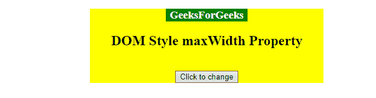

# HTML | DOM 样式最大宽度属性

> 原文:[https://www . geesforgeks . org/html-DOM-style-maxwidth-property/](https://www.geeksforgeeks.org/html-dom-style-maxwidth-property/)

**最大宽度属性**设置/返回元素的最大宽度。
**最大宽度属性**仅影响块级元素，绝对或固定位置元素。

**语法:**

*   它返回 maxWidth 属性。

    ```html
    object.style.maxWidth

    ```

*   它设置最大宽度属性。

```html
object.style.maxWidth = "none|length|%|initial|inherit"

```

**值:**

| 价值 | 描述 |
| 没有人 | 对元素宽度没有任何限制的默认值 |
| 长度 | 以长度单位定义宽度的最大值 |
| % | 以父元素的百分比定义宽度的最大值 |
| 最初的 | 将属性设置为默认值 |
| 继承 | 从其父元素继承 |

**返回值:**返回元素的最大宽度。

**示例-1:** 以长度单位设置宽度。

```html
<!DOCTYPE html>
<html>

<head>
    <title>DOM Style maxWidth Property </title>
</head>
<style>
    #Geek1 {
        color: white;
        width: 300px;
        background: green;
    }
</style>

<body>
    <center>
        <h1 id="Geek1"> 
                GeeksForGeeks 
            </h1>

        <h2>DOM Style maxWidth Property </h2>
        <br>
        <button type="button" onclick="mygeeks()">
            Click to change
        </button>

        <script>
            function mygeeks() {

                //  set width using length unit.
                document.getElementById(
                  "Geek1").style.maxWidth = "220px";
            }
        </script>
    </center>
</body>

</html>
```

**输出:**

*   点击按钮前:
    
*   点击按钮后:
    

**示例-2:** 以“%”为单位设置宽度。

```html
<!DOCTYPE html>
<html>

<head>
    <title>DOM Style maxWidth Property </title>
</head>
<style>
    #Geek1 {
        color: white;
        width: 50%;
        background: green;
    }

    #Geek_Center {
        background: yellow;
        width: 400px;
        margin-left: 150px;
    }
</style>

<body>
    <center id="Geek_Center">
        <h3 id="Geek1"> 
                GeeksForGeeks 
            </h3>

        <h2>DOM Style maxWidth Property </h2>
        <br>

        <button type="button" onclick="mygeeks()">
            Click to change
        </button>

        <script>
            function mygeeks() {

                // Set width using % .
                document.getElementById(
                    "Geek1").style.maxWidth = "35%";
            }
        </script>
    </center>
</body>

</html>
```

**输出:**

*   点击按钮前:
    
*   点击按钮后:
    

**支持的浏览器:**下面列出了*HTML | DOM Style maxWidth Property*支持的浏览器:

*   谷歌 Chrome
*   微软公司出品的 web 浏览器
*   Mozilla firefox
*   歌剧
*   旅行队