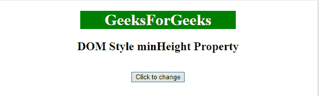
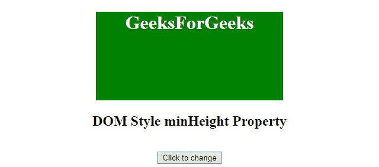
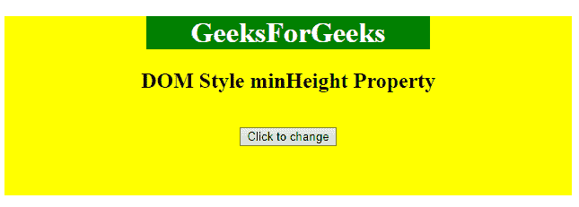
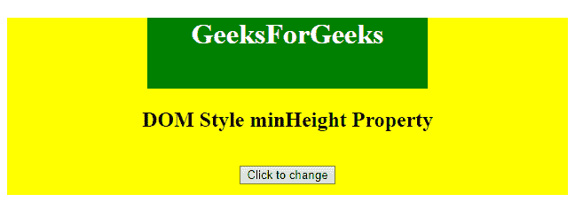

# HTML | DOM Style 闵行属性

> 原文:[https://www . geeksforgeeks . org/html-DOM-style-Minh have-property/](https://www.geeksforgeeks.org/html-dom-style-minheight-property/)

HTML DOM 中的**minh8**属性用于设置或返回元素的最小高度。此属性仅影响块级元素、绝对或固定位置元素。

**语法:**

*   它返回 minHeight 属性。

    ```html
    object.style.minHeight
    ```

*   用于设置闵八属性。

    ```html
    object.style.minHeight = "length|%|initial|inherit"
    ```

**属性值:**

| 价值 | 描述 |
| 长度 | 以长度单位定义长度。 |
| % | 定义相对于父元素的长度百分比 |
| 最初的 | 设置默认值。 |
| 继承 | 从父元素继承属性。 |

**返回值:**返回元素的最小高度。

**例 1:**

```html
<!DOCTYPE html> 
<html> 
    <head> 
        <title>
            DOM Style minHeight Property 
        </title> 

        <style>
            #Geek1 {
                color: white;
                width: 50%;
                background: green;
            }
        </style>
    </head> 

    <body> 
        <center> 
            <h1 id = "Geek1"> 
                GeeksForGeeks 
            </h1> 

            <h2>DOM Style minHeight Property </h2>         
            <br> 
            <button type = "button" onclick = "geeks()"> 
                Click to change 
            </button> 

            <script> 
                function geeks() { 
                    document.getElementById("Geek1").style.minHeight
                            = "150px"; 
                } 
            </script> 
        </center> 
    </body> 
</html>                             
```

**输出:**

*   之前点击按钮:
    
*   点击按钮后:
    

**例 2:**

```html
<!DOCTYPE html> 
<html> 
    <head> 
        <title>
            DOM Style minHeight Property
        </title> 

        <style>
            #Geek1 {
                color: white;
                width: 50%;
                background: green;
            }
            #Geek_Center {
                background: yellow;
                height: 200px;
            }
        </style>
    </head> 

    <body> 
        <center id = "Geek_Center"> 

            <h1 id = "Geek1"> 
                GeeksForGeeks 
            </h1> 

            <h2>DOM Style minHeight Property </h2>         
            <br> 
            <button type = "button" onclick = "geeks()"> 
                Click to change 
            </button> 

            <script> 
                function geeks() { 
                    document.getElementById("Geek1").style.minHeight
                            = "50%"; 
                } 
            </script> 
        </center> 
    </body> 
</html>                                 
```

**输出:**

*   之前点击按钮:
    
*   点击按钮后:
    

**支持的浏览器:**以下列出了*DOM Style minh8 属性*支持的浏览器:

*   谷歌 Chrome
*   微软公司出品的 web 浏览器
*   Mozilla Firefox
*   歌剧
*   旅行队