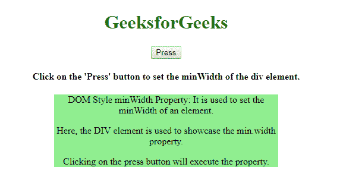
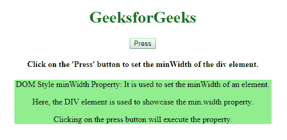
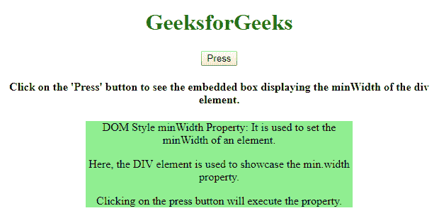
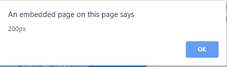

# HTML | DOM 样式最小宽度属性

> 原文:[https://www . geesforgeks . org/html-DOM-style-min width-property/](https://www.geeksforgeeks.org/html-dom-style-minwidth-property/)

**DOM Style minWidth 属性**用于**设置**或**返回** *元素的最小宽度*。它只适用于块级元素或具有绝对或固定位置的元素。

**语法:**

*   返回最小宽度属性:

    ```html
    object.style.minWidth
    ```

*   设置最小宽度属性:

    ```html
    object.style.minWidth = "length|%|initial|inherit"
    ```

**属性:**

*   **长度:**以长度单位设置最小宽度。
*   **%:** 设置父对象的最小宽度，单位为%。
*   **初始值:**将属性设置为默认值。
*   **继承:**从父元素继承属性值。

**返回值:**返回一个字符串，代表所选元素的最小宽度。

**示例-1:**

```html
<!DOCTYPE html>
<html>

<head>
    <title>
        HTML | DOM Style minWidth Property
    </title>
    <style>
        h1 {
            color: green;
        }

        #gfgg {
            width: 60%;
            background-color: lightgreen;
        }
    </style>
</head>

<body>
    <center>

        <h1>GeeksforGeeks</h1>
        <button onclick="min()">
          Press
      </button>

        <h4>Click on the 'Press' button to
          set the minWidth of the div element.</h4>

        <div id="gfgg">
            <p>DOM Style minWidth Property: It is
              used to set the minWidth of an element.</p>
            <p>Here, the DIV element is used to 
              showcase the min.width property.</p>
            <p>Clicking on the press button 
              will execute the property.</p>
        </div>

        <script>
            function min() {
                document.getElementById(
                  "gfgg").style.minWidth = "500px";
            }
        </script>
    </center>
</body>

</html>
```

**输出:**

*   点击按钮前:
    
*   点击按钮后:
    

**示例-2:**

```html
<!DOCTYPE html>
<html>

<head>
    <title>
        HTML | DOM Style minWidth Property
    </title>
    <style>
        h1 {
            color: green;
        }

        #gfgg {
            width: 60%;
            background-color: lightgreen;
        }
    </style>
</head>

<body>
    <center>
        <h1>GeeksforGeeks</h1>
        <button onclick="min()">Press</button>
        <h4>Click on the 'Press' button to see the
embedded box displaying the minWidth of the div element.</h4>

        <div style="background:lightgreen;
                    min-width:200px;" 
             id="gfgg">

            <p>DOM Style minWidth Property: It is used 
              to set the minWidth of an element.</p>

            <p>Here, the DIV element is used to 
              showcase the min.width property.</p>

            <p>Clicking on the press button
              will execute the property.</p>
        </div>

        <script>
            function min() {
                alert(document.getElementById(
                  "gfgg").style.minWidth);
            }
        </script>
    </center>
</body>

</html>
```

**输出:**

*   点击按钮前:
    
*   点击按钮后:
    

**浏览器支持:***HTML DOM Style minWidth 属性*支持的浏览器如下:

*   谷歌 Chrome*   微软公司出品的 web 浏览器*   火狐浏览器*   歌剧*   狩猎