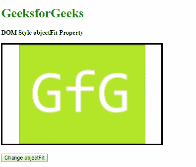
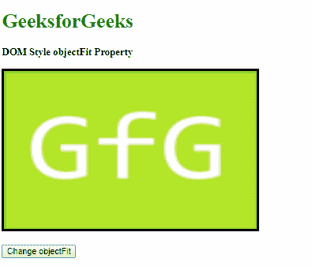
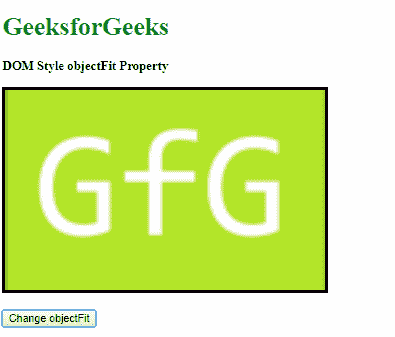
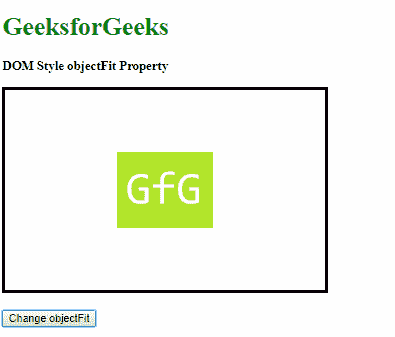
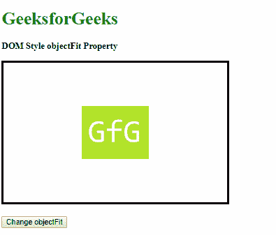
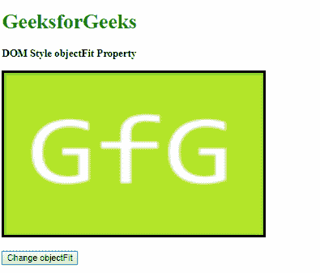
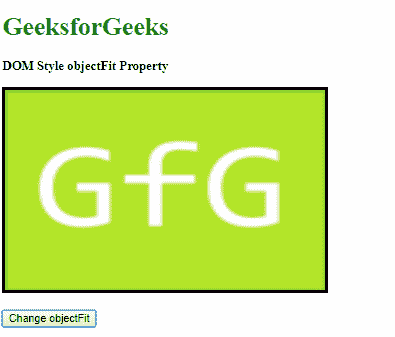
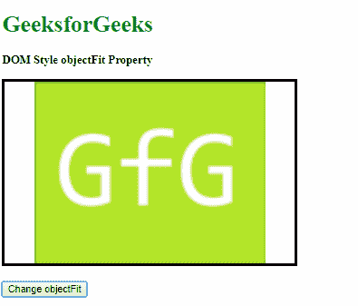

# HTML | DOM Style objectFit 属性

> 原文:[https://www . geesforgeks . org/html-DOM-style-object fit-property/](https://www.geeksforgeeks.org/html-dom-style-objectfit-property/)

HTML DOM 中的 **Style objectFit** 属性用于**设置**或**返回**如何调整图像或视频元素的大小以适合其容器。

**语法:**

*   它返回 objectFit 属性。

    ```html
    object.style.objectFit
    ```

*   它用于设置 objectFit 属性。

    ```html
    object.style.objectFit = "contain|cover|scale-down|none|fill|
    initial|inherit"
    ```

**返回值:**它返回一个字符串值，代表元素的对象拟合

**属性值:**

*   **contain:** The replaced content is scaled to maintain its aspect ratio while also fitting the content box.

    **示例-1:**

    ```html
    <!DOCTYPE html>
    <html>

    <head>
        <title>
          DOM Style objectFit Property
        </title>
        <style>
            #content {
                border: solid;
                height: 250px;
                width: 400px;
            }
        </style>
    </head>

    <body>
        <h1 style="color: green">
          GeeksforGeeks
        </h1>
        <b>
          DOM Style objectFit Property
        </b>
        <p>
            
        </p>
        <button onclick="setObjectFit()">
            Change objectFit
        </button>

        <!-- Script to set objectFit to contain -->
        <script>
            function setObjectFit() {
                elem = document.querySelector('#content');
                elem.style.objectFit = 'contain';
            }
        </script>
    </body>

    </html>
    ```

    **输出:**

    *   Before clicking the button:

        

    *   After clicking the button:

        

*   **cover:** The replaced content is sized to maintain its aspect ratio while filling the element’s entire content box. The object may be clipped to fit the content box if required.

    **示例-2:**

    ```html
    <!DOCTYPE html>
    <html>

    <head>
        <title>
          DOM Style objectFit Property
        </title>
        <style>
            #content {
                border: solid;
                height: 250px;
                width: 400px;
            }
        </style>
    </head>

    <body>
        <h1 style="color: green">
          GeeksforGeeks
        </h1>
        <b>
          DOM Style objectFit Property
        </b>
        <p>
            
        </p>
        <button onclick="setObjectFit()">
            Change objectFit
        </button>

        <!-- Script to set objectFit to cover -->
        <script>
            function setObjectFit() {
                elem = document.querySelector('#content');
                elem.style.objectFit = 'cover';
            }
        </script>
    </body>

    </html>
    ```

    **输出:**

    *   Before clicking the button:

        

    *   After clicking the button:

        

        *   **scale-down:** The replaced image is resized as if none or contain were specified and it results to the smallest object size.

    **示例-3:**

    ```html
    <!DOCTYPE html>
    <html>

    <head>
        <title>
          DOM Style objectFit Property
        </title>
        <style>
            #content {
                border: solid;
                height: 250px;
                width: 400px;
            }
        </style>
    </head>

    <body>
        <h1 style="color: green">
          GeeksforGeeks
        </h1>
        <b>
          DOM Style objectFit Property
        </b>
        <p>
            
        </p>
        <button onclick="setObjectFit()">
            Change objectFit
        </button>

        <!-- Script to set objectFit to scale-down -->
        <script>
            function setObjectFit() {
                elem = document.querySelector('#content');
                elem.style.objectFit = 'scale-down';
            }
        </script>
    </body>

    </html>
    ```

    **输出:**

    *   Before clicking the button:

        

    *   After clicking the button:

        

        *   **none:** The replaced content is not resized.

    **示例-4:**

    ```html
    <!DOCTYPE html>
    <html>

    <head>
        <title>
          DOM Style objectFit Property
        </title>
        <style>
            #content {
                border: solid;
                height: 250px;
                width: 400px;
            }
        </style>
    </head>

    <body>
        <h1 style="color: green">
          GeeksforGeeks
        </h1>
        <b>
          DOM Style objectFit Property
        </b>
        <p>
            
        </p>
        <button onclick="setObjectFit()">
            Change objectFit
        </button>

        <!-- Script to set objectFit to none -->
        <script>
            function setObjectFit() {
                elem = document.querySelector('#content');
                elem.style.objectFit = 'none';
            }
        </script>
    </body>

    </html>
    ```

    **输出:**

    *   Before clicking the button:

        

    *   After clicking the button:

        

        *   **fill:** The content is resized to fill the element’s content box. This is the default value.

    **示例-5:**

    ```html
    <!DOCTYPE html>
    <html>

    <head>
        <title>
          DOM Style objectFit Property
        </title>
        <style>
            #content {
                border: solid;
                height: 250px;
                width: 400px;
                object-fit: scale-down;
            }
        </style>
    </head>

    <body>
        <h1 style="color: green">
          GeeksforGeeks
        </h1>
        <b>
          DOM Style objectFit Property
        </b>
        <p>
            
        </p>
        <button onclick="setObjectFit()">
            Change objectFit
        </button>

        <!-- Script to set objectFit to fill -->
        <script>
            function setObjectFit() {
                elem = document.querySelector('#content');
                elem.style.objectFit = 'fill';
            }
        </script>
    </body>

    </html>
    ```

    **输出:**

    *   Before clicking the button:

        

    *   After clicking the button:

        

        *   **initial:** This is used to set this property to its default value.

    **示例-6:**

    ```html
    <!DOCTYPE html>
    <html>

    <head>
        <title>
          DOM Style objectFit Property
        </title>
        <style>
            #content {
                border: solid;
                height: 250px;
                width: 400px;
                object-fit: scale-down;
            }
        </style>
    </head>

    <body>
        <h1 style="color: green">
          GeeksforGeeks
        </h1>
        <b>
          DOM Style objectFit Property
        </b>
        <p>
            
        </p>
        <button onclick="setObjectFit()">
            Change objectFit
        </button>

        <!-- Script to set objectFit to initial -->
        <script>
            function setObjectFit() {
                elem = document.querySelector('#content');
                elem.style.objectFit = 'initial';
            }
        </script>
    </body>

    </html>
    ```

    **输出:**

    *   Before clicking the button:

        

    *   After clicking the button:

        

        *   **inherit:** This inherits the property from its parent.

    **示例-7:**

    ```html
    <!DOCTYPE html>
    <html>

    <head>
        <title>
          DOM Style objectFit Property
        </title>
        <style>
            #parent {
                object-fit: contain;
            }

            #content {
                border: solid;
                height: 250px;
                width: 400px;
            }
        </style>
    </head>

    <body>
        <h1 style="color: green">
          GeeksforGeeks
        </h1>
        <b>
          DOM Style objectFit Property
        </b>
        <p id="parent">
            
        </p>
        <button onclick="setObjectFit()">
            Change objectFit
        </button>

        <!-- Script to set objectFit to inherit -->
        <script>
            function setObjectFit() {
                elem = document.querySelector('#content');
                elem.style.objectFit = 'inherit';
            }
        </script>
    </body>

    </html>
    ```

    **输出:**

    *   Before clicking the button:

        

    *   After clicking the button:

        

**支持的浏览器:**以下列出了 *objectFit* 属性支持的浏览器:

*   谷歌 Chrome 31.0
*   Internet Explorer 16.0
*   Firefox 36.0
*   Opera 19.0
*   苹果 Safari 7.1