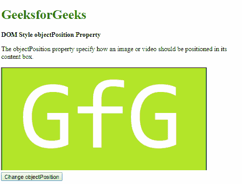
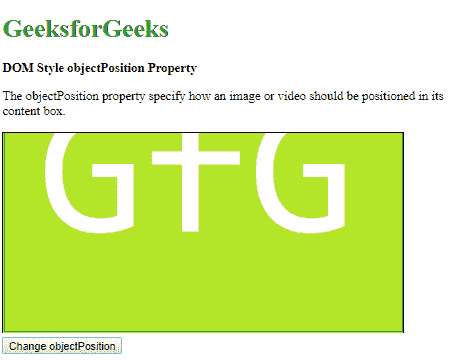

# HTML | DOM 样式对象位置属性

> 原文:[https://www . geesforgeks . org/html-DOM-style-object position-property/](https://www.geeksforgeeks.org/html-dom-style-objectposition-property/)

DOM Style **objectPosition** 属性用于**设置**或**返回** *图像或视频在自己的内容框中的位置。*

**语法:**

*   它返回 objectPosition 属性。

    ```html
    object.style.objectPosition
    ```

*   它用于设置 objectPosition 属性。

    ```html
    object.style.objectPosition = "position|initial|inherit"
    ```

**属性值:**

*   **position:** This is used to specify the position of the image or video in terms of either length values or strings (left, right and center).

    **示例-1:**

    ```html
    <!DOCTYPE html>
    <html>

    <head>
        <title>
            DOM Style objectPosition Property
        </title>
        <style>
            .content {
                border: 1px solid;
                object-fit: cover;
                height: 250px;
                width: 500px;
            }
        </style>
    </head>

    <body>
        <h1 style="color: green">
          GeeksforGeeks
        </h1>
        <b>
          DOM Style objectPosition Property
        </b>
        <p>
          The objectPosition property 
          specify how an image or video 
          should be positioned in its content box.
        </p>
        

        <button onclick="setObjectPosition()">
            Change resize
        </button>

        <!-- Script to set objectPosition to 50% 100% -->
        <script>
            function setObjectPosition() {
                elem = document.querySelector('.content');
                elem.style.objectPosition = '75% 100%';
            }
        </script>
    </body>

    </html>
    ```

    **输出:**

    *   Before clicking the button:

        

    *   After clicking the button:

        

*   **initial:** This is used to set this property to its default value.

    **示例-2:**

    ```html
    <!DOCTYPE html>
    <html>

    <head>
        <title>
            DOM Style objectPosition Property
        </title>
        <style>
            .content {
                border: 1px solid;
                object-fit: cover;
                height: 250px;
                width: 500px;
                object-position: 50% 100%;
            }
        </style>
    </head>

    <body>
        <h1 style="color: green">
          GeeksforGeeks
        </h1>
        <b>
          DOM Style objectPosition Property
        </b>
        <p>
            The objectPosition property specify 
          how an image or video should be
          positioned in its content box.
        </p>
        

        <button onclick="setObjectPosition()">
            Change resize
        </button>

        <!-- Script to set objectPosition to initial -->
        <script>
            function setObjectPosition() {
                elem = document.querySelector('.content');
                elem.style.objectPosition = 'initial';
            }
        </script>
    </body>

    </html>
    ```

    **输出:**

    *   Before clicking the button:

        

    *   After clicking the button:

        

        *   **inherit:** This inherits the property from its parent.

    **示例-3:**

    ```html
    <!DOCTYPE html>
    <html>

    <head>
        <title>
            DOM Style objectPosition Property
        </title>
        <style>
            #parent {
                object-position: 50% 100%;
            }

            .content {
                border: 1px solid;
                object-fit: cover;
                height: 250px;
                width: 500px;
            }
        </style>
    </head>

    <body>
        <h1 style="color: green">
          GeeksforGeeks
        </h1>
        <b>
          DOM Style objectPosition Property
        </b>
        <p>
            The objectPosition property specify how an 
          image or video should be positioned in its content box.
        </p>
        <div id="parent">
            
        </div>

        <button onclick="setObjectPosition()">
            Change resize
        </button>

        <!-- Script to set objectPosition to inherit -->
        <script>
            function setObjectPosition() {
                elem = document.querySelector('.content');
                elem.style.objectPosition = 'inherit';
            }
        </script>
    </body>

    </html>
    ```

    **输出:**

    *   Before clicking the button:

        

    *   After clicking the button:

        

**支持的浏览器:**由*对象位置*属性支持的浏览器如下:

*   谷歌 Chrome 31.0
*   Internet Explorer 16.0
*   Firefox 36.0
*   Opera 19.0
*   苹果 Safari 10.1