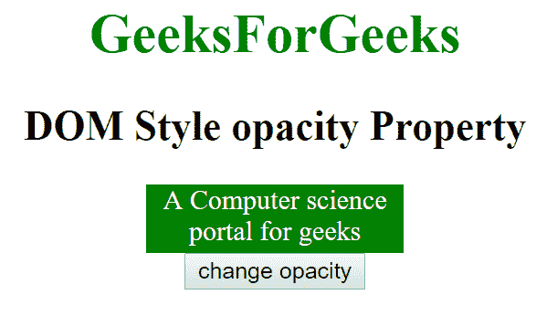
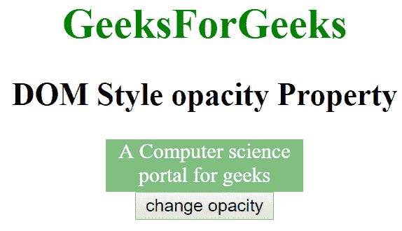
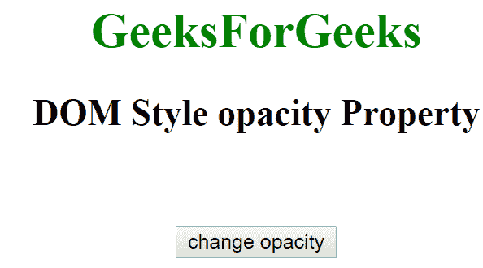

# HTML | DOM 样式不透明度属性

> 原文:[https://www . geesforgeks . org/html-DOM-style-不透明度-property/](https://www.geeksforgeeks.org/html-dom-style-opacity-property/)

HTML DOM 中的样式**不透明度**属性用于设置元素的不透明度级别。不透明度级别定义透明度级别，其中值 1 表示不透明，0.5 表示 50%透明度，0 表示完全透明。它还返回元素的不透明度。
**语法:**

*   它返回不透明度属性。

```html
object.style.opacity
```

*   它用于设置不透明度属性。

```html
object.style.opacity = "number|initial|inherit"
```

**房产价值:**

*   **数字:**指定不透明度值，范围从 0.0 到 1.0。
*   **初始:**将不透明度属性设置为默认值。
*   **inherit:** 该属性从其父元素继承而来。

**返回值:**返回一个代表元素不透明度的字符串。
**示例-1:**

## 超文本标记语言

```html
<!DOCTYPE html>
<html>

<head>
    <title>DOM Style opacity Property </title>

</head>

<body>

    <center>
        <h1 style="color:green;">
                GeeksForGeeks
            </h1>
        <h2>DOM Style opacity Property </h2>
        <div id="gfg"> A Computer science portal for geeks</div>

        <button type="button" onclick="geeks()">
            set Decoration
        </button>

        <script>
            function geeks() {
                document.getElementById("gfg").style.opacity
                                                      = "0.3";
            }
        </script>
    </center>
</body>

</html> 
```

**输出:**

*   点击按钮前:



*   点击按钮后:



**示例-2:**

## 超文本标记语言

```html
<!DOCTYPE html>
<html>

<head>
    <title>DOM Style opacity Property </title>
    <style>
        #gfg {
            width: 150px;
            height: 40px;
            background-color: green;
        }
    </style>
</head>

<body>

    <center>
        <h1 style="color:green;">
                GeeksForGeeks
            </h1>
        <h2>DOM Style opacity Property </h2>
        <div id="gfg" style="color:white">
        A Computer science portal for geeks</div>

        <button type="button" onclick="geeks()">
            change opacity
        </button>

        <script>
            function geeks() {
                document.getElementById("gfg").style.opacity
                                                       = "0";
            }
        </script>
    </center>
</body>

</html>
```

**输出:**

*   点击按钮前:


*   点击按钮后:



**支持的浏览器:**由 **DOM Style 不透明度**属性支持的浏览器如下:

*   谷歌 Chrome
*   微软公司出品的 web 浏览器
*   火狐浏览器
*   歌剧
*   苹果 Safari