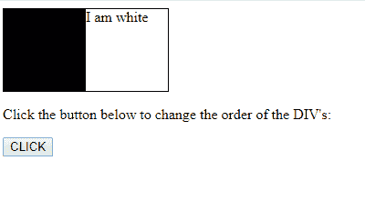
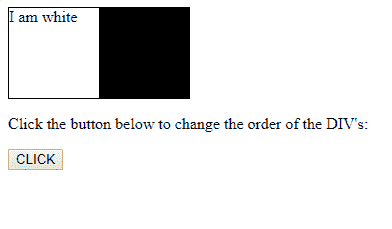

# HTML | DOM 样式顺序属性

> 原文:[https://www . geesforgeks . org/html-DOM-style-order-property/](https://www.geeksforgeeks.org/html-dom-style-order-property/)

**DOM Style order** 属性指定了一个灵活元素相对于同一容器元素中其他灵活元素的顺序。

**语法:**

*   设置属性:

    ```html
    object.style.order = "number | initial | inherit"
    ```

    *   To get the property:

    ```html
    object.style.order
    ```

    **返回值:**返回一个 String 值，代表元素的顺序属性

    **属性值:**

    *   **编号:**指定柔性元件的顺序。
        默认值 0。
    *   **初始值:**将属性设置为默认值。
    *   **继承:**从其父元素继承属性。

    **示例:**

    ```html
    <!DOCTYPE html>
    <!DOCTYPE html>
    <html>

    <head>
        <title>
            HTML | DOM Style order Property
        </title>
        <style>
            #main {
                width: 180px;
                height: 90px;
                border: 1px solid #000000;
                display: flex;
            }

            #main div {
                width: 90px;
                height: 90px;
            }
        </style>
    </head>

    <body>

        <!-- two div with different color. -->
        <div id="main">
            <div style="background-color:black;"
                id="black"></div>
            <div style="background-color:white;"
                id="white">I am white.</div>
            </div>

        <p>Click the button below to change 
        the order of the four DIV's:</p>

        <button onclick="myFunction()">CLICK</button>

        <!-- Change order of div -->
        <script>
            function myFunction() {
                document.getElementById(
                "black").style.order = "2";
                document.getElementById(
                "white").style.order = "1";
            }
        </script>

    </body>

    </html>                    
    ```

    **输出:**

    *   点击按钮前:
        
    *   点击按钮后:
        

    **支持的浏览器:**以下是 *HTML | DOM Style 订单属性*支持的浏览器:

    *   谷歌 Chrome
    *   Internet Explorer 12.0
    *   火狐浏览器
    *   歌剧
    *   旅行队