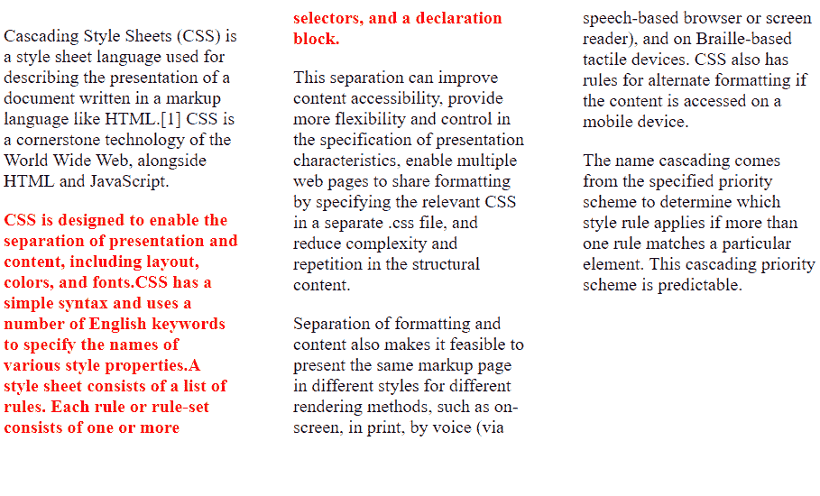

# HTML | DOM 风格孤儿属性

> 原文:[https://www . geesforgeks . org/html-DOM-style-孤儿-property/](https://www.geeksforgeeks.org/html-dom-style-orphans-property/)

DOM **样式孤儿属性**控制旧页面上段落拆分的最小行数。孤儿的默认值是**继承的**或 2(这意味着如果一个段落将被拆分，页面上至少会留下 2 行)。
DOM Style 孤儿属性控制旧页面上段落拆分的最小行数。孤儿的默认值是继承的或 2(这意味着如果一个段落将被拆分，页面上至少会留下 2 行)。

**语法:**

*   返还孤儿财产:

    ```html
    object.style.orphans
    ```

    *   Set the orphans property:

    ```html
    object.style.orphans = "number|initial|inherit"
    ```

    **属性值:**

    *   **数字:**一个整数，它指定一页或一列末尾可以留下的行数。不允许负值。默认值为 2。
    *   **初始值:**将元素设置为初始值。
    *   **继承:**元素从父元素继承其孤儿属性。

    **例-1:** 设置孤儿财产的母狮数量。

    ```html
    <!DOCTYPE html>
    <html>

    <head>
        <title>
            HTML | DOM Style orphans Property
        </title>
        <div id="element">
            <p>
              Cascading Style Sheets (CSS) is a style
              sheet language used for describing the 
              presentation of a document written in a
              markup language like HTML.[1] CSS is a 
              cornerstone technology of the World Wide 
              Web, alongside HTML and JavaScript.
            </p>

            <p> 
              <span style="color: red; font-weight: bold">
                CSS is designed to enable the separation 
                of presentation and content, including 
                layout,colors, and fonts.CSS has a simple
                syntax and uses a number of English keywords
                to specify the names of various style 
                properties.A style sheet consists of a list 
                of rules. Each rule or rule-set consists of
                one or more selectors,and a declaration block.
              </span>
            </p>

            <p>
              This separation can improve content accessibility,
              provide more flexibility and control in the 
              specification of presentation characteristics,
              enable multiple web pages to share formatting 
              by specifying the relevant CSS in a separate .css 
              file, and reduce complexity and repetition in 
              the structural content.
            </p>

            <p>
              Separation of formatting and content also makes
              it feasible to present the same markup page in 
              different styles for different rendering methods, 
              such as on-screen, in print, by voice 
              (via speech-based browser or screen reader), 
              and on Braille-based tactile devices. CSS also
              has rules for alternate formatting if the content
              is accessed on a mobile device.
            </p>
            <p>
              The name cascading comes from the specified 
              priority scheme to determine which style rule
              applies if more than one rule matches a particular
              element. This cascading priority scheme is predictable.
            </p>

        </div>
        <style>
            #element {
                columns: 12em 3;
                column-gap: 3em;
            }
        </style>

        <script>
            function myFunction() {

                // Number of lines that can be left at the end 
                // of a page or column.
                document.getElementById("element").style.orphans = 
                                                              "5";
            }
            myFunction()
        </script>

    </head>

    </html>
    ```

    **输出:**按照孤儿属性，如果一个段落要拆分，页面或列上至少会留下 5 行(就像我们在代码中设置孤儿属性“5”)。

    

    **支持的浏览器:**以下是 *HTML | DOM Style 孤儿属性*支持的浏览器:

    *   谷歌 Chrome 25+
    *   Internet Explorer 8+
    *   Opera 9.2+