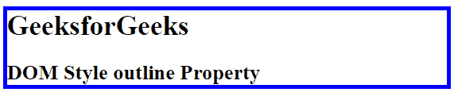
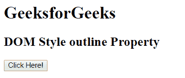
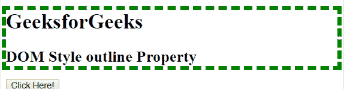

# HTML | DOM 样式轮廓属性

> 原文:[https://www . geesforgeks . org/html-DOM-style-outline-property/](https://www.geeksforgeeks.org/html-dom-style-outline-property/)

HTML DOM 中的**样式轮廓属性**用于在一个声明中设置或返回所有轮廓属性。此属性在元素周围画一条线。它以简短形式设置或返回一个或多个边框属性。
大纲可以设置以下属性:

*   轮廓宽度
*   轮廓式
*   轮廓颜色

**语法:**

*   它返回 outline 属性。

    ```html
    object.style.outline
    ```

*   它用于设置 outline 属性。

    ```html
    object.style.outline = "width|style|color|initial|inherit"
    ```

**返回值:**返回一个字符串值，代表元素的轮廓宽度、样式和/或颜色

**属性值:**

*   **宽度:**设置轮廓宽度。
*   **样式:**设置轮廓的样式。
*   **颜色:**设置轮廓的颜色。
*   **Initial:** 将 DOM 大纲属性设置为默认值。
*   **继承:**元素从父元素继承其属性。

**示例 1:** 在 div 容器周围添加一个粗实的蓝色轮廓。

```html
<!DOCTYPE html>
<html>

<head>
    <title>
        HTML DOM Style outline Property
    </title>
</head>

<body>
    <div id = "container">
        <h1>GeeksforGeeks</h1>

        <h2>DOM Style outline Property</h2>
    </div>

    <script>
        function myGeeks() {
            document.getElementById("container").style.outline
                    = "thick solid blue";
        }
        myGeeks();
    </script>
</body>

</html>                    
```

**输出:**


**示例 2:** 在 div 容器周围添加一个长度虚线绿色轮廓。

```html
<!DOCTYPE html>
<html>

<head>
    <title>
        HTML DOM Style outline Property
    </title>
    <style>
    #container {
        border: 3px solid black;
        outline: 3px solid blue;
    }
    </style>
</head>

<body>
    <div id = "GFG">
        <h1>GeeksforGeeks</h1>

        <h2>DOM Style outline Property</h2>
    </div>

    <button onclick = "myGeeks()">
        Click Here!
    </button>

    <!-- script to set outline style -->
    <script>
        function myGeeks() {
            document.getElementById("GFG").style.outline
                    = "7px dashed green";
        }
    </script>
</body>

</html>                    
```

**输出:**

*   之前点击按钮:
    
*   点击按钮后:
    

**支持的浏览器:***DOM Style 轮廓属性*支持的浏览器如下:

*   谷歌 Chrome
*   微软公司出品的 web 浏览器
*   火狐浏览器
*   歌剧
*   旅行队