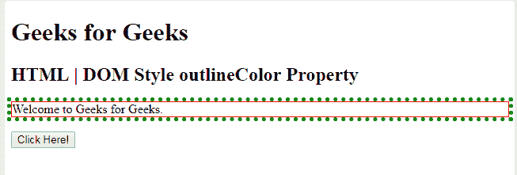
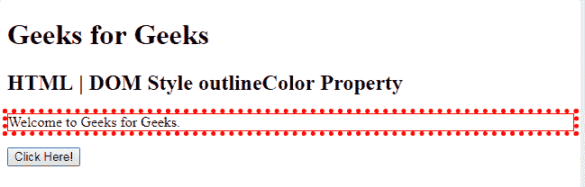
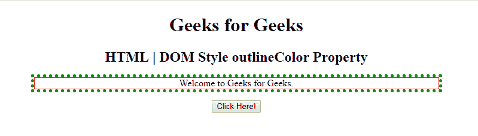
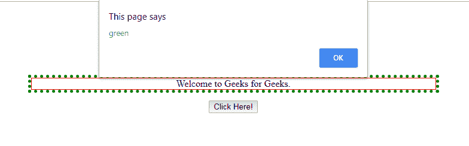

# HTML | DOM 样式大纲视图属性

> 原文:[https://www . geesforgeks . org/html-DOM-style-outlinecolor-property/](https://www.geeksforgeeks.org/html-dom-style-outlinecolor-property/)

**DOM Style outlineColor 属性**用于设置或返回元素周围轮廓的颜色。

**语法:**

*   用于返回 outlineColor 属性

    ```html
    object.style.outlineColor 
    ```

    *   it is used to Set the outlineColor property

    ```html
    object.style.outlineColor = "color|invert|initial|inherit"
    ```

    **属性值:**

    *   **颜色:**它将轮廓颜色设置为任何有效的 CSS 颜色。
    *   **反转:**它将轮廓颜色设置为与背景相反的颜色，这确保了轮廓将始终可见。注意:并非所有浏览器都支持它。
    *   **继承:**根据其父元素继承的轮廓颜色属性设置轮廓颜色。

    **返回值:**返回一个字符串值，该值代表元素中欧林的颜色。

    **示例-1:**

    ```html
    <!DOCTYPE html>
    <html>

    <head>
        <title>
            HTML | DOM Style outlineColor Property
        </title>
        <style>
            #myDiv {
                border: 1px solid red;
                outline: green dotted thick;
            }
        </style>
    </head>

    <body>
        <h1> Geeks for Geeks</h1>
        <h2>HTML | DOM Style outlineColor Property</h2>

        <div id="myDiv">Welcome to Geeks for Geeks.</div>
        <br>
        <button type="button" onclick="myFunction()">
            Click Here!
        </button>

        <script>
            function myFunction() {

                //  Set outline color. 
                document.getElementById("myDiv")
                    .style.outlineColor = "red";
            }
        </script>

    </body>

    </html>
    ```

    **输出:**

    **点击按钮前:**
    

    **点击按钮后:**
    

    **示例-2 :**

    ```html

    <!DOCTYPE html>
    <html>

    <head>
        <title>
            HTML | DOM Style outlineColor Property
        </title>
        <style>
            #myDiv {
                border: 1px solid red;
                outline: dotted thick;
            }
        </style>
    </head>

    <body>
        <h1> Geeks for Geeks</h1>
        <h2>HTML | DOM Style outlineColor Property</h2>

        <div id="myDiv" style="outline-color:green;">
          Welcome to Geeks for Geeks.</div>
        <br>

        <button type="button" onclick="myFunction()">
            Click Here!
        </button>

        <script>
            function myFunction() {
                alert(document.getElementById(
                  "myDiv").style.outlineColor);
            }
        </script>

    </body>

    </html>
    ```

    **输出:**

    *   点击按钮前:
        
    *   点击按钮后:
        

    **支持的浏览器:**T2 DOM Style outlineColor 属性支持的浏览器如下:

    *   谷歌 Chrome
    *   微软公司出品的 web 浏览器
    *   火狐浏览器
    *   歌剧
    *   旅行队