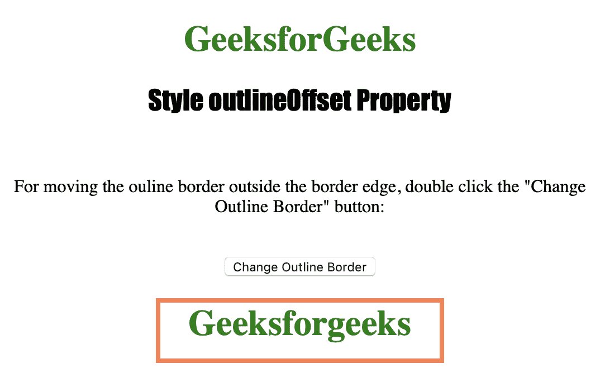
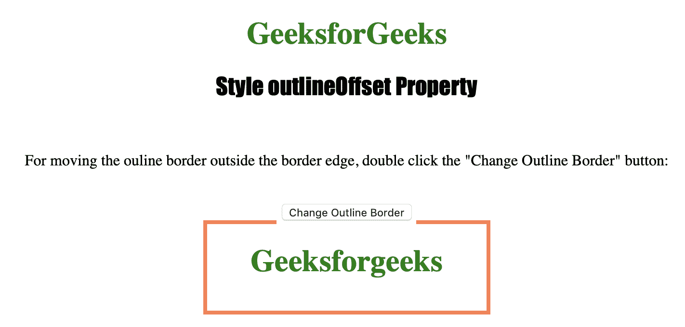

# HTML | DOM 样式大纲属性

> 原文:[https://www . geesforgeks . org/html-DOM-style-outlineoffset-property/](https://www.geeksforgeeks.org/html-dom-style-outlineoffset-property/)

**样式轮廓设置**属性用于偏移轮廓并将其绘制到边界边缘之外。
轮廓不占用空间，不像边框。它返回一个字符串，表示元素的 outline-offset 属性。
**语法:**

*   去拿财产

```
object.style.outlineOffset
```

*   设置属性

```
object.style.outlineOffset = "length|initial|inherit"
```

**属性值:**

<figure class="table">

| value | explain |
| length | Defines the length in length units. |
| initial | Define default values. |
| inherit | Slave parent element |

</figure>

继承属性

下面的程序说明了 Style outlineOffset 属性方法:
**示例:**

## 超文本标记语言

```
<!DOCTYPE html>
<html>

<head>
    <title>Style outlineOffset Property in HTML</title>
    <style>
        #samplediv {
            margin: auto;
            border: 2px green;
            outline: coral solid 4px;
            width: 250px;
            height: 50px;
        }

        h1 {
            color: green;
        }

        h2 {
            font-family: Impact;
        }

        body {
            text-align: center;
        }
    </style>
</head>

<body>

    <h1>GeeksforGeeks</h1>
    <h2>Style outlineOffset Property</h2>
    <br>

<p>For moving the ouline border outside the border edge, double click the "Change Outline Border" button: </p>

    <br>

    <button ondblclick="outline()">
        Change Outline Border
    </button>

    <div id="samplediv">
        <h1>Geeksforgeeks</h1>
    </div>

    <script>
        function outline() {
            document.getElementById("samplediv")
                .style.outlineOffset = "20px";
        }
    </script>

</body>

</html>  
```

**输出:**

*   在单击按钮之前:



*   单击按钮后:



**支持的浏览器:**以下列出了*HTML | DOM Style outlineOffset Property*支持的浏览器:

*   微软公司出品的 web 浏览器
*   谷歌 Chrome
*   火狐浏览器
*   歌剧
*   苹果 Safari