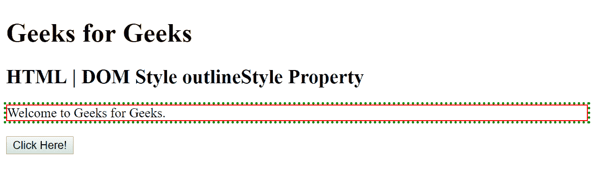
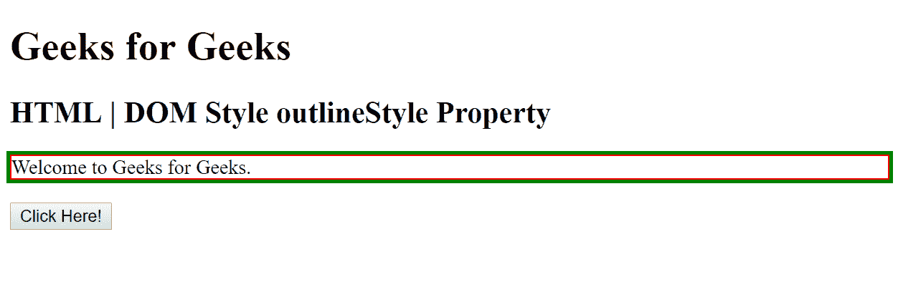
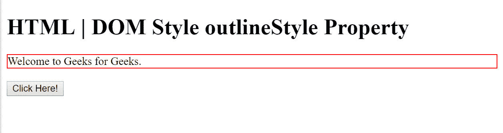
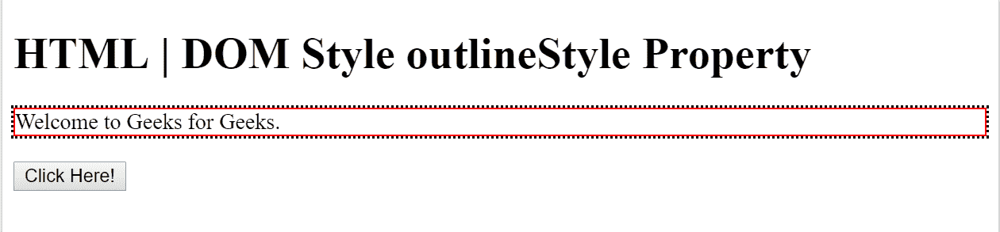

# HTML | DOM 样式大纲样式属性

> 原文:[https://www . geesforgeks . org/html-DOM-style-outlinestyle-property/](https://www.geeksforgeeks.org/html-dom-style-outlinestyle-property/)

HTML DOM 中的**样式 outlineStyle 属性**用于设置或返回元素周围轮廓的样式。
**语法:**

*   它用于返回 outlineStyle 属性。

    ```html
    object.style.outlineStyle
    ```

    *   It is used to set the outlineStyle property.

    ```html
    object.style.outlineStyle = value
    ```

    ：

    **属性值:**

    *   **无:**这是不设置轮廓的默认值。*   **隐藏:**使用该值，轮廓被关闭。*   **虚线:**该值设置虚线轮廓。*   **虚线:**该值设置虚线轮廓。*   **固体；**该值设置一个实心轮廓。*   **加倍；**该值设置双轮廓。*   **凹槽；**该值设置三维凹槽轮廓。*   **山脊；**该值设置三维脊状轮廓。*   **插图；**该值设置三维嵌入轮廓。*   **开始；**该值设置 3D 开始轮廓。*   **初始；**该值将大纲属性设置为浏览器的默认值。*   **inherit:** This value sets the outline property to the value from its parent element.

    **返回值:**这个方法返回一个**字符串值**，代表元素轮廓的样式。

    **例 1:**

    ```html
    <!DOCTYPE html>
    <html>

    <head>
        <title>
            HTML | DOM Style outlineStyle Property
        </title>
        <style>
            #myDiv {
                border: 1px solid red;
                outline: green dotted thick;
            }
        </style>
    </head>

    <body>
        <h1> Geeks for Geeks</h1>
        <h2>HTML | DOM Style outlineStyle Property</h2>

        <div id="myDiv">Welcome to Geeks for Geeks.</div>
        <br>
        <button type="button" onclick="myFunction()">
            Click Here!
        </button>

        <script>
            function myFunction() {
                document.getElementById("myDiv")
                    .style.outlineStyle = "solid";
            }
        </script>

    </body>

    </html>
    ```

    **输出:**

    *   之前点击按钮:
        *   After click on the button:
    

    **例 2:**

    ```html
    <!DOCTYPE html>
    <html>

    <head>
        <title>
            HTML | DOM Style outlineStyle Property
        </title>
        <style>
            #myDiv {
                border: 1px solid red;
            }
        </style>
    </head>

    <body>

        <h1> HTML | DOM Style outlineStyle Property</h1>

        <div id="myDiv">Welcome to Geeks for Geeks.</div>
        <br>
        <button type="button" onclick="myFunction()">
            Click Here!
        </button>

        <script>
            function myFunction() {
                document.getElementById("myDiv")
                    .style.outlineStyle = "dotted";
            }
        </script>

    </body>

    </html>
    ```

    **输出:**

    *   之前点击按钮:
        *   After click on the button:
    

    **支持的浏览器:**以下列出了*DOM Style outlineStyle Property*支持的浏览器:

    *   谷歌 Chrome
    *   微软公司出品的 web 浏览器
    *   火狐浏览器
    *   歌剧
    *   旅行队