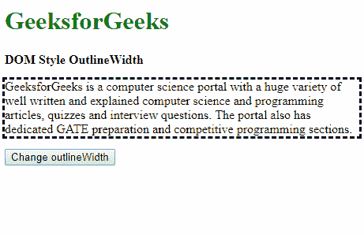
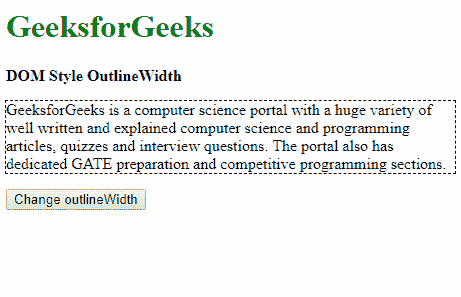
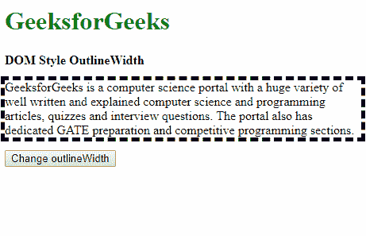
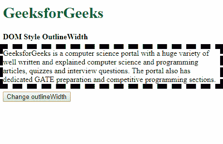
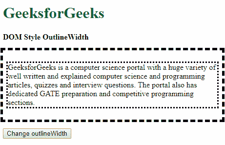
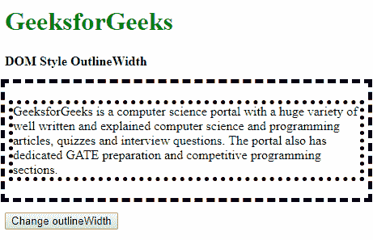

# HTML | DOM 样式 outlineWidth 属性

> 原文:[https://www . geeksforgeeks . org/html-DOM-style-outlinewidth-property/](https://www.geeksforgeeks.org/html-dom-style-outlinewidth-property/)

DOM Style **outlineWidth** 属性用于设置或返回元素周围轮廓的宽度。轮廓是在元素边框之外的指定元素周围创建的线条，以使特定的元素更加独特和易于区分。

**语法:**

*   它返回 outlineWidth 属性。

    ```html
    object.style.outlineWidth
    ```

*   它用于设置 outlineWidth 属性。

    ```html
    object.style.outlineWidth = "thin|medium|thick|length|initial|
    inherit"
    ```

**返回值:**返回一个字符串值，代表元素轮廓的宽度。

**属性值:**

*   **thin:** It sets the outline width to thin, the outline achieved is thinner than outline specified with width as medium and thick.
    **Example:**

    ```html
    <!DOCTYPE html>
    <html>

    <head>
        <title>
            DOM Style outlineWidth Property
        </title>

        <style>
            .elem {
                outline-style: dashed;
            }
        </style>
    </head>

    <body>
        <h1 style="color: green">
            GeeksforGeeks
        </h1>

        <b>DOM Style OutlineWidth</b>

        <p class="elem">
            GeeksforGeeks is a computer science portal
            with a huge variety of well written and 
            explained computer science and programming
            articles, quizzes and interview questions.
            The portal also has dedicated GATE preparation
            and competitive programming sections.
        </p>

        <button onclick="changeWidth()">
            Change outlineWidth
        </button>

        <!--Script to change the outline width -->
        <script>
            function changeWidth() {
                elem = document.querySelector('.elem');
                elem.style.outlineWidth = 'thin';
            }
        </script>
    </body>

    </html>                    
    ```

    **输出:**

    *   点击按钮前:
        
    *   点击按钮后:
        
*   **medium:** It sets the outline width to default. The width of the outline is thinner than the outline sets thick and thicker than the outline set as thin.
    **Example:**

    ```html
    <!DOCTYPE html>
    <html>

    <head>
        <title>
            DOM Style outlineWidth Property
        </title>

        <style>
            .elem {
                outline-style: dashed;
                outline-width: thin;
            }
        </style>
    </head>

    <body>
        <h1 style="color: green">
            GeeksforGeeks
        </h1>

        <b>DOM Style OutlineWidth</b>

        <p class="elem">
            GeeksforGeeks is a computer science portal
            with a huge variety of well written and 
            explained computer science and programming
            articles, quizzes and interview questions.
            The portal also has dedicated GATE preparation
            and competitive programming sections.
        </p>

        <button onclick="changeWidth()">
            Change outlineWidth
        </button>

        <!--Script to change the outline width -->
        <script>
            function changeWidth() {
                elem = document.querySelector('.elem');
                elem.style.outlineWidth = 'medium';
            }
        </script>
    </body>

    </html>                    
    ```

    **输出:**

    *   点击按钮前:
        
    *   点击按钮后:
        
*   **thick:** It sets the outline width to thick, the outline achieved is thicker than outline specified with width as medium and think.
    **Example:**

    ```html
    <!DOCTYPE html>
    <html>

    <head>
        <title>
            DOM Style outlineWidth Property
        </title>

        <style>
            .elem {
                outline-style: dashed;
            }
        </style>
    </head>

    <body>
        <h1 style="color: green">
            GeeksforGeeks
        </h1>

        <b>DOM Style OutlineWidth</b>

        <p class="elem">
            GeeksforGeeks is a computer science portal
            with a huge variety of well written and 
            explained computer science and programming
            articles, quizzes and interview questions.
            The portal also has dedicated GATE preparation
            and competitive programming sections.
        </p>

        <button onclick="changeWidth()">
            Change outlineWidth
        </button>

        <!--Script to change the outline width -->
        <script>
            function changeWidth() {
                elem = document.querySelector('.elem');
                elem.style.outlineWidth = 'thick';
            }
        </script>
    </body>

    </html>                    
    ```

    **输出:**

    *   点击按钮前:
        
    *   点击按钮后:
        
*   **length:** It is used to define the outline width in terms of length units.
    **Example:**

    ```html
    <!DOCTYPE html>
    <html>

    <head>
        <title>
            DOM Style outlineWidth Property
        </title>

        <style>
            .elem {
                outline-style: dashed;
            }
        </style>
    </head>

    <body>
        <h1 style="color: green">
            GeeksforGeeks
        </h1>

        <b>DOM Style OutlineWidth</b>

        <p class="elem">
            GeeksforGeeks is a computer science portal
            with a huge variety of well written and 
            explained computer science and programming
            articles, quizzes and interview questions.
            The portal also has dedicated GATE preparation
            and competitive programming sections.
        </p>

        <button onclick="changeWidth()">
            Change outlineWidth
        </button>

        <!--Script to change the outline width -->
        <script>
            function changeWidth() {
                elem = document.querySelector('.elem');
                elem.style.outlineWidth = '10px';
            }
        </script>
    </body>

    </html>                    
    ```

    **输出:**

    *   点击按钮前:
        
    *   点击按钮后:
        
*   **initial:** It is used to set this property to its default value.
    **Example:**

    ```html
    <!DOCTYPE html>
    <html>

    <head>
        <title>
            DOM Style outlineWidth Property
        </title>

        <style>
            .elem {
                outline-style: dashed;
                outline-width: 4px;
            }
        </style>
    </head>

    <body>
        <h1 style="color: green">
            GeeksforGeeks
        </h1>

        <b>DOM Style OutlineWidth</b>

        <p class="elem">
            GeeksforGeeks is a computer science portal
            with a huge variety of well written and 
            explained computer science and programming
            articles, quizzes and interview questions.
            The portal also has dedicated GATE preparation
            and competitive programming sections.
        </p>

        <button onclick="changeWidth()">
            Change outlineWidth
        </button>

        <!--Script to change the outline width -->
        <script>
            function changeWidth() {
                elem = document.querySelector('.elem');
                elem.style.outlineWidth = 'initial';
            }
        </script>
    </body>

    </html>                    
    ```

    **输出:**

    *   点击按钮前:
        
    *   点击按钮后:
        
*   **inherit:** This inherits the property from its parent.
    **Example:**

    ```html
    <!DOCTYPE html>
    <html>

    <head>
        <title>
            DOM Style outlineWidth property
        </title>

        <style>
            #parent {
                padding: 10px;
                outline-style: dashed;

                /* Set the outlineWidth of
                parent element */
                outline-width: 5px;
            }
            .elem {
                outline-style: dotted;
            }
        </style>
    </head>

    <body>
        <h1 style="color: green">
            GeeksforGeeks
        </h1>

        <b>DOM Style OutlineWidth</b>

        <br><br>

        <div id="parent">
            <p class="elem">
                GeeksforGeeks is a computer science portal
                with a huge variety of well written and 
                explained computer science and programming
                articles, quizzes and interview questions.
                The portal also has dedicated GATE preparation
                and competitive programming sections.
            </p>
        </div>

        <br>

        <button onclick="changeWidth()">
            Change outlineWidth
        </button>

        <!-- Script to change the outline width -->
        <script>
            function changeWidth() {
                elem = document.querySelector('.elem');
                elem.style.outlineWidth = 'inherit';
            }
        </script>
    </body>

    </html>                    
    ```

    **输出:**

    *   点击按钮前:
        
    *   点击按钮后:
        

    **支持的浏览器:**以下列出了*DOM Style outlineidth 属性*支持的浏览器:

    *   谷歌 Chrome
    *   微软公司出品的 web 浏览器
    *   火狐浏览器
    *   歌剧
    *   苹果 Safari