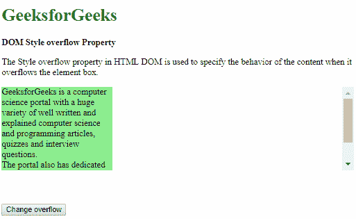

# HTML | DOM 样式溢出属性

> 原文:[https://www . geesforgeks . org/html-DOM-style-overflow-property/](https://www.geeksforgeeks.org/html-dom-style-overflow-property/)

HTML DOM 中的**样式溢出**属性用于指定内容溢出元素框时的行为。内容可以隐藏、显示，或者根据值显示滚动条。

**语法:**

*   它返回溢出属性。

    ```html
    object.style.overflow
    ```

*   它用于设置溢出属性。

    ```html
    object.style.overflow = "visible|hidden|scroll|auto|initial|
    inherit"
    ```

**返回值:**返回一个字符串值，代表元素框外呈现的内容。

**属性值:**

*   **visible:** The content is not clipped and may overflow out of the containing element.

    **示例:**

    ```html
    <!DOCTYPE html>
    <html>

    <head>
        <title>
            DOM Style overflow Property
        </title>

        <style>
            .content {
                background-color: lightgreen;
                height: 150px;
                width: 200px;
                overflow: hidden;
            }

            button {
                margin-top: 60px;
            }
        </style>
    </head>

    <body>
        <h1 style="color: green">
            GeeksforGeeks
        </h1>

        <b>DOM Style overflow Property</b>

        <p>
            The Style overflow property in HTML DOM is
            used to specify the behavior of the content
            when it overflows the element box.
        </p>

        <div class="content">
            GeeksforGeeks is a computer science portal
            with a huge variety of well written and
            explained computer science and programming
            articles, quizzes and interview questions.
            <br>The portal also has dedicated GATE
            preparation and competitive programming 
            sections.
        </div>

        <button onclick="setOverflow()">
            Change overflow
        </button>

        <!-- Script to set overflow to visible -->
        <script>
            function setOverflow() {
                elem = document.querySelector('.content');
                elem.style.overflow = 'visible';
            }
        </script>
    </body>

    </html>                    
    ```

    **输出:**

    *   点击按钮前:
        
    *   点击按钮后:
        
*   **hidden:** The content is clipped and hidden to fit the element. No scrollbars are provided when using this value.

    **示例:**

    ```html
    <!DOCTYPE html>
    <html>

    <head>
        <title>
            DOM Style overflow Property
        </title>

        <style>
            .content {
                background-color: lightgreen;
                height: 150px;
                width: 200px;
            }

            button {
                margin-top: 60px;
            }
        </style>
    </head>

    <body>
        <h1 style="color: green">
            GeeksforGeeks
        </h1>

        <b>DOM Style overflow Property</b>

        <p>
            The Style overflow property in HTML DOM is
            used to specify the behavior of the content
            when it overflows the element box.
        </p>

        <div class="content">
            GeeksforGeeks is a computer science portal
            with a huge variety of well written and
            explained computer science and programming
            articles, quizzes and interview questions.
            <br>The portal also has dedicated GATE
            preparation and competitive programming 
            sections.
        </div>

        <button onclick="setOverflow()">
            Change overflow
        </button>

        <!-- Script to set overflow to visible -->
        <script>
            function setOverflow() {
                elem = document.querySelector('.content');
                elem.style.overflow = 'hidden';
            }
        </script>
    </body>

    </html>                    
    ```

    **输出:**

    *   点击按钮前:
        
    *   点击按钮后:
        
*   **scroll:** The content is clipped to fit the element box and scrollbars are provided to help scroll the overflowed content. The scrollbar here is added even if the content is not clipped.

    **示例:**

    ```html
    <!DOCTYPE html>
    <html>

    <head>
        <title>
            DOM Style overflow Property
        </title>

        <style>
            .content {
                background-color: lightgreen;
                height: 150px;
                width: 200px;
                overflow: hidden;
            }

            button {
                margin-top: 60px;
            }
        </style>
    </head>

    <body>
        <h1 style="color: green">
            GeeksforGeeks
        </h1>

        <b>DOM Style overflow Property</b>

        <p>
            The Style overflow property in HTML DOM is
            used to specify the behavior of the content
            when it overflows the element box.
        </p>

        <div class="content">
            GeeksforGeeks is a computer science portal
            with a huge variety of well written and
            explained computer science and programming
            articles, quizzes and interview questions.
            <br>The portal also has dedicated GATE
            preparation and competitive programming 
            sections.
        </div>

        <button onclick="setOverflow()">
            Change overflow
        </button>

        <!-- Script to set overflow to visible -->
        <script>
            function setOverflow() {
                elem = document.querySelector('.content');
                elem.style.overflow = 'scroll';
            }
        </script>
    </body>

    </html>                    
    ```

    **输出:**

    *   点击按钮前:
        
    *   点击按钮后:
        
*   **auto:** The behavior of auto depends on the content and scrollbars are added only when the content overflows.

    **示例:**

    ```html
    <!DOCTYPE html>
    <html>

    <head>
        <title>
            DOM Style overflow Property
        </title>

        <style>
            .content {
                background-color: lightgreen;
                height: 150px;
                width: 200px;
                overflow: visible;
            }

            button {
                margin-top: 60px;
            }
        </style>
    </head>

    <body>
        <h1 style="color: green">
            GeeksforGeeks
        </h1>

        <b>DOM Style overflow Property</b>

        <p>
            The Style overflow property in HTML DOM is
            used to specify the behavior of the content
            when it overflows the element box.
        </p>

        <div class="content">
            GeeksforGeeks is a computer science portal
            with a huge variety of well written and
            explained computer science and programming
            articles, quizzes and interview questions.
            <br>The portal also has dedicated GATE
            preparation and competitive programming 
            sections.
        </div>

        <button onclick="setOverflow()">
            Change overflow
        </button>

        <!-- Script to set overflow to visible -->
        <script>
            function setOverflow() {
                elem = document.querySelector('.content');
                elem.style.overflow = 'auto';
            }
        </script>
    </body>

    </html>                    
    ```

    **输出:**

    *   点击按钮前:
        
    *   点击按钮后:
        
*   **initial:** It is used to set this property to its default value.

    **示例:**

    ```html
    <!DOCTYPE html>
    <html>

    <head>
        <title>
            DOM Style overflow Property
        </title>

        <style>
            .content {
                background-color: lightgreen;
                height: 150px;
                width: 200px;
                overflow: scroll;
            }

            button {
                margin-top: 60px;
            }
        </style>
    </head>

    <body>
        <h1 style="color: green">
            GeeksforGeeks
        </h1>

        <b>DOM Style overflow Property</b>

        <p>
            The Style overflow property in HTML DOM is
            used to specify the behavior of the content
            when it overflows the element box.
        </p>

        <div class="content">
            GeeksforGeeks is a computer science portal
            with a huge variety of well written and
            explained computer science and programming
            articles, quizzes and interview questions.
            <br>The portal also has dedicated GATE
            preparation and competitive programming 
            sections.
        </div>

        <button onclick="setOverflow()">
            Change overflow
        </button>

        <!-- Script to set overflow to visible -->
        <script>
            function setOverflow() {
                elem = document.querySelector('.content');
                elem.style.overflow = 'initial';
            }
        </script>
    </body>

    </html>                    
    ```

    **输出:**

    *   点击按钮前:
        
    *   点击按钮后:
        
*   **inherit:** This inherits the property from its parent.

    **示例:**

    ```html
    <!DOCTYPE html>
    <html>

    <head>
        <title>
            DOM Style overflow Property
        </title>

        <style>
            #parent {
                overflow: auto;
            }

            .content {
                background-color: lightgreen;
                height: 150px;
                width: 200px;
            }

            button {
                margin-top: 60px;
            }
        </style>
    </head>

    <body>
        <h1 style="color: green">
            GeeksforGeeks
        </h1>

        <b>DOM Style overflow Property</b>

        <p>
            The Style overflow property in HTML DOM is used
            to specify the behavior of the content when it
            overflows the element box.
        </p>

        <div id="parent">
            <div class="content">
                GeeksforGeeks is a computer science portal with
                a huge variety of well written and explained
                computer science and programming articles, 
                quizzes and interview questions.<br>The portal
                also has dedicated GATE preparation and competitive
                programming sections.
            </div>
        </div>

        <button onclick="setOverflow()">
            Change overflow
        </button>

        <!-- Script to set overflow to inherit -->
        <script>
            function setOverflow() {
                elem = document.querySelector('.content');
                elem.style.overflow = 'inherit';
            }
        </script>
    </body>

    </html>                    
    ```

    **输出:**

*   点击按钮前:
    
*   点击按钮后:
    

**支持的浏览器:****DOM Style 溢出属性**支持的浏览器如下:

*   谷歌 Chrome
*   微软公司出品的 web 浏览器
*   火狐浏览器
*   歌剧
*   苹果 Safari