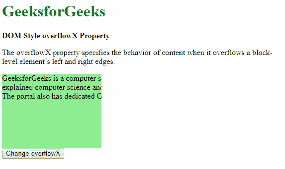
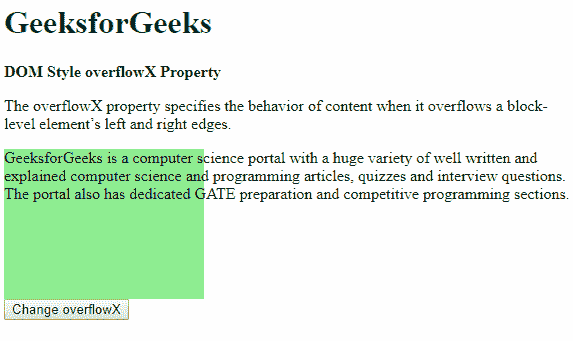
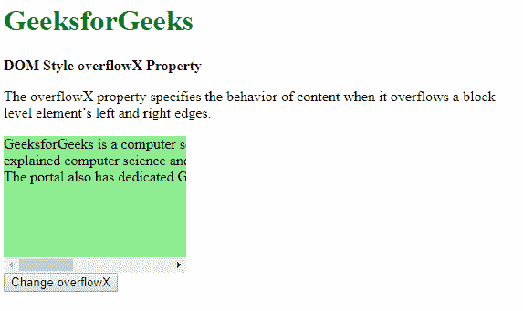

# HTML | DOM Style overflowX 属性

> 原文:[https://www . geesforgeks . org/html-DOM-style-overflow x-property/](https://www.geeksforgeeks.org/html-dom-style-overflowx-property/)

HTML DOM 中的 **Style overflowX** 属性用于指定内容溢出元素左右边缘时的行为。根据该值，内容可以隐藏、显示或显示在滚动条上。

**语法:**

*   它返回 overflowX 属性。

    ```html
    object.style.overflowX
    ```

*   它用于设置 overflowX 属性。

    ```html
    object.style.overflowX = "hidden|visible|scroll|auto|initial|
    inherit"
    ```

**返回值:**返回一个字符串值，代表元素的 overflow-x 属性

**属性值:**

*   **hidden:** The content is clipped and hidden to fit the element. No scrollbars are provided when using this value.
    **Example:**

    ```html
    <!DOCTYPE html>
    <html>

    <head>
        <title>
            DOM Style overflowX Property
        </title>

        <style>
            .content {
                background-color: lightgreen;
                height: 150px;
                width: 200px;
                white-space: nowrap;
            }
        </style>
    </head>

    <body>
        <h1 style="color: green">
            GeeksforGeeks
        </h1>

        <b>DOM Style overflowX Property</b>

        <p>
            The overflowX property specifies the behavior of
            content when it overflows a block-level element’s
            left and right edges.
        </p>

        <div class="content">
            GeeksforGeeks is a computer science portal with a
            huge variety of well written and<br> explained
            computer science and programming articles, quizzes
            and interview questions. <br>The portal also has
            dedicated GATE preparation and competitive
            programming sections.
        </div>

        <button onclick="setOverflow()">
            Change overflowX
        </button>

        <!-- Script to set overflowX to hidden -->
        <script>
            function setOverflow() {
                elem = document.querySelector('.content');
                elem.style.overflowX = 'hidden';
            }
        </script>
    </body>

    </html>                    
    ```

    **输出:**

    *   点击按钮前:
        
    *   点击按钮后:
        
*   **visible:** The content is not clipped and may overflow out to the left or right of the containing element.
    **Example:**

    ```html
    <!DOCTYPE html>
    <html>

    <head>
        <title>
            DOM Style overflowX Property
        </title>

        <style>
            .content {
                background-color: lightgreen;
                height: 150px;
                width: 200px;
                white-space: nowrap;
                overflow-x: hidden;
            }
        </style>
    </head>

    <body>
        <h1 style="color: green">
            GeeksforGeeks
        </h1>

        <b>DOM Style overflowX Property</b>

        <p>
            The overflowX property specifies the behavior of
            content when it overflows a block-level element’s
            left and right edges.
        </p>

        <div class="content">
            GeeksforGeeks is a computer science portal with a
            huge variety of well written and<br> explained
            computer science and programming articles, quizzes
            and interview questions. <br>The portal also has
            dedicated GATE preparation and competitive
            programming sections.
        </div>

        <button onclick="setOverflow()">
            Change overflowX
        </button>

        <!-- Script to set overflowX to visible -->
        <script>
            function setOverflow() {
                elem = document.querySelector('.content');
                elem.style.overflowX = 'visible';
            }
        </script>
    </body>

    </html>                    
    ```

    **输出:**

    *   点击按钮前:
        
    *   点击按钮后:
        
*   **scroll:** The content is clipped to fit the element box and a scrollbar is provided help scroll the extra overflowed content. The scrollbar here is added even if the content is not clipped.
    **Example:**

    ```html
    <!DOCTYPE html>
    <html>

    <head>
        <title>
            DOM Style overflowX Property
        </title>

        <style>
            .content {
                background-color: lightgreen;
                height: 150px;
                width: 200px;
                white-space: nowrap;
            }
        </style>
    </head>

    <body>
        <h1 style="color: green">
            GeeksforGeeks
        </h1>

        <b>DOM Style overflowX Property</b>

        <p>
            The overflowX property specifies the behavior of
            content when it overflows a block-level element’s
            left and right edges.
        </p>

        <div class="content">
            GeeksforGeeks is a computer science portal with a
            huge variety of well written and<br> explained
            computer science and programming articles, quizzes
            and interview questions. <br>The portal also has
            dedicated GATE preparation and competitive
            programming sections.
        </div>

        <button onclick="setOverflow()">
            Change overflowX
        </button>

        <!-- Script to set overflowX to scroll -->    
        <script>
            function setOverflow() {
                elem = document.querySelector('.content');
                elem.style.overflowX = 'scroll';
            }
        </script>
    </body>
    </html>                    
    ```

    **输出:**

    *   点击按钮前:
        
    *   点击按钮后:
        
*   **auto:** The behavior of auto depends on the content and scrollbars are added only when the content overflows.
    **Example:**

    ```html
    <!DOCTYPE html>
    <html>

    <head>
        <title>
            DOM Style overflowX Property
        </title>

        <style>
            .content {
                background-color: lightgreen;
                height: 150px;
                width: 200px;
                white-space: nowrap;
            }
        </style>
    </head>

    <body>
        <h1 style="color: green">
            GeeksforGeeks
        </h1>

        <b>DOM Style overflowX Property</b>

        <p>
            The overflowX property specifies the behavior of
            content when it overflows a block-level element’s
            left and right edges.
        </p>

        <div class="content">
            GeeksforGeeks is a computer science portal with a
            huge variety of well written and<br> explained
            computer science and programming articles, quizzes
            and interview questions. <br>The portal also has
            dedicated GATE preparation and competitive
            programming sections.
        </div>

        <button onclick="setOverflow()">
            Change overflowX
        </button>

        <!-- Script to set overflowX to auto -->
        <script>
            function setOverflow() {
                elem = document.querySelector('.content');
                elem.style.overflowX = 'auto';
            }
        </script>
    </body>

    </html>                    
    ```

    **输出:**

    *   点击按钮前:
        
    *   点击按钮后:
        
*   **initial:** This is used to set this property to its default value.
    **Example:**

    ```html
    <!DOCTYPE html>
    <html>

    <head>
        <title>
            DOM Style overflowX Property
        </title>

        <style>
            .content {
                background-color: lightgreen;
                height: 150px;
                width: 200px;
                white-space: nowrap;

                /* Setting the overflow-x property to 'scroll' to
                observe the effect of initial */
                overflow-x: scroll;
            }
        </style>
    </head>

    <body>
        <h1 style="color: green">
            GeeksforGeeks
        </h1>

        <b>DOM Style overflowX Property</b>

        <p>
            The overflowX property specifies the behavior of
            content when it overflows a block-level element’s
            left and right edges.
        </p>

        <div class="content">
            GeeksforGeeks is a computer science portal with a
            huge variety of well written and<br> explained
            computer science and programming articles, quizzes
            and interview questions. <br>The portal also has
            dedicated GATE preparation and competitive
            programming sections.
        </div>

        <button onclick="setOverflow()">
            Change overflowX
        </button>

        <!-- Script to set overflowX to initial -->
        <script>
            function setOverflow() {
                elem = document.querySelector('.content');
                elem.style.overflowX = 'initial';
            }
        </script>
    </body>
    </html>                    
    ```

    **输出:**

    *   点击按钮前:
        
    *   点击按钮后:
        
*   **inherit:** It inherits the property from its parent element.
    **Example:**

    ```html
    <!DOCTYPE html>
    <html>

    <head>
        <title>
            DOM Style overflowX Property
        </title>

        <style>
            #parent {

                /* Setting the overflow-x property
                of the parent */
                overflow-x: hidden;
            }
            .content {
                background-color: lightgreen;
                height: 150px;
                width: 200px;
                white-space: nowrap;
            }
        </style>
    </head>

    <body>
        <h1 style="color: green">
            GeeksforGeeks
        </h1>

        <b>DOM Style overflowX Property</b>

        <p>
            The overflowX property specifies the behavior of
            content when it overflows a block-level element’s
            left and right edges.
        </p>

        <div id="parent">
            <div class="content">
                GeeksforGeeks is a computer science portal
                with a huge variety of well written and <br>
                explained computer science and programming 
                articles, quizzes and interview questions.
                <br>The portal also has dedicated GATE 
                preparation and competitive programming 
                sections.
            </div>
        </div>

        <button onclick="setOverflow()">
            Change overflowX
        </button>

        <!-- Script to use overflowX to inherit -->
        <script>
            function setOverflow() {
                elem = document.querySelector('.content');
                elem.style.overflowX = 'inherit';
            }
        </script>
    </body>

    </html>                    
    ```

    **输出:**

    *   点击按钮前:
        
    *   点击按钮后:
        

    **支持的浏览器:**T2 DOM Style overflow x 属性支持的浏览器如下:

    *   谷歌 Chrome
    *   微软公司出品的 web 浏览器
    *   火狐浏览器
    *   歌剧
    *   苹果 Safari