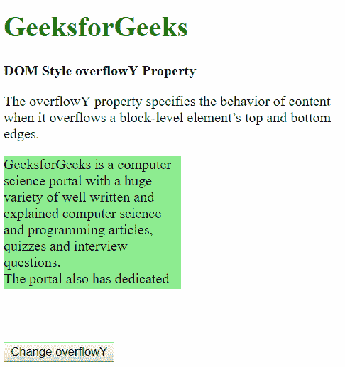
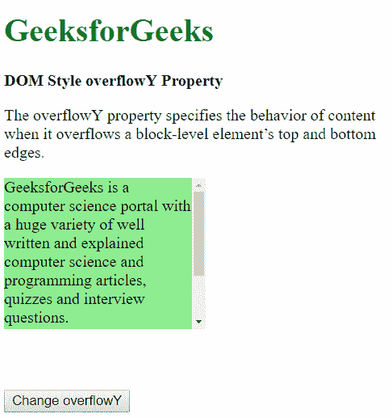
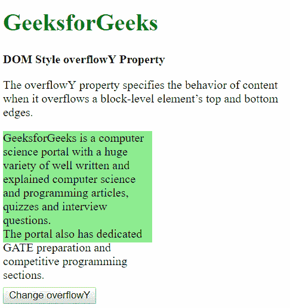
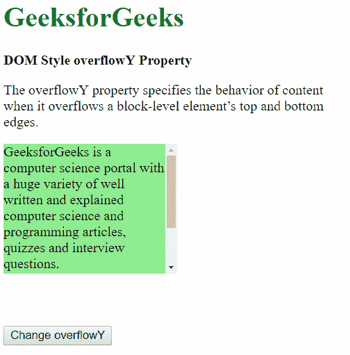
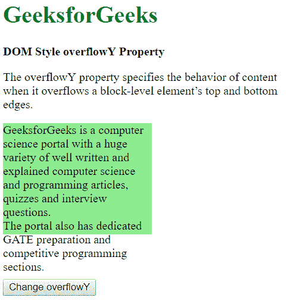
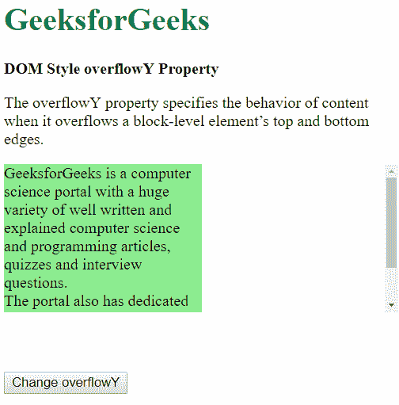
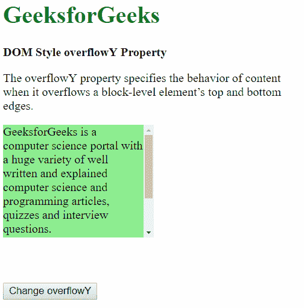

# HTML | DOM 样式溢出属性

> 原文:[https://www . geesforgeks . org/html-DOM-style-overflow-property/](https://www.geeksforgeeks.org/html-dom-style-overflowy-property/)

HTML DOM 中的 **Style overflowY** 属性用于指定内容溢出元素上下边缘时的行为。根据该值，内容可以隐藏、显示或显示在滚动条上。

**语法:**

*   它返回 overflowY 属性。

    ```html
    object.style.overflowY
    ```

*   它用于设置 overflowY 属性。

    ```html
    object.style.overflowY = "scroll|hidden|visible|auto|initial|inherit"
    ```

**返回值:**返回一个字符串值，代表元素的 overflow-y 属性

**属性值:**

*   **scroll:** The content is clipped to fit the element box and a scrollbar is provided help scroll the extra overflowed content. The scrollbar here is added even if the content is not clipped.

    **示例:**

    ```html
    <!DOCTYPE html>
    <html>

    <head>
        <title>
            DOM Style overflowY Property
        </title>

        <style>
            .content {
                background-color: lightgreen;
                height: 150px;
                width: 200px;
                overflow-y: hidden;
            }

            button {
                margin-top: 60px;
            }
        </style>
    </head>

    <body>
        <h1 style="color: green">
            GeeksforGeeks
        </h1>

        <b>DOM Style overflowY Property</b>

        <p>
            The overflowY property specifies the
            behavior of content when it overflows
            a block-level element’s top and 
            bottom edges.
        </p>

        <div class = "content">
            GeeksforGeeks is a computer science portal
            with a huge variety of well written and
            explained computer science and programming
            articles, quizzes and interview questions. 
            <br>The portal also has dedicated GATE
            preparation and competitive programming
            sections.
        </div>

        <button onclick = "myGeeks()">
            Change overflowY
        </button>

        <!-- script to create overflowY -->
        <script>
            function myGeeks() {
                elem = document.querySelector('.content');
                elem.style.overflowY = 'scroll';
            }
        </script>
    </body>

    </html>                    
    ```

    **输出:**
    **之前点击按钮:**
    
    **之后点击按钮:**
    

*   **hidden:** The content is clipped and hidden to fit the element. No scrollbars are provided when using this value.

    **示例:**

    ```html
    <!DOCTYPE html>
    <html>

    <head>
        <title>
            DOM Style overflowY Property
        </title>

        <style>
            .content {
                background-color: lightgreen;
                height: 150px;
                width: 200px;
            }

            button {
                margin-top: 60px;
            }
        </style>
    </head>

    <body>
        <h1 style="color: green">
            GeeksforGeeks
        </h1>

        <b>DOM Style overflowY Property</b>

        <p>
            The overflowY property specifies the
            behavior of content when it overflows
            a block-level element’s top and 
            bottom edges.
        </p>

        <div class = "content">
            GeeksforGeeks is a computer science portal
            with a huge variety of well written and
            explained computer science and programming
            articles, quizzes and interview questions. 
            <br>The portal also has dedicated GATE
            preparation and competitive programming
            sections.
        </div>

        <button onclick = "myGeeks()">
            Change overflowY
        </button>

        <!-- script to create overflowY -->
        <script>
            function myGeeks() {
                elem = document.querySelector('.content');
                elem.style.overflowY = 'hidden';
            }
        </script>
    </body>

    </html>                    
    ```

    **输出:**
    **之前点击按钮:**
    
    **之后点击按钮:**
    

*   **visible:** The content is not clipped and may overflow out to the top or bottom of the containing element.

    **示例:**

    ```html
    <!DOCTYPE html>
    <html>

    <head>
        <title>
            DOM Style overflowY Property
        </title>

        <style>
            .content {
                background-color: lightgreen;
                height: 150px;
                width: 200px;
                overflow-y: hidden;
            }

            button {
                margin-top: 60px;
            }
        </style>
    </head>

    <body>
        <h1 style = "color: green">
            GeeksforGeeks
        </h1>

        <b>DOM Style overflowY Property</b>

        <p> 
            The overflowY property specifies the
            behavior of content when it overflows
            a block-level element’s top and bottom
            edges.
        </p>

        <div class = "content">
            GeeksforGeeks is a computer science
            portal with a huge variety of well
            written and explained computer science
            and programming articles, quizzes and
            interview questions. <br>The portal
            also has dedicated GATE preparation 
            and competitive programming sections.
        </div>

        <button onclick = "myGeeks()">
            Change overflowY
        </button>

        <!-- script to use oveflowY property -->
        <script>
            function myGeeks() {
                elem = document.querySelector('.content');
                elem.style.overflowY = 'visible';
            }
        </script>
    </body>

    </html>                    
    ```

    **输出:**
    **之前点击按钮:**
    
    **之后点击按钮:**
    

*   **auto:** The behavior of auto depends on the content and scrollbars are added only when the content overflows.

    **示例:**

    ```html
    <!DOCTYPE html>
    <html>

    <head>
        <title>
            DOM Style overflowY Property
        </title>

        <style>
            .content {
                background-color: lightgreen;
                height: 150px;
                width: 200px;
            }

            button {
                margin-top: 60px;
            }
        </style>
    </head>

    <body>
        <h1 style = "color: green">
            GeeksforGeeks
        </h1>

        <b>DOM Style overflowY Property</b>

        <p> 
            The overflowY property specifies the
            behavior of content when it overflows
            a block-level element’s top and bottom
            edges.
        </p>

        <div class = "content">
            GeeksforGeeks is a computer science
            portal with a huge variety of well
            written and explained computer science
            and programming articles, quizzes and
            interview questions. <br>The portal
            also has dedicated GATE preparation 
            and competitive programming sections.
        </div>

        <button onclick = "myGeeks()">
            Change overflowY
        </button>

        <!-- script to use oveflowY property -->
        <script>
            function myGeeks() {
                elem = document.querySelector('.content');
                elem.style.overflowY = 'auto';
            }
        </script>
    </body>

    </html>                    
    ```

    **输出:**
    **之前点击按钮:**
    
    **之后点击按钮:**
    

*   **initial:** It sets the style overflowY property to its default value.

    **示例:**

    ```html
    <!DOCTYPE html>
    <html>

    <head>
        <title>
            DOM Style overflowY Property
        </title>

        <style>
            .content {
                background-color: lightgreen;
                height: 150px;
                width: 200px;
                overflow-y: scroll;
            }

            button {
                margin-top: 60px;
            }
        </style>
    </head>

    <body>
        <h1 style = "color: green">
            GeeksforGeeks
        </h1>

        <b>DOM Style overflowY Property</b>

        <p> 
            The overflowY property specifies the
            behavior of content when it overflows
            a block-level element’s top and bottom
            edges.
        </p>

        <div class = "content">
            GeeksforGeeks is a computer science
            portal with a huge variety of well
            written and explained computer science
            and programming articles, quizzes and
            interview questions. <br>The portal
            also has dedicated GATE preparation 
            and competitive programming sections.
        </div>

        <button onclick = "myGeeks()">
            Change overflowY
        </button>

        <!-- script to use oveflowY property -->
        <script>
            function myGeeks() {
                elem = document.querySelector('.content');
                elem.style.overflowY = 'initial';
            }
        </script>
    </body>

    </html>                    
    ```

    **输出:**
    **之前点击按钮:**
    
    **之后点击按钮:**
    

*   **inherit:** This inherits the property from its parent.

    **示例:**

    ```html
    <!DOCTYPE html>
    <html>

    <head>
        <title>
            DOM Style overflowY Property
        </title>

        <style>
            #parent {

                /* setting the parent div
                to 'auto' */
                overflow-y: auto;
            }

            .content {
                background-color: lightgreen;
                height: 150px;
                width: 200px;
            }

            button {
                margin-top: 60px;
            }
        </style>
    </head>

    <body>
        <h1 style = "color: green;">
            GeeksforGeeks
        </h1>

        <b>DOM Style overflowY Property</b>

        <p>
            The overflowY property specifies the
            behavior of content when it overflows
            a block-level element’s top and bottom
            edges.
        </p>

        <div id = "parent">
            <div class = "content">
                GeeksforGeeks is a computer science
                portal with a huge variety of well
                written and explained computer science
                and programming articles, quizzes and
                interview questions. <br>The portal
                also has dedicated GATE preparation and
                competitive programming sections.
            </div>
        </div>

        <button onclick = "myGeeks()">
            Change overflowY
        </button>

        <!-- script to set style overflowY property -->
        <script>
            function myGeeks() {
                elem = document.querySelector('.content');
                elem.style.overflowY = 'inherit';
            }
        </script>
    </body>

    </html>                    
    ```

    **输出:**
    **之前点击按钮:**
    
    **之后点击按钮:**
    

**支持的浏览器:**由*DOM style overflow*属性支持的浏览器如下:

*   铬
*   微软公司出品的 web 浏览器
*   火狐浏览器
*   旅行队
*   歌剧