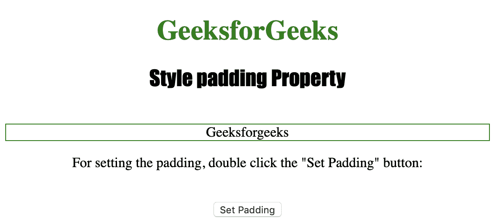
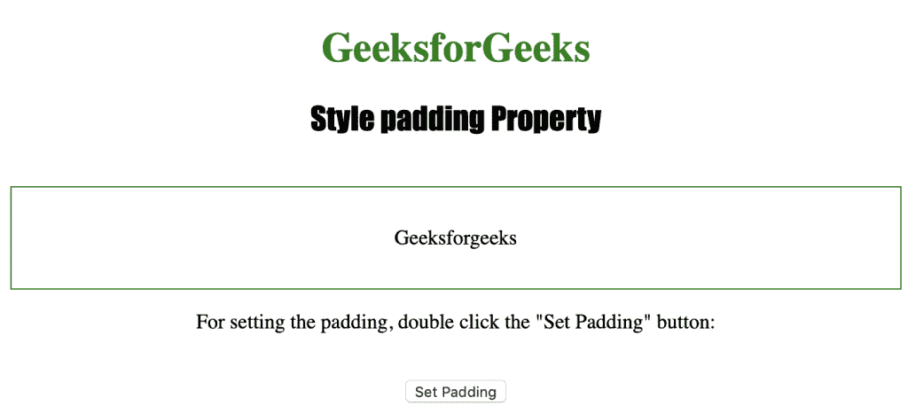
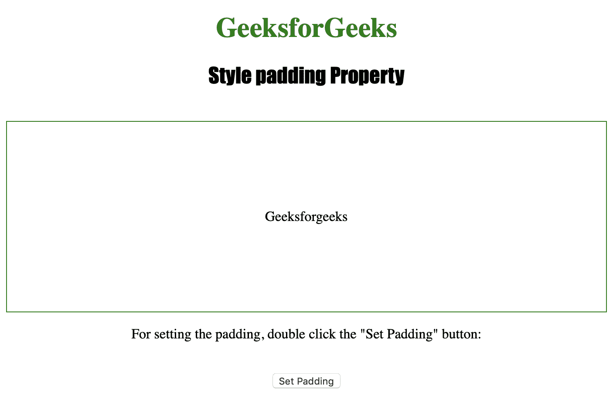
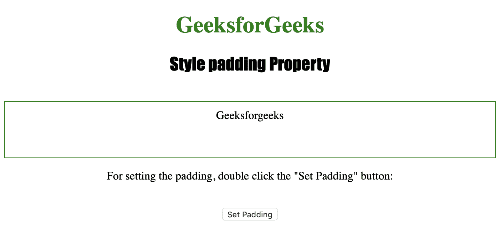
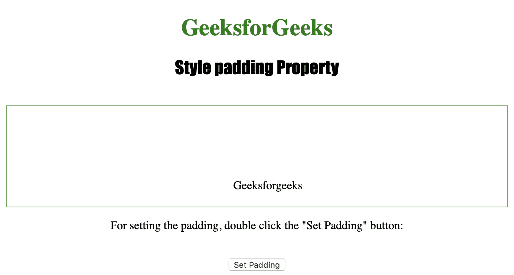

# HTML | DOM 样式填充属性

> 原文:[https://www . geesforgeks . org/html-DOM-style-padding-property/](https://www.geeksforgeeks.org/html-dom-style-padding-property/)

样式填充属性用于设置或返回元素的填充。
样式填充属性可以通过 4 种不同的方式使用:

*   **div { padding:30px }**-在这种情况下，所有四个边都有 30px 的填充。
*   **div {填充:100px 50px }**-在这种情况下，上下填充将为 100px，左右填充将为 50px。
*   **div {填充:10px 20px 50px }**-在这种情况下，顶部填充将是 10px，左右填充将是 20px，底部填充将是 50px。
*   **div {填充:100px 10px 20px 40px }**-在这种情况下，顶部填充将是 100px，右侧填充将是 10px，底部填充将是 20px，左侧填充将是 40px。

**语法:**

*   获取属性值:

    ```
    object.style.padding
    ```

*   要设置属性值:

    ```
    object.style.padding = "%|length|initial|inherit"
    ```

**返回值:**返回一个字符串值，代表一个元素的填充。

**属性值:**

*   **% :** 用于定义父元素宽度的填充百分比。
*   **长度:**用于以长度单位定义填充。
*   **初始值:**用于将该属性设置为默认值。
*   **inherit :** 用于从其父元素继承该属性。

下面的程序说明了样式填充属性:

**示例 1:为< div >元素设置填充{ 30px }:**

```
<!DOCTYPE html>
<html>

<head>
    <title>Style padding Property in HTML</title>
    <style>
        #samplediv {
            border: 1px solid green;
        }

        h1 {
            color: green;
        }

        h2 {
            font-family: Impact;
        }

        body {
            text-align: center;
        }
    </style>
</head>

<body>

    <h1>GeeksforGeeks</h1>
    <h2>Style padding Property</h2>
    <br>

    <div id="samplediv">Geeksforgeeks</div>

    <p>For setting the padding, 
      double click the "Set Padding" button: </p>
    <br>

    <button ondblclick="padding()">
        Set Padding
    </button>

    <script>
        function padding() {
            document.getElementById("samplediv")
                .style.padding = "30px";
        }
    </script>

</body>

</html>       
```

**输出:**

*   点击按钮前:
    

*   After clicking the button:
    

    **示例 2:为< div >元素设置填充{ 100 px 50px:**

    ```
    <!DOCTYPE html>
    <html>

    <head>
        <title>Style padding Property in HTML</title>
        <style>
            #samplediv {
                border: 1px solid green;
            }

            h1 {
                color: green;
            }

            h2 {
                font-family: Impact;
            }

            body {
                text-align: center;
            }
        </style>
    </head>

    <body>

        <h1>GeeksforGeeks</h1>
        <h2>Style padding Property</h2>
        <br>

        <div id="samplediv">Geeksforgeeks</div>

        <p>For setting the padding, 
          double click the "Set Padding" button: </p>
        <br>

        <button ondblclick="padding()">Set Padding </button>

        <script>
            function padding() {
                document.getElementById("samplediv")
                    .style.padding = "100px 50px";
            }
        </script>

    </body>

    </html>         
    ```

    **输出:**

    *   点击按钮前:
        *   After clicking the button:
    

    **示例 3:为< div >元素设置填充{ 10px 20px 50px:**

    ```
    <!DOCTYPE html>
    <html>

    <head>
        <title>Style padding Property in HTML</title>
        <style>
            #samplediv {
                border: 1px solid green;
            }

            h1 {
                color: green;
            }

            h2 {
                font-family: Impact;
            }

            body {
                text-align: center;
            }
        </style>
    </head>

    <body>

        <h1>GeeksforGeeks</h1>
        <h2>Style padding Property</h2>
        <br>

        <div id="samplediv">Geeksforgeeks</div>

        <p>For setting the padding, 
          double click the "Set Padding" button: </p>
        <br>

        <button ondblclick="padding()">
            Set Padding
        </button>

        <script>
            function padding() {
                document.getElementById("samplediv")
                    .style.padding = "10px 20px 50px";
            }
        </script>

    </body>

    </html>     
    ```

    **输出:**

    *   点击按钮前:
        *   After clicking the button:
    

    **示例 4:为< div >元素设置填充{ 100px 10px 20px 40px:**

    ```
    <!DOCTYPE html>
    <html>

    <head>
        <title>Style padding Property in HTML</title>
        <style>
            #samplediv {
                border: 1px solid green;
            }

            h1 {
                color: green;
            }

            h2 {
                font-family: Impact;
            }

            body {
                text-align: center;
            }
        </style>
    </head>

    <body>

        <h1>GeeksforGeeks</h1>
        <h2>Style padding Property</h2>
        <br>

        <div id="samplediv">Geeksforgeeks</div>

        <p>For setting the padding, 
          double click the "Set Padding" button: </p>
        <br>

        <button ondblclick="padding()">
            Set Padding
        </button>

        <script>
            function padding() {
                document.getElementById("samplediv")
                    .style.padding = "100px 10px 20px 40px";
            }
        </script>

    </body>

    </html>        
    ```

    **输出:**

    *   点击按钮前:
        *   After clicking the button:
    

    **支持的浏览器:**下面列出了 *HTML | DOM Style 填充属性*支持的浏览器:

    *   谷歌 Chrome
    *   微软公司出品的 web 浏览器
    *   火狐浏览器
    *   歌剧
    *   苹果 Safari