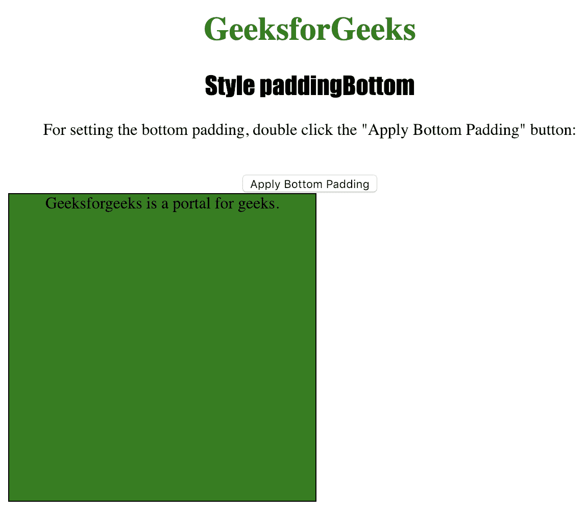
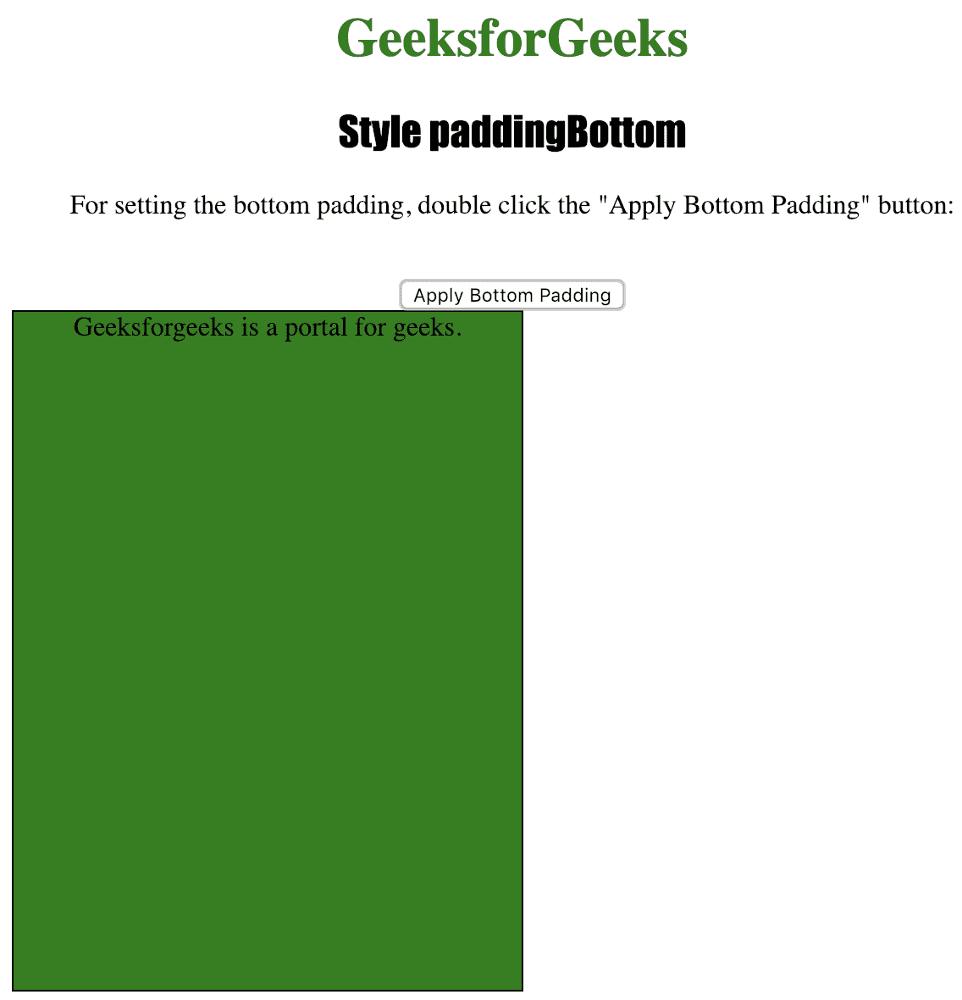

# HTML | DOM 样式填充底部属性

> 原文:[https://www . geesforgeks . org/html-DOM-style-padding bottom-property/](https://www.geeksforgeeks.org/html-dom-style-paddingbottom-property/)

样式**填充底部**属性用于设置或返回元素的底部填充。
padding 属性在元素的边框内插入用户想要的空间。

**语法:**

*   获取属性:

    ```html
    object.style.paddingBottom
    ```

*   要设置属性值:

    ```html
    object.style.paddingBottom = "%|length|initial|inherit"
    ```

**返回值:**返回一个字符串，代表元素的底部填充

**属性值:**

*   **% :** 用于定义以父元素宽度的%为单位的底部填充。
*   **长度:**用于以长度单位定义底部填充。
*   **初始值:**用于将该属性设置为默认值。
*   **inherit :** 用于从其父元素继承该属性。

下面的程序说明了样式填充底部属性方法:

**示例:设置< div >元素的底部填充。**

```html
<!DOCTYPE html>
<html>

<head>
    <title>Style paddingBottom in HTML</title>
    <style>
        #MyElement {
            border: 1px solid black;
            background-color: green;
            width: 300px;
            height: 300px;
        }

        h1 {
            color: green;
        }

        h2 {
            font-family: Impact;
        }

        body {
            text-align: center;
        }
    </style>
</head>

<body>

    <h1>GeeksforGeeks</h1>
    <h2>Style paddingBottom</h2>

    <p>For setting the bottom padding, 
      double click the "Apply Bottom Padding" button: </p>
    <br>

    <button ondblclick="padding()">Apply Bottom Padding</button>

    <div id="MyElement">
        Geeksforgeeks is a portal for geeks.
    </div>

    <script>
        function padding() {
            document.getElementById("MyElement")
            .style.paddingBottom = "100px";
        }
    </script>

</body>

</html>         
```

**输出:**

*   点击按钮前:
    

*   After clicking the button:
    

    **支持的浏览器:**以下列出了*HTML | DOM Style padding bottom Property*支持的浏览器:

    *   谷歌 Chrome
    *   微软公司出品的 web 浏览器
    *   火狐浏览器
    *   歌剧
    *   苹果 Safari