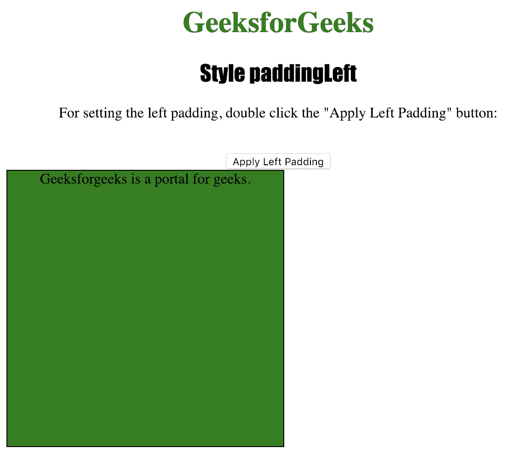
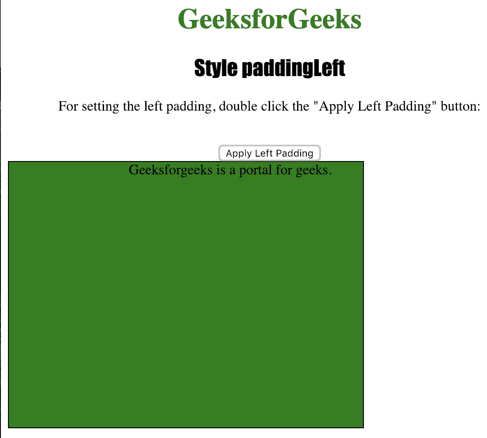

# HTML DOM |样式填充属性

> 原文:[https://www . geesforgeks . org/html-DOM-style-padding left-property-2/](https://www.geeksforgeeks.org/html-dom-style-paddingleft-property-2/)

Style **paddingLeft** 属性用于设置或返回元素的左填充。
padding 属性在元素的边框内插入用户想要的空间。

**语法:**

*   获取属性:

    ```
    object.style.paddingLeft
    ```

*   设置属性:

    ```
    object.style.left = "auto|length|%|initial|inherit"
    ```

**返回值:**返回一个字符串值，代表元素的左填充

**属性值:**

*   **自动:**用于让浏览器设置左侧位置。
*   **长度:**用于以长度单位定义左填充。
*   **% :** 用于定义父元素宽度的左填充百分比。
*   **初始值:**用于将该属性设置为默认值。
*   **inherit :** 用于从其父元素继承该属性。

下面的程序说明了样式填充属性方法:

**示例:设置< div >元素的左填充。**

```
<!DOCTYPE html>
<html>

<head>
    <title>Style paddingLeft in HTML</title>
    <style>
        #MyElement {
            border: 1px solid black;
            background-color: green;
            width: 300px;
            height: 300px;
        }

        h1 {
            color: green;
        }

        h2 {
            font-family: Impact;
        }

        body {
            text-align: center;
        }
    </style>
</head>

<body>
    <h1>GeeksforGeeks</h1>
    <h2>Style paddingLeft</h2>

    <p>For setting the left padding, 
      double click the "Apply Left Padding" button: </p>
    <br>

    <button ondblclick="padding()">Apply Left Padding</button>

    <div id="MyElement">
        Geeksforgeeks is a portal for geeks.
    </div>

    <script>
        function padding() {
            document.getElementById("MyElement")
            .style.paddingLeft = "100px";
        }
    </script>

</body>

</html>
```

**输出:**

*   Before Clicking the button:

    

*   点击按钮后:
    

**支持的浏览器:**下面列出了*支持的浏览器:*

*   谷歌 Chrome
*   微软公司出品的 web 浏览器
*   火狐浏览器
*   歌剧
*   苹果 Safari