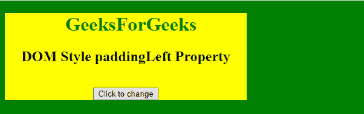
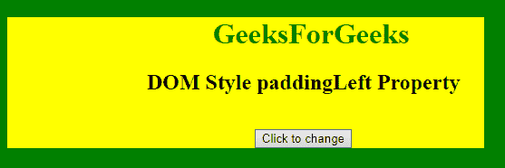

# HTML | DOM 样式 paddingLeft 属性

> 原文:[https://www . geesforgeks . org/html-DOM-style-padding left-property/](https://www.geeksforgeeks.org/html-dom-style-paddingleft-property/)

**填充符**:用于修改或获取元素的左填充符。

*   **与 marginLeft 的区别:**
    margin left 属性和 paddingLeft 属性都在元素中插入了左空格。但是，不同之处在于 marginLeft 在边框周围插入空间，而 paddingLeft 在元素左侧的边框内插入空间。

**语法:**

*   它返回 paddingLeft 属性。

    ```html
    object.style.paddingLeft
    ```

*   它设置了 paddingLeft 属性。

    ```html
    object.style.paddingLeft = "%|length|initial|inherit"
    ```

**返回值:**返回代表元素左填充的字符串值。

**示例-1:**

```html
<!DOCTYPE html>
<html>

<head>
    <title>DOM Style paddingLeft Property </title>
    <style>
        #Geek_1 {
            color: green;
            width: 50%;
        }

        #Geek_Center {
            width: 400px;
            background: yellow;
        }
    </style>
</head>

<body bgcolor="green">
    <center id="Geek_Center">
        <h1 id="Geek_1"> 
                GeeksForGeeks 
            </h1>

        <h2>DOM Style paddingLeft Property </h2>
        <br>

        <button type="button" onclick="geeks()">
            Click to change
        </button>

        <script>
            function geeks() {

                //  Set padding left using 
                //  length unit.
                document.getElementById(
                  "Geek_Center").style.paddingLeft =
                  "50px";
            }
        </script>
    </center>
</body>

</html>
```

**输出:**

**之前点击按钮:**


**点击按钮后:**


**示例-2:**

```html
<!DOCTYPE html>
<html>

<head>
    <title>DOM Style paddingLeft Property </title>
    <style>
        #Geek_1 {
            color: green;
            width: 50%;
        }

        #Geek_Center {
            width: 400px;
            background: yellow;
        }
    </style>
</head>

<body bgcolor="green">
    <center id="Geek_Center">
        <h1 id="Geek_1"> 
                GeeksForGeeks 
            </h1>

        <h2>DOM Style paddingLeft Property </h2>
        <br>
        <button type="button" onclick="geeks()">
            Click to change
        </button>

        <script>
            function geeks() {

                //  Set 'left padding'
                //  using %.
                document.getElementById(
                  "Geek_Center").style.paddingLeft =
                  "20%";
            }
        </script>
    </center>
</body>

</html>
```

**输出:**

**之前点击按钮:**

**之后点击按钮:**


**支持的浏览器:**T2 DOM Style padding left 属性支持的浏览器如下:

*   谷歌 Chrome
*   微软公司出品的 web 浏览器
*   Mozilla firefox
*   旅行队
*   歌剧