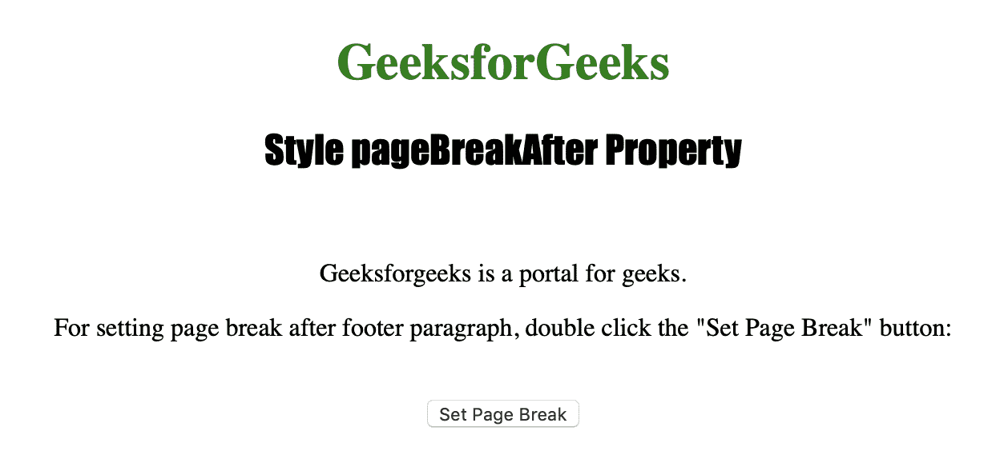
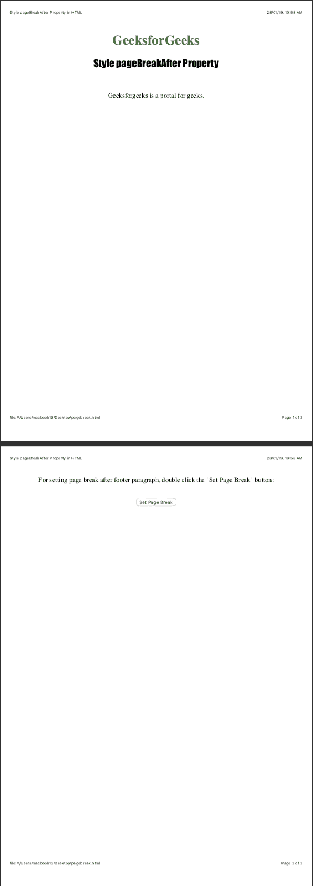

# HTML DOM | Style pageBreakAfter 属性

> 原文:[https://www . geesforgeks . org/html-DOM-style-page breakafter-property/](https://www.geeksforgeeks.org/html-dom-style-pagebreakafter-property/)

样式**分页后**属性用于在打印或打印预览中设置或返回元素后的分页行为。
Style**page breakafter**属性不影响绝对定位的元素。

**语法:**
要获取属性:

```
object.style.pageBreakAfter
```

要设置属性，请执行以下操作:

```
object.style.pageBreakAfter = "auto|always|avoid|emptystring|left|
right|initial|inherit"
```

**返回值:**返回一个字符串，代表打印时元素后的分页符行为

**属性值:**

*   **auto :** 用于必要时在元素后插入分页符。
*   **始终:**用于在元素前后插入分页符。
*   **回避:**用于回避元素前后的页面。
*   **emptystring :** 分页符没有插入到元素之后。
*   **左:**用于在元素后插入一两个分页符，所以下一页被认为是左页。
*   **右:**用于在元素后插入一两个分页符，所以下一页被认为是右页。
*   **初始值:**用于将该属性设置为默认值。
*   **inherit :** 用于从其父元素继承该属性。

下面的程序说明了样式分页后属性:

**示例 1:在 id="footer"** 的< p >元素后设置分页符

```
<!DOCTYPE html>
<html>

<head>
    <title>Style pageBreakAfter Property in HTML</title>
    <style>
        h1 {
            color: green;
        }

        h2 {
            font-family: Impact;
        }

        body {
            text-align: center;
        }
    </style>
</head>

<body>

    <h1>GeeksforGeeks</h1>
    <h2>Style pageBreakAfter Property</h2>
    <br>

    <p id="myfooter">Geeksforgeeks is a portal for geeks.</p>

    <p>For setting page break after footer paragraph, 
      double click the "Set Page Break" button: </p>
    <br>

    <button ondblclick="pagebreak()">Set Page Break</button>

    <script>
        function pagebreak() {

            document.getElementById("myfooter")
                .style.pageBreakAfter = "always";
        }
    </script>

</body>

</html>          
```

**输出:**

*   点击按钮前:
    

*   After clicking the button:
    

    **注意:**为了看到输出，请将代码保存在 HTML 文件中，并在浏览器上运行。当您看到该文件的打印预览时，将会看到输出。

    **支持的浏览器:**以下是*HTML DOM | Style page breakafter Property*支持的浏览器:

    *   谷歌 Chrome
    *   微软公司出品的 web 浏览器
    *   火狐浏览器
    *   歌剧
    *   苹果 Safari