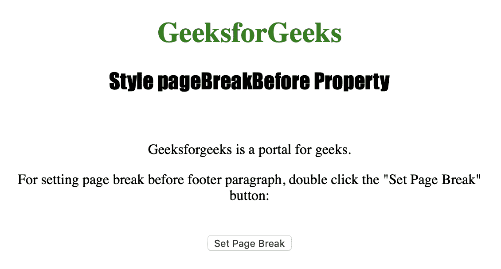
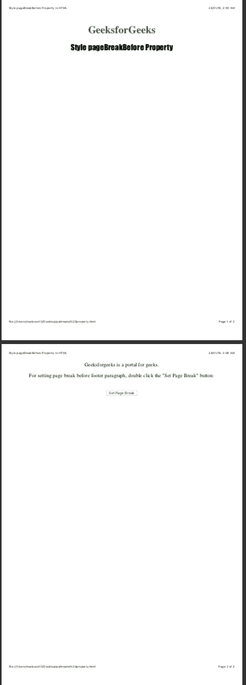

# HTML DOM | Style page breakbefore 属性

> 原文:[https://www . geesforgeks . org/html-DOM-style-page breakbefore-property-2/](https://www.geeksforgeeks.org/html-dom-style-pagebreakbefore-property-2/)

样式分页前属性用于在打印或打印预览中设置或返回元素之前的分页行为。
Style page breakbefore 属性不影响绝对定位的元素。

**语法:**

```
object.style.pageBreakBefore
```

**返回值:**返回一个字符串，代表打印时元素前的分页符行为。

**属性值:**

> object . style . pagebreakbefore = " auto**|**始终 **|** 避免| emptystring **|** 左 **|** 右 **|** 初始 **|** 继承"

**数值说明:**

*   **auto :** 用于必要时在元素前插入分页符。
*   **始终:**用于在元素前始终插入分页符。
*   **避免:**用于避免元素前出现分页符。
*   **emptystring :** 分页符没有插入到元素之前。
*   **左:**用于在元素前插入一两个分页符，所以下一页被认为是左页。
*   **右:**用于在元素前插入一两个分页符，所以下一页被认为是右页。
*   **初始值:**用于将该属性设置为默认值。
*   **inherit :** 用于从其父元素继承该属性。

下面的程序说明了样式分页前属性:

**示例:在 id="footer"** 的< p >元素前设置分页符

```
<!DOCTYPE html>
<html>

<head>
    <title>Style pageBreakBefore Property in HTML</title>
    <style>
        h1 {
            color: green;
        }

        h2 {
            font-family: Impact;
        }

        body {
            text-align: center;
        }
    </style>
</head>

<body>

    <h1>GeeksforGeeks</h1>
    <h2>Style pageBreakBefore Property</h2>
    <br>

    <p id="myfooter">Geeksforgeeks is a portal for geeks.</p>

    <p>For setting page break before footer paragraph, 
      double click the "Set Page Break" button: </p>
    <br>

    <button ondblclick="pagebreak()">Set Page Break</button>

    <script>
        function pagebreak() {
            document.getElementById("myfooter")
            .style.pageBreakBefore = "always";
        }
    </script>

</body>

</html>         
```

**输出:**

*   **点击按钮前:**
    

*   **After clicking the button**
    

    **注意:**为了看到输出，请将代码保存在 HTML 文件中，并在浏览器上运行。当您看到该文件的打印预览时，将会看到输出。