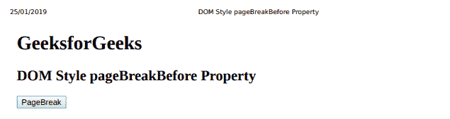
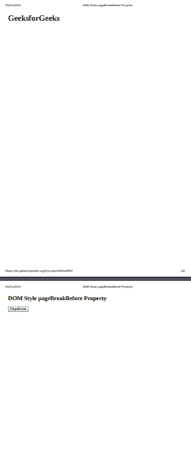

# HTML | DOM 样式分页前属性

> 原文:[https://www . geesforgeks . org/html-DOM-style-page breakbefore-property/](https://www.geeksforgeeks.org/html-dom-style-pagebreakbefore-property/)

HTML DOM 中的 **pageBreakBefore** 属性用于设置或返回 HTML 文档中指定元素之前的分页特征。此属性在打印和打印预览模式下工作。pageBreakBefore 属性对 HTML DOM 中绝对定位的元素没有影响。“分页前”属性只能在打印预览模式和硬拷贝中生效。

**语法:**

*   它返回 pageBreakBefore 属性。

    ```html
    object.style.pageBreakBefore
    ```

*   它用于设置 pageBreakBefore 属性。

    ```html
    object.style.pageBreakBefore = "auto|always|avoid|emptystring|left
                 |right|initial|inherit"
    ```

**属性值:**

*   **自动:**为默认值。如有必要，它用于在元素前分页。
*   **始终:**该值始终在元素前插入分页符。
*   **避免:**该值避免元素前的分页符
*   **emptystring:** 当分页符没有插入到元素之前时，使用该值。
*   **左:**用于在元素前插入一两个分页符，所以下一页被认为是左页。
*   **右:**用于在元素前插入一两个分页符，所以下一页被认为是右页。
*   **初始值:**pageBreakBefore 属性用于设置其默认值。
*   **inherit:** 从其父元素继承而来。

**返回值:**返回一个字符串，代表打印时指定元素前的分页符属性。

**例 1:**

```html
<!DOCTYPE html> 
<html> 
    <head> 
        <title>
            DOM Style pageBreakBefore Property 
        </title> 
    </head> 

    <body> 
        <h1>GeeksforGeeks</h1>

        <h2 id = "footer">
            DOM Style pageBreakBefore Property 
        </h2>

        <button type = "button" onclick = "geeks()"> 
                PageBreak 
            </button> 

        <script> 
            function geeks() { 
            document.getElementById("footer").style.pageBreakBefore
                    = "always";

            } 
        </script> 
    </body> 
</html>                    
```

**输出:**
点击按钮前打印-预览:
T5】点击按钮后打印-预览:


**示例 2:** 避免元素前的分页符。

```html
<!DOCTYPE html> 
<html> 
    <head> 
        <title>
            DOM Style pageBreakBefore Property 
        </title> 
    </head> 

    <body> 
        <h1>GeeksforGeeks</h1>

        <h2 id = "footer">
            DOM Style pageBreakBefore Property 
        </h2>

        <button type = "button" onclick = "geeks()"> 
                PageBreak 
            </button> 

        <script> 
            function geeks() { 
            document.getElementById("footer").style.pageBreakBefore
                    = "avoid";

            } 
        </script> 
    </body> 
</html>                    
```

**输出:**
点击按钮前打印-预览:
点击按钮后打印-预览:


**支持的浏览器:**T2 DOM Style page breakbefore 属性支持的浏览器如下:

*   谷歌 Chrome
*   微软公司出品的 web 浏览器
*   火狐浏览器
*   旅行队
*   歌剧