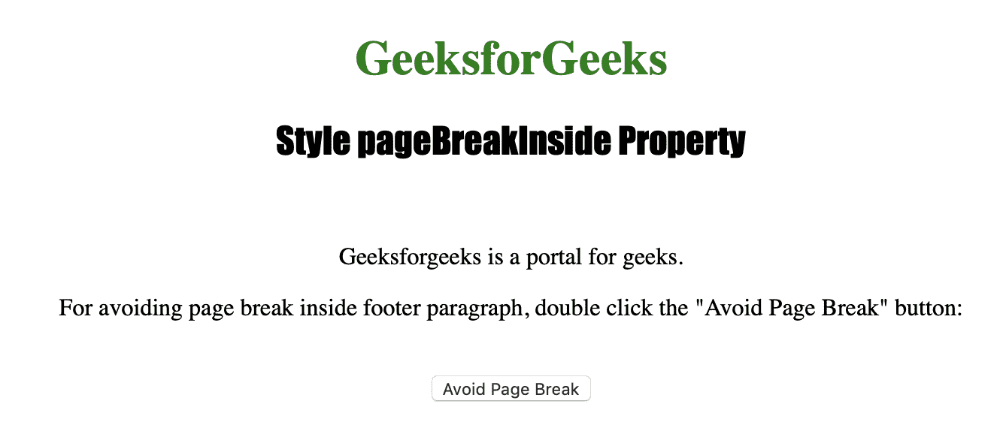
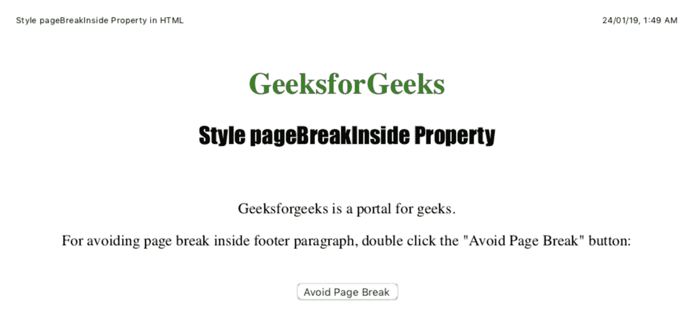

# HTML DOM |样式分页内部属性

> 原文:[https://www . geesforgeks . org/html-DOM-style-page breakinside-property/](https://www.geeksforgeeks.org/html-dom-style-pagebreakinside-property/)

样式**分页内部**属性用于在打印或打印预览中设置或返回元素内部的分页行为。
Style**page breakinside**属性不影响绝对定位的元素。

**语法:**

*   获取属性:

    ```
    object.style.pageBreakInside
    ```

*   设置属性:

    ```
    object.style.pageBreakInside = "auto|avoid|initial|inherit"
    ```

**返回值:**返回一个字符串值，代表打印时元素内部的分页行为

**属性值:**

*   **auto:** 用于必要时在元素内部插入分页符。
*   **避免:**用于避免元素内部出现分页符。
*   **初始值:**用于将该属性设置为默认值。
*   **inherit :** 用于从其父元素继承该属性。

下面的程序说明了样式页面分隔符属性:

**示例:避免在 id="footer"** 的< p >元素中出现分页符

```
<!DOCTYPE html>
<html>

<head>
    <title>Style pageBreakInside Property in HTML</title>
    <style>
        h1 {
            color: green;
        }

        h2 {
            font-family: Impact;
        }

        body {
            text-align: center;
        }
    </style>
</head>

<body>

    <h1>GeeksforGeeks</h1>
    <h2>Style pageBreakInside Property</h2>
    <br>

    <p id="myfooter">Geeksforgeeks is a portal for geeks.</p>

    <p>For avoiding page break inside footer paragraph, 
      double click the "Avoid Page Break" button: </p>
    <br>

    <button ondblclick="pagebreak()">Avoid Page Break</button>

    <script>
        function pagebreak() {
            document.getElementById("myfooter")
            .style.pageBreakInside = "avoid";
        }
    </script>

</body>

</html>
```

**输出:**

*   Before Clicking the button:

    

*   点击按钮后:
    

**注意:**为了看到输出，请将代码保存在 HTML 文件中，并在浏览器上运行。当您看到该文件的打印预览时，将会看到输出。

**支持的浏览器:**以下是*HTML DOM | Style page breakinside Property*支持的浏览器:

*   谷歌 Chrome
*   微软公司出品的 web 浏览器
*   火狐浏览器
*   歌剧
*   苹果 Safari